# 6.新老平衡

前置知识

[1.差距]()

## 学习目标

* <mark style="color:green;">(C级)了解新老玩家的概念，知道新老玩家对游戏发展都很重要。这将为学习《退游》做准备。</mark>
* <mark style="color:purple;">(A级)明白新老矛盾的本质是游戏资源的冲突。</mark>
* <mark style="color:orange;">(S级)知道</mark><mark style="color: orange;">**吸新固老**</mark><mark style="color: orange;">是猫鼠目前的运营目标，熟悉并理解策划组为达成新老平衡的举措。能运用该理论简单分析这些举措提升新/老玩家游戏体验的方式。</mark>
  * <mark style="color: orange;">(S级)理解看似偏袒新玩家的资源分配，其目的是缩小新老玩家差距,提高新玩家体验,从而增加玩家数量。注意到策划组为保护老玩家，对新玩家设置了获取资源的限制。能运用该理论看待、批判老玩家对于新手福利的争议。</mark>
  * <mark style="color: orange;">(S级)学会**提升自身技术、开创新玩法**，在游戏中获得更大发展空间的“老玩家生存法则”。而策划组已经运用了大量措施，帮助老玩家实现这一成就，这些内容将在拓展部分1阐述。</mark>
* <mark style="color:blue;">(B级)意识到部分老玩家没能理解资源分配的用意，应试着引导他们正确认识新老平衡。</mark>

## 新老玩家地位平等

&#x20;      在序中我们知道了：猫鼠现状危急，热度呈衰退趋势。通常而言，游戏的热度和玩家人数呈正相关。对于猫鼠，玩家人数分为3个部分：

$$
玩家人数=新玩家+老玩家-退游玩家
$$

&#x20;      其中**正增长因素**是<mark style="color:green;">**新玩家**</mark>。而占据很大比例的**老玩家**，看似不会体现在游戏人数的正增长上，却是维持热度的重要支柱。很遗憾的是，有些小伙伴，由于各种因素暂时或永久的消失在猫鼠大家庭中，造成了玩家人数的下降，我们就叫他们“<mark style="color:red;">退游玩家</mark>” 。以后我们会围绕他们退游的动机与后果讨论。

## 吸新固老是猫鼠目前的运营目标

&#x20;      我们要知道，无论是新玩家老玩家——他们都可能转变为退游玩家造成玩家数量减少，这对猫鼠是不利的。换个说法，无论新玩家还是老玩家，都在猫鼠玩家人数里占据一席之地。所以，<mark style="color:red;">**新、老玩家在猫鼠中都处于同等地位，且不因为包括但不限于技术、财力、游戏时长等因素改变地位大小。**</mark>

&#x20;      猫鼠要获得发展，需要增加玩家数量。就是增加新玩家的同时减少退游玩家，简单概括，<mark style="background-color:orange;">**吸新固老是猫鼠目前的运营目标**</mark>。这也是小标题“新老平衡”的本质。而实现这个目的很大程度上依靠福利——也就是，游戏资源的分配。

## 游戏资源与新老矛盾

### 游戏资源的发放形式多样但目的统一
\*注意，以下内容只考虑0氪和微氪的情况。

如果你恰巧财力雄厚，这些内容对你可能并不适用

&#x20;      我们把这些游戏资源姑且分成2类：其中影响游戏对局的，与<mark style="color:red;">**强度有关**</mark>的叫局内资源，包含角色、知识卡（等诸如卡组商店配置的附属物品）

&#x20;      无关的叫局外资源，包含皮肤、彩饰（等诸如染色、火箭机器鼠改装等附属物品）还有一些，不属于局内外资源——但可以用他们通过抽奖、购买、兑换来获取资源，把他们归类为虚拟货币：包括金币、银币、星星、邮票等，大致上也和网易直接发角色皮肤划等号。他们的主要转化关系如图所示：

<figure><figcaption>
资源转化关系图
</figcaption></figure>

&#x20;      网易在派发福利的时候，通常是局内外资源和虚拟货币混着发。通过活动、邮件等形式给到玩家，其目的主要是促进玩家继续游玩。

### 老玩家一侧新老矛盾的本质是福利上的矛盾

&#x20;      网易在近来上调了给新手玩家的福利。这衍生出了网易“优待新玩家” “不把老玩家当人”的言论，真的如此吗？ 我们一个个解析：

!!! info *注意，以下内容只考虑0氪和微氪的情况。 如果你恰巧财力雄厚，这些内容对你可能并不适用

## 新老矛盾分析

* [角色](#角色)
* [知识卡](#知识卡)
* [皮肤](#皮肤)

### 角色

#### <mark style="background-color:orange;">新玩家适合老角色、武器</mark>

&#x20;      数量上，老玩家的角色总是比新玩家的要多。角色掌握上，老玩家的角色比新玩家更熟练。那么，什么样的角色适合他们呢？为了保证<mark style="color:green;">新玩家</mark>有<mark style="background-color:green;">一定强度</mark>，他们需要的是<mark style="color:green;">**上手简单**</mark>的角色。对新手局而言：开局给的手型枪汤姆和铁锤杰瑞就是最佳选择。他们都操作简单，技能理解容易。手型枪平地一放就可以把老鼠抓过来，大铁锤按一下就能砸晕猫。

#### <mark style="background-color:orange;">老玩家中，大部分新出的武器/角色利用率高</mark>

&#x20;      但这两个角色的第一武器，老玩家倒是不常用——我们（老玩家）在实战中遇到的概率并不高。反而是他们的第二武器：平底锅和鸟哨的利用率较为高些。

&#x20;      在老玩家群体中，新出的武器和角色_基本上_更适应版本现状。利用率_一般性_也较高。

&#x20;      例如，在某个巅峰对决，角色池有汤姆、库博、苏蕊 如果要你ban掉1个，你会选？&#x20;

&#x20;      在座的可能会ban库博、会ban苏蕊。但ban老角色汤姆应该非常少。猫如此，鼠也如此。就像各位更愿意把ban位留给马索尔、尼宝；而不会ban罗杰与海盗。

&#x20;      不过，部分较早出的角色，因为有了第二武器而焕发了第二春。例如猫方的托普斯捕虫网、鼠方的国王战旗、剑菲长枪。

&#x20;      大部分后来的角色与武器的利用率高些，不仅是他们的属性特殊，更是他们需要的练习，对技术的要求高——这样的角色适合老玩家。典型例子是亲友邮局的限定角色：

<figure><figcaption>
亲友邮局限定角色
</figcaption></figure>

#### <mark style="background-color:orange;">老的角色、武器强度略低，是玩家技术上升的必然结果</mark>

&#x20;      所以，策划在角色的设计上：总体上是按照<mark style="background-color:red;">**新玩家用老角色武器，老玩家用新角色武器的方针**</mark>。

&#x20;      有人认为，老角色强度受限，并以此责怪策划。以现在的眼光看，在老赛季，玩家平均水平低下，老角色的属性适合他们。而现在新玩家的水平，和那些曾经的老玩家水平是一样的，让那些新玩家走老玩家曾经的道路，这不是策划对老角色的偏见，而是玩家平均技术上升的必然结果。

#### [<mark style="background-color:orange;">策划需要</mark><mark style="color:red;background-color:orange;">有底线</mark><mark style="background-color:orange;">地降低角色获取难度</mark>](#user-content-fn-1)[^1]

&#x20;      另一方面，新手玩家角色数目少，会增加对游戏理解的困难程度——策划需要降低角色获取难度。

&#x20;      例如新手活动获取角色，角色体验卡， 限免角色，角色碎片红包兑换角色等——但这样的降低获取难度总是有底线的，例如亲友邮局。

&#x20;      在完全0氪的情况下：如果你从2020年春持续玩到现在，保守估计能获得140+邮票。运气好点能有1根羽毛，更不要提新玩家了。作为一个一般玩家，如果你每赛季氪一个货架什么的，可以获得300+邮票 ，2根羽毛总有了。不要忘了这是保守估计——

&#x20;      我们以可爱但小鱼（化名）为例：他氪金4赛季黄金货架（S3\~S5、S7） 获得424+邮票，抽到3根羽毛，3羽毛恰好对应3个限定角色（虽然他没有这么做便是） 。

&#x20;      亲友邮局如此严苛的角色获取机制，限制了新玩家过快拿到限定角色。不过反过来，策划把新玩家的开局角色换成大表哥——难道让他们上演“表哥来演”吗？

#### <mark style="background-color:orange;">当今角色对新老玩家的要求随他们的能力而变</mark>

所以，在角色上：

新玩家需要提升角色数量，老玩家需要提升角色质量。这里的质量，需要的是可操作性，也就是上限。这要求新玩家，要充分利用获得的角色了解游戏；要求老玩家不能局限于单一角色，要勇于尝试新角色武器——而不是在他们出现的时候说这是“下水道角色”！

&#x20;      请老玩家们记住，后出的角色强度不可能非常明显 其目的就是将新老玩家区分开来 新玩家如果上手就是会被暴打 只有老玩家才可能明白，并玩好这些角色 这是新玩家根本做不到的！

***

### <mark style="color:purple;">知识卡</mark>

#### <mark style="background-color:purple;">**部分老玩家对更改颇有微词，这是他们知识卡较为全面导致的**</mark>

&#x20;      接下来说知识卡：选取比较有代表意义的几张卡，把他们的数值更改日期罗列出来：

<table data-view="cards"><thead><tr><th></th><th></th></tr></thead><tbody><tr><td>
细心

<em>（数值为debuff减速效果，越小越好）</em>
</td><td>
2019.7.18   3/2/1

2019.8.1     9/7/5

2021.5.4    10/8/6

2021.9.24  7/6.5/6
</td></tr><tr><td>
蓄势一击

<em>（数值为CD，越短越好）</em>
</td><td>
2020.1.19  25/20/15（不可打断）

2020.8.28 17/15/13

2021.9.24  16/15/14
</td></tr><tr><td>
无畏

<em>（数值为无敌时间，越长越好）</em> 
</td><td>
2018.7.25  3/5/7

2020.5.22 5/6/7

2021.9.24  6/6.5/7
</td></tr></tbody></table>

&#x20;      老玩家，基本上每张知识卡都有——它们都是3级或接近3级的。新玩家，你不要说3级了，你能集齐全部卡组我就谢天谢地。

&#x20;      那首先得让他们集齐卡组。

&#x20;      策划推出了新手卡池，帮助新玩家更快集齐知识卡。当他们完成新手卡池的抽取，卡组的效果其实基本上已经大差不差了（因为大部分卡lv1和lv3差距不大）。

&#x20;      如果要进一步升级,还能通过抽取知识卡碎片升级指定的卡组——这在远古版本是不可能实现的。当时候只有知识卡的随机抽取。这造成了“要的卡组抽不到,不要的卡组抽一堆”而现在要升级什么卡,抽对应的碎片就行了。那以前的机制算什么呢?我好不容易升级到Lv3的卡组,别人不就能轻松拿到了吗?这是老玩家不满的一个原因。

&#x20;      另一方面来说卡片等级对游戏平衡影响减小了。不可否认地动摇了老玩家的游戏成果。这是老玩家不满的第二个原因。&#x20;

#### <mark style="background-color:purple;">**知识卡机制随时间推移发生了翻天覆地的变化，是猫鼠**</mark><mark style="color:purple;background-color:purple;">**进步**</mark><mark style="background-color:purple;">**的标志；因此老玩家需要摆脱对知识卡等级差的依赖**</mark>

&#x20;      远古版本,猫鼠被吐槽是卡牌游戏。强度高度依赖知识卡。而知识卡的等级和数量高度依赖氪金的数量。以及运气(那时候玩家游玩时间差距不太大,故不计入)。策划近来对知识卡的改动,实质是让猫鼠脱离卡牌游戏的行列。是猫鼠玩法进步的一个标志。

这要求老玩家不可以固步自封坐享其成,而需要在技术、意识方面花功夫。\
&#x20;      另外,与知识卡相关密切的是银币。老玩家几乎不需要升级知识卡,所以存有大量的银币。这些银币可以用来购买卡组和商店配置,大大增加了可玩性与操作空间。除此之外,多余的银币、知识点、角色碎片可以以红包的形式发给其他人。新玩家可以着重抢这些红包,加快自己的提升速度。

&#x20;      以下是知识卡的小结。

### <mark style="color:red;">皮肤</mark>

#### <mark style="background-color:red;">皮肤不影响对局</mark>

接下来说皮肤（这里的皮肤包括火箭、彩饰、染色等内容。首先皮肤不影响对局中平衡），手感只是觉得皮肤好不好看的借口。既不改变角色本身数值,又不增加减少任何实质性的buff。这是新老玩家都要清楚的。\
皮肤的获取方式有:&#x20;

1. 抽取(星星-魔法魔镜、金币-奇幻魔镜、礼盒等)
2. 购买(通过紫色石头(皮肤精华)、钻石、金币在商城买)
3. 网易福利(例如活动、货架皮肤等)&#x20;
4. 兑换(皮肤碎片商城-通用皮肤碎片、亲友邮局-金色羽毛、信笺商店-信笺)&#x20;
5. 其他形式(囤积皮肤碎片兑换券等其他形式)

如果**只考虑零氪的情况**,那速度最快获得皮肤的2个方式是: 1发星星中S皮。以及网易发皮肤。

#### <mark style="background-color:red;">对于新玩家，抽取皮肤无关账号等级；而他们在白嫖皮肤上被老玩家完全碾压</mark>

&#x20;      前一种是《序》中的“用寿命玩好猫鼠”不展开讨论;但将排行榜上新手的一发命中,说成是网易狗托,就显得有失偏颇。猫鼠的新手玩家群体比各位想象中的多。这点将在之后进行说明。其次看网易发皮肤。如果认为在这方面网易偏袒新玩家,那更是百思不得其解。请看：自开服起可白嫖的A及以上皮肤和新手玩家白嫖皮肤的列表。可以看到,差距异常悬殊。

#### <mark style="background-color:red;">截至目前的网易免费赠送的A及以上等级皮肤（皮肤等级是零氪为条件能获取的最大值）</mark>

<table data-full-width="false"><thead><tr><th width="196.33333333333331">皮肤名称</th><th width="99">时间</th><th width="100">皮肤等级</th></tr></thead><tbody><tr><td>国王杰瑞·郁金香王座  </td><td>2020.1</td><td><mark style="color:purple;"><strong>A级</strong></mark></td></tr><tr><td>泰菲·糖果兔</td><td>2020.6</td><td><mark style="color:purple;"><strong>A级</strong></mark></td></tr><tr><td>图多盖洛·白狐少女</td><td>2020.6</td><td><mark style="color:purple;"><strong>A级 彩饰</strong></mark></td></tr><tr><td>泰菲·小蜜蜂</td><td>2020.11、2021.11</td><td><mark style="color:purple;"><strong>A级</strong></mark></td></tr><tr><td>图茨·世家贵女</td><td>2021.2</td><td><mark style="color:purple;"><strong>A级 彩饰</strong></mark></td></tr><tr><td>天使泰菲·小财神</td><td>2021.2</td><td><mark style="color:purple;"><strong>A级</strong></mark></td></tr><tr><td>布奇·拳击手</td><td>2021.2</td><td><mark style="color:purple;"><strong>A级</strong></mark></td></tr><tr><td>恶魔泰菲·科学天才</td><td>2021.2</td><td><mark style="color:purple;"><strong>A级 彩饰</strong></mark></td></tr><tr><td>侦探泰菲·小报童</td><td>2021.3</td><td><mark style="color:purple;"><strong>A级</strong></mark></td></tr><tr><td>莱特宁·说唱歌手</td><td>2021.4</td><td><mark style="color:purple;"><strong>A级</strong></mark></td></tr><tr><td>库博·太空学者</td><td>2021.6</td><td><mark style="color:purple;"><strong>A级</strong></mark></td></tr><tr><td>音乐家杰瑞·星海乐章</td><td>2021.6</td><td><em><b>S级</b></em></td></tr><tr><td>托普斯·冬雪之旅</td><td>2022.1</td><td><mark style="color:purple;"><strong>A级</strong></mark></td></tr><tr><td>凯特·冬日恋语（又称温暖冬日）</td><td>2022.1</td><td><mark style="color:purple;"><strong>A级 彩饰</strong></mark></td></tr><tr><td>天使汤姆·光明使者</td><td>2022.6</td><td><mark style="color:purple;"><strong>A级 彩饰</strong></mark></td></tr><tr><td>恶魔汤姆·深渊使者</td><td>2023.6</td><td><mark style="color:purple;"><strong>A级 彩饰</strong></mark></td></tr></tbody></table>

&#x20;      而B皮更是数不胜数,篇幅有限,暂时不列出。 如果你游戏时间长,那么你还能在持续的游戏中囤积星星和皮肤精华,获得更多皮肤。如果结合你自己的游戏经历,皮肤数量和游戏时间是呈正相关的。认为新玩家在皮肤上有优势,这是有一定问题的。

## 策划围绕新老平衡做出大量改动

&#x20;      总体上看,基于《正片1:差距》,[新老玩家的差距过于巨大](../../part.i-current-abstract/1.gap.md#wan-jia-bei-jing)。无法削弱老玩家,那就只能尽快提升新玩家。从技术,到角色,到卡组,全方位托底。在平面直角坐标系中,用横轴表示赛季,纵轴表示拥有的资源数量。面对这样的更改,部分老玩家没能理解改动的用意。他们只看新玩家资源突然增加的一段,而这些改动沦为了猫鼠被喷的把柄。殊不知,增加了大量新玩家,正面的,能提升游戏体验,降低匹配时间。而对自己没有任何实质上的负面损害。

&#x20;      反过来,策划也运用了一系列措施,拓宽了老玩家的道路,增加了上限与可玩性。那么，我们一定要积极思考,努力开创玩法。这些内容我们将会放在评论置顶的拓展篇讲解。&#x20;

## 固步自封的老玩家必将被淘汰

&#x20;      如果那些老玩家持续“闭关锁国”,对猫鼠已有的改变不管不问,上纲上线的指责批评甚至谩骂猫鼠与策划,那被版本、时代、这个游戏甚至这个社会所淘汰是迟早的事情！

[^1]: 底线：亲友邮局

# 6.1 [拓展Ⅰ] 森林牧场为什么叫策划墓场？策划对老玩家做了什么？

本文作为《猫鼠意识养成课·正片6·新老平衡》的补充内容

请观看完《序》~《正片6》的视频再阅读，否则会难以理解

## **一、引入**

首先请大家看看以下的图片，你辨认得出它们是什么地图吗？

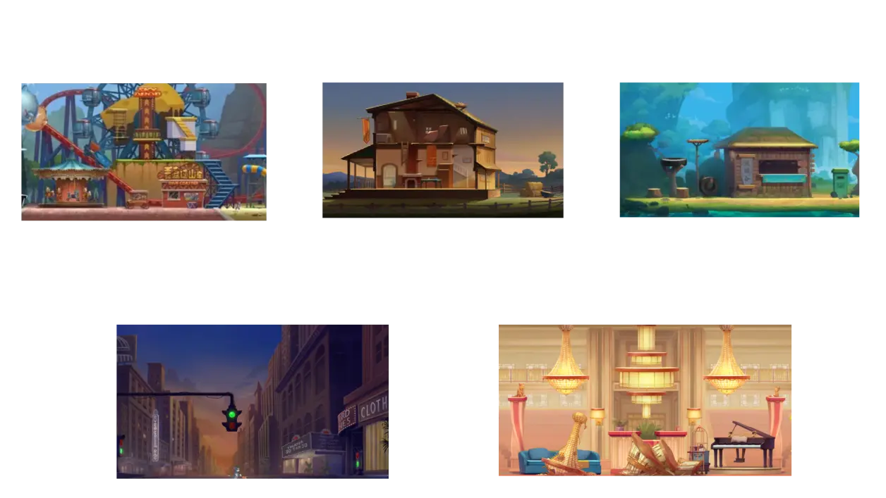猫鼠现有的公认的大图（截止到2022.5.3) 

 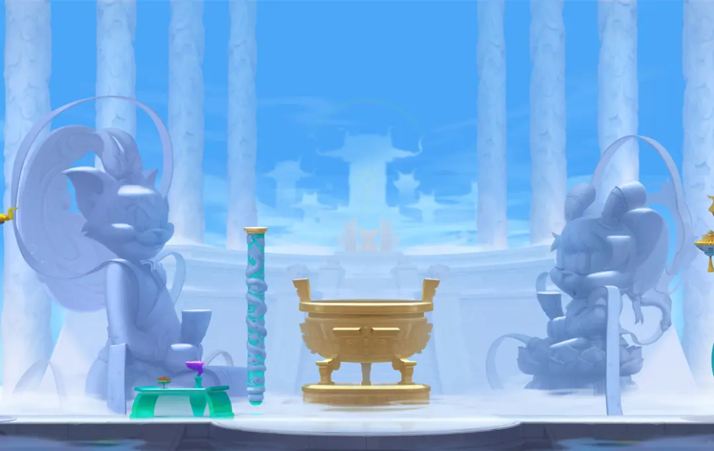

天宫地图（2022.6.16)上线

它们分别是：

游乐场，森林牧场，熊猫馆、御门酒店（天梯地图）

大都会（非天梯地图），天宫（2023.1.12上线天梯）

*本篇中说的【大图】没有特别说明，均指以上6地图

按照出场顺序是，游乐场，森林牧场，大都会，熊猫馆，御门酒店，天宫

其中，一些地图有其独特的外号

森林牧场——“策划墓场”

大都会——“bug都会”

御门酒店——“郁闷酒店”

可见玩家对这些地图的讨厌程度。那策划为什么要设计大图呢？

  

## **二、地图**

### **2.1 地图和学业的关系**

我们发现，这些地图不是突然就让各位玩家上手玩的，而是有个循序渐进的过程

新手的“见习学业”解锁的地图

  

以下是学业和对应解锁的地图：

  

见习学业    经典之家

高级学业    雪夜古堡

特级学业    夏日游轮、太空堡垒

大师学业    所有大图

**结论1**    地图面积整体上随学业提升而提升

**结论2**    地图复杂性随学业提升而提升

  

### **2.2 地图与天梯、职业赛的关系**

学业对应的不仅仅是地图，还有天梯段位

天梯开放学业列表

见习学业    青铜**所有段位（猫方角色≥2，鼠方角色≥4）

高级学业    白银所有段位

特级学业    黄金5——铂金3（不含）

大师学业    铂金3及其以上

**这里的段位都是平均段位，即1猫和4鼠的段位均值，在特殊情况下（如4、3、2排等）会有一定提升，下同

  

由结论1，可得

**结论3**    段位越高，对应的地图越复杂，越大。可以认为，打大图，是高段位的要求

**假设1**    段位高⇒技术强         #目前为简化理解，认为该命题为真，而证明将在《数据》解析

由结论3和假设1:

　　**结论4**    打大图是技术较强玩家的要求

　　**推论1**    打大图是鉴别技术高低的有效手段，能对技术都较高的双方作比较

  

***特殊的，在天梯中[[不被采用]]的**大都会**在各大主流比赛（精英联赛、奶酪杯、Next电竞赛等）中都出现在地图池中。那些职业选手的段位、技术较高，他们就**需要熟悉更大的地图**。

****（2022.6.16御门酒店加入天梯）**（天宫于2023.1.12上线天梯）****

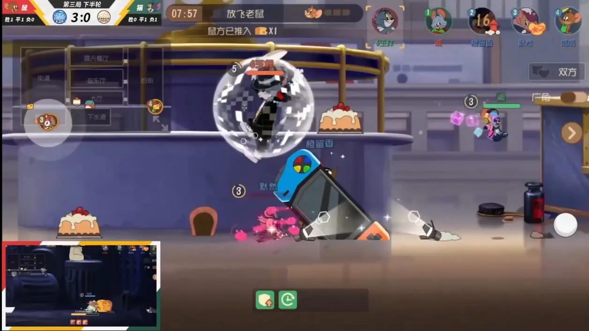

职业选手在大都会的比赛 
 

图源：精英联赛

  

## **三、机制**

地图是基本随着玩家发展，而逐渐变得繁多、复杂，这对玩家的要求也随之提升。有没有其他机制也是这样呢？

### **3.1特技    [高级学业]**

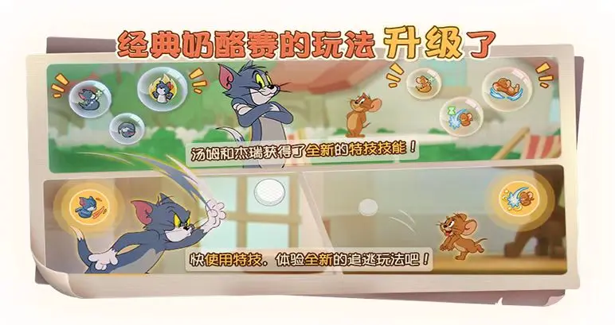

特技玩法宣传图
 

特技是除了主动、武器、被动之外的额外技能。

特技在10级且高级学业开放，且10级时只拥有少量特技技能，随账号等级提升数量。

也就是说，账号等级越高，特技搭配玩法越丰富。老玩家可操作的空间就显得较大了。

例    朵朵2被动＋冰冻保鲜，可以在火箭上方释放特技，用一秒左右的无敌时间救援队友

### **3.2 BP    [大师学业]**

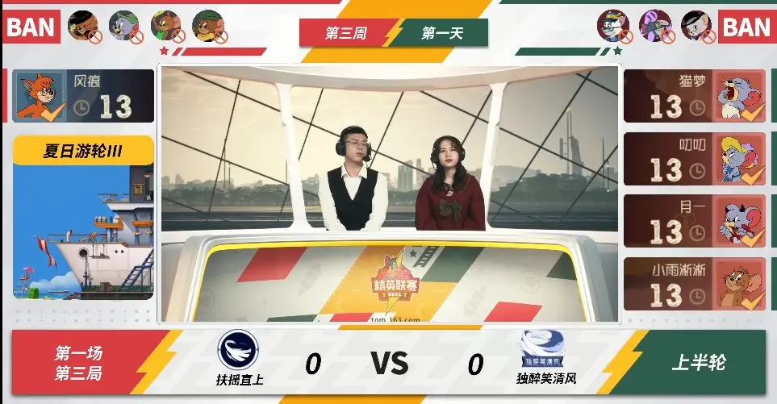

职业选手在BP环节[3猫4鼠]
 

BP    全名**ban ＆ Pick，又称巅峰对决、ban选；**

**以下是ban选类型&你何时遇到这些ban选**

1猫2鼠    钻石天梯

2猫3鼠    原猫鼠皇（现传奇）及其以上天梯

0猫1鼠~2猫3鼠    职业比赛**淘汰赛**阶段

1猫2鼠~**3猫4鼠**    职业比赛**决赛**阶段

​		*普通玩家可以在房间模式体验3猫4鼠

**我们发现，段位越高（≈技术越高）ban位越多，那么，你的ban选组合就更丰富，战术更多元。以下是一些运用广泛的实际例子：**

在1猫2鼠的ban位中

鼠方可以ban苏蕊，用控制角色反制库博*

猫方也可以不ban马索尔，用苏蕊克制马索尔

在森林牧场的2猫3鼠中，鼠可以不ban库博*（传送点不佳）而留一个ban位给侍卫，第二个ban位给苏蕊，另外选2个女角色，用阵容ban塔拉

*2023.2.7注 这种ban位当前不适用，但其中原理类似，请读者加以迁移

**这些例子种类多样，实战运用广，充分体现了老玩家的经验丰富与智慧。**  

### **3.3 局内商店    [大师学业]**

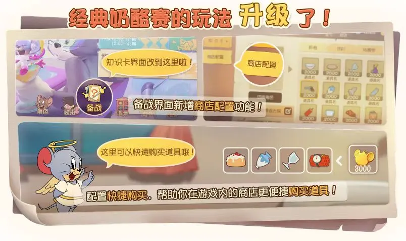

局内商店宣传图
 

局内商店，在大师学业开启，天梯到达铂金3后开启。

可以在游戏中通过正向行为（例如推奶酪，抓老鼠）获得代币。

而这可以让猫鼠双方“要道具有道具”，至于如何利用的问题则交给玩家自行发挥了。

			<!--块级封装-->
    
	<!--将图片和文字居中-->
    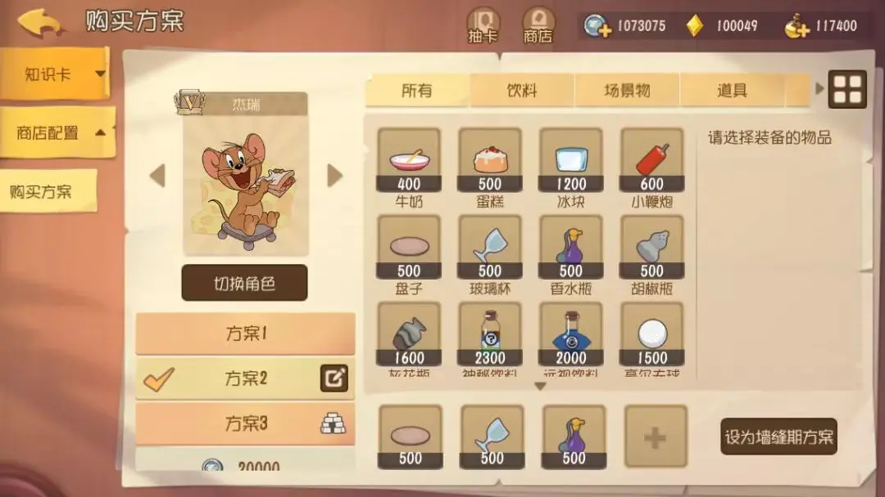
     		<!--换行-->
    商店购买方案组合丰富多样，可操作性广	<!--标题-->
    

就道具分配而言：

　　奶酪期    鼠方可以买道具拦截，猫方可以用护盾药水反制或购买火箭换绑

　　墙缝期    鼠方可以买比利和果盘等道具破墙，猫方可以用修理锤和泡泡防守

就猫方的金钱分配而言：

　　前期流的猫可以倾向于奶酪期购买药水、拍子获取节奏，购买火箭获取有利地形便于防守；  

　　后期流猫可以在墙缝期购买兴奋药水和修理锤、泡泡机等。

**这些搭配种类多样，在商店配置中调整，对实战帮助巨大。**

## **四、角色**

### **4.1 角色本身**

在视频中，我们提到了**新玩家对应老角色，老玩家对应新角色**。那么，新玩家为何玩不了新角色呢？

  

#### **4.1.1 理解角色介绍**

角色介绍，细分为技能介绍，数据面板，定位，角色教学，我们逐一解析：

##### **4.1.1.1 技能介绍**

首先看两张图：

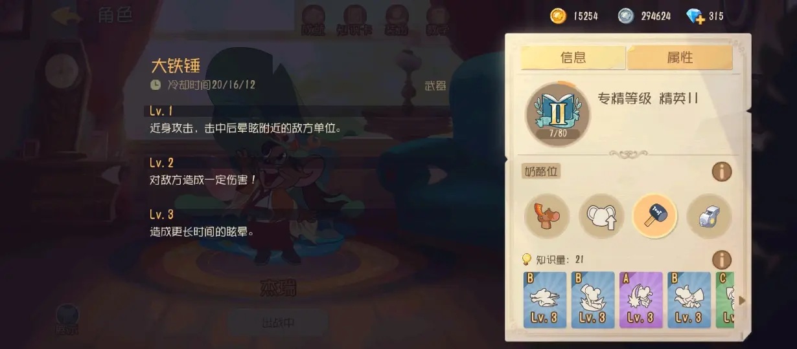

杰瑞大铁锤技能介绍
 

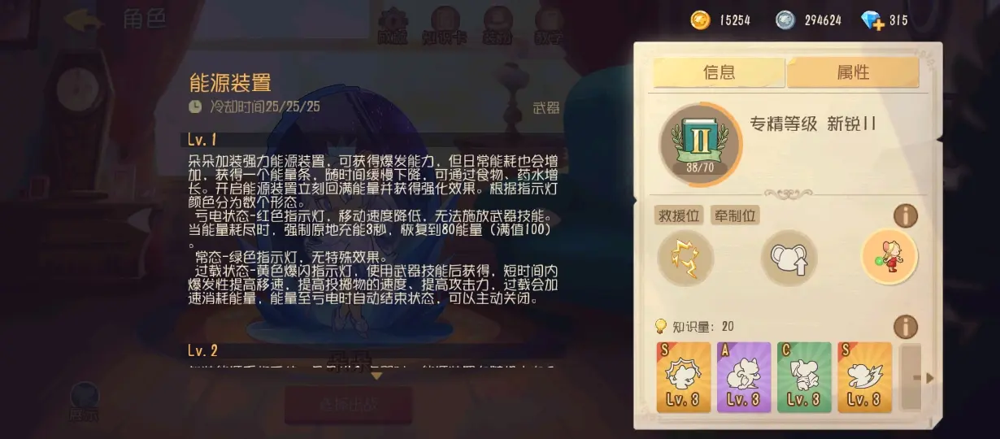

朵朵能源装置技能介绍
 

**请问：这两个技能介绍，你更愿意看哪一个？**

一般性是前者。前者更简单易懂。

技能介绍的确是简洁为好，网易的技能介绍常被人吐槽“阅读分析”。

　　但新角色技能机制确实比老角色复杂，需要更强大的理解能力和游戏经验，新玩家没有这个能力去理解的。**理解繁复的技能介绍是对老玩家的要求**。只有看熟这些角色介绍，对他们的基本机制有所掌握，才可能在接下来的练习中走向正确的方向。

##### **4.1.1.2 数据面板**

类似的，角色介绍里面有各项数据。

通常认为这些数据都是图一乐，但是这些数值属于“评估值”（就是策划给它们打的分数）可以大致了解这角色擅长什么。

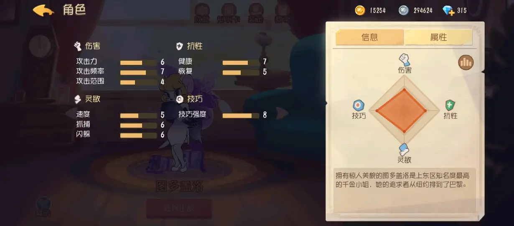

图多技能介绍
 

例如图多数据面板，可以看出她主要依靠爪刀获取伤害（别杠，你喷香水也是要挥爪刀的，没有人会一整局只用香吻击倒老鼠）。

值得注意的是“技巧”一栏：一般性认为，技巧强度越高，越需要技术（不一定是练习提升的硬性技术，像决策判断等隐性技术也是包含在内（例如图多盖洛））

  

##### **4.1.1.3 定位**

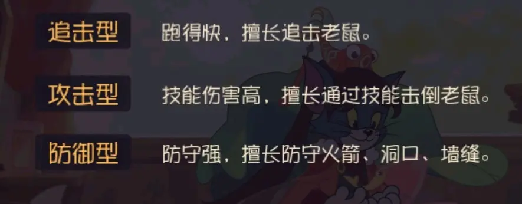

官方对猫的定位
 

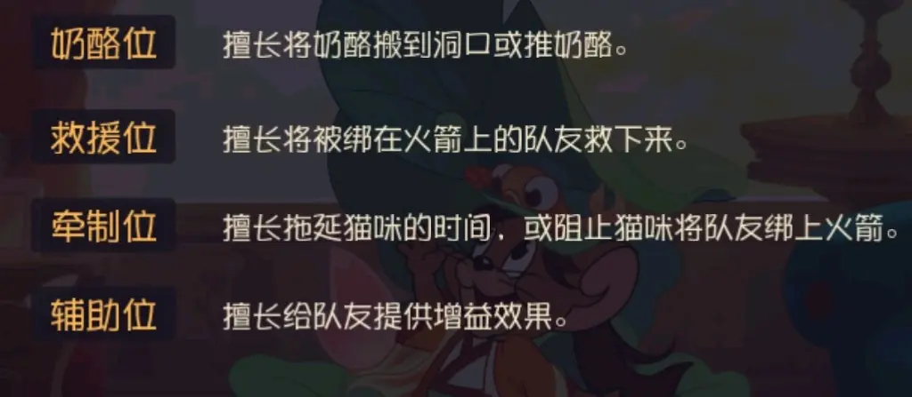

官方对鼠的定位
 

除了“信息”栏中，猫的“追击、攻击、防御”；鼠的“奶酪、救援、牵制、辅助”表示其定位外，也可以在“精灵”里提问相关角色，知道它们的擅长内容。

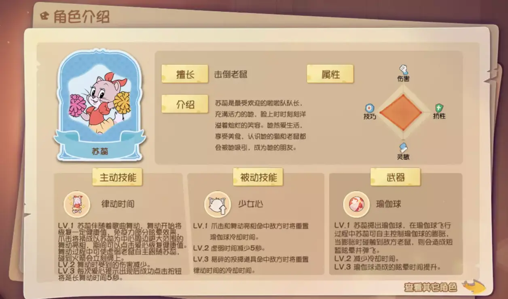

提问“精灵”“苏蕊”时回复的内容
 

例如这边的“擅长”就变成了击倒老鼠，就比前面的“定位”精确多了，参考性更强。

（很明显，官方对角色的定位还是较为模糊，所以看“擅长”更清楚）

  

##### **4.1.1.4 角色教学**

即使老角色的介绍简单易懂，也架不住某些新玩家是“松饼脑袋”。

> 猫鼠玩家的差距是客观存在的。
>
> **——《意识养成课·正片1·差距》**

不过，网易也是有角色教学的：

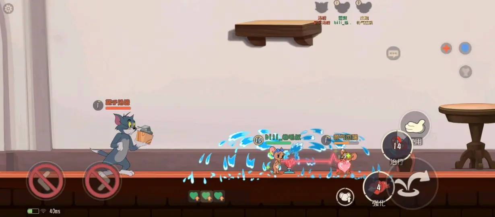

雪梨角色教学
 

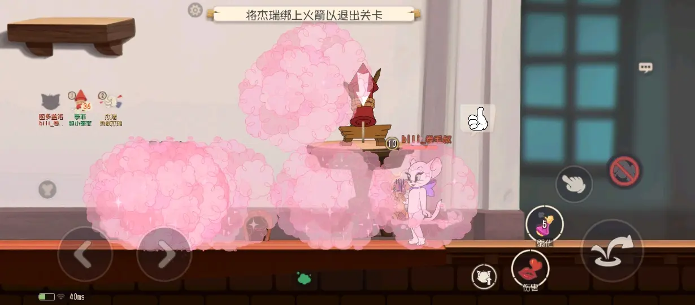

图多盖洛角色教学
 

鼠方的雪梨、猫方图多盖洛以及在她们之前出的角色都是有角色教学的。且教学内容均为第一武器。

简单的说，新武器和新角色是没有教学的。准确的说，没必要。~~（策划太懒）~~

  

##### **4.1.1.5    一些现象**

有些老玩家，对这些角色介绍有强烈的排斥情绪，认为浪费时间。另外有些老玩家虽为老玩家，但是对这些角色介绍有强烈的畏难情绪，新角色一出，他们是等各大up发解析视频，而不仔细阅读介绍，自我思考。

角色介绍即使很繁琐，废话很多，你也得坚持把它看完。就像是课本上的知识点，你连这些知识点都不知道，就去听课外的那些二级结论和“大招秒杀”，可以说是【【本末倒置】】。另外，别人讲给你听的和你自己想出来的，根本就不一样。
**而且，你连技能介绍都不认真看，你这叫懂这个角色吗？这点困难你都畏惧，能指望你认真练习这个角色吗？？**
从外部看，人非圣贤孰能无过？难道你能保证你看的up都不犯错误吗？所以作为老玩家：

*   1.要思考，别人的玩法什么的都是仅供参考，坚持自认为对的东西；

*   2.要积极学习了解别人的玩法，抛弃自身的偏见和不佳的玩法。

*   **这两项并不矛盾，可不要混为一谈了。**  

  

#### **4.1.2    价格*仅考虑金币购买**

先出的角色价格更低，往往是这样。

新玩家资源有限，没法买贵的角色，便宜的角色反而价廉物美。

  

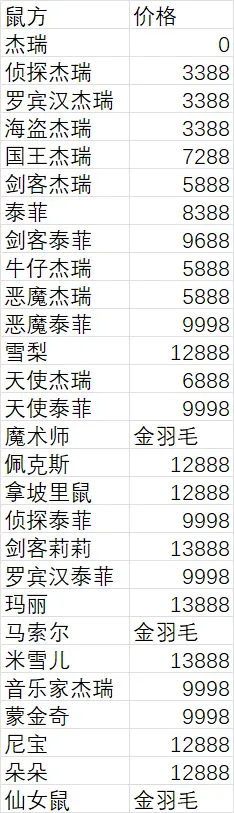

鼠方价目表
 

  

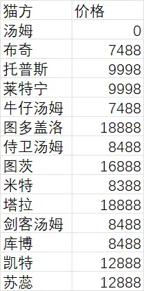

猫方价目表
 

根据这些，易得下面两个图表：

  

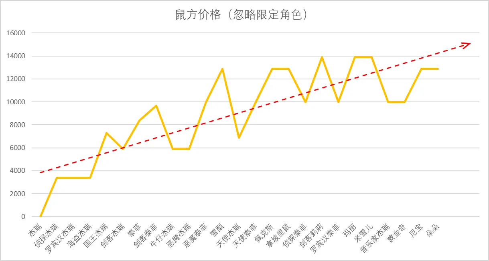

鼠方价格走势（红色为趋势线）  
 

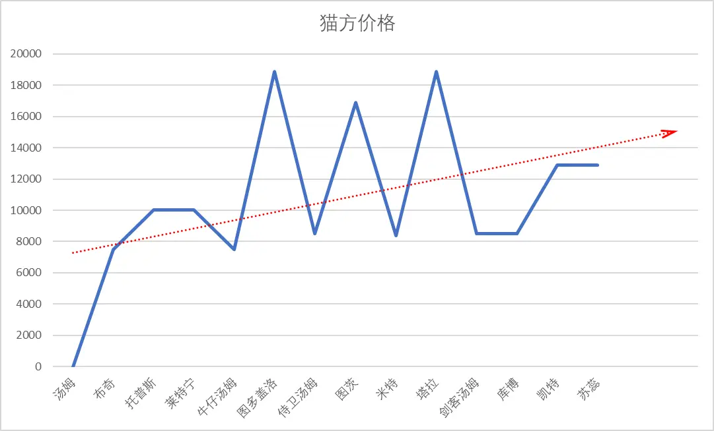

猫方价格走势（红色为趋势线)
 

我们可以观察到：猫鼠双方角色的价格都呈上升趋势，猫的角色均价较高，（鼠均价9047，猫均价**10661**）且鼠的上升趋势较大。

这是由于网易的老的鼠角色价格较低（参考侦探罗宾海盗3388三人组），猫的价格一开始就较高。

我们可以推断：网易在分配上更倾向让新玩家加入到鼠阵营，**这为鼠阵营强大提供了玩家基数的基础**。

> 削猫强鼠是策划一直以来长期的任务。
>
> **——《意识养成课·正片3·敌我平衡》**

### **4.2卡组**

#### **4.2.1    平衡的“去卡组化”并不完全**

以下是部分知识卡的修改情况

|          细心          |            蓄势一击            |       无畏        |
| :--------------------: | :----------------------------: | :---------------: |
| 2019.7.18 3/2/1（B级） | 2020.1.19 25/20/15（不可打断） |  2018.7.25 3/5/7  |
|     2019.8.1 9/7/5     |       2020.8.28 17/15/13       |  2020.5.22 5/6/7  |
|    2021.5.4 10/8/6     |       2021.9.24 16/15/14       | 2021.9.24 6/6.5/7 |
|   2021.9.24 7/6.5/6    |                                |                   |

在视频中我们知道了：知识卡**等级对游戏平衡影响逐渐减小**。不过，并不是每一张卡都这样的。以下举2个典型例子：  

##### **4.2.1.1    屈打成招**

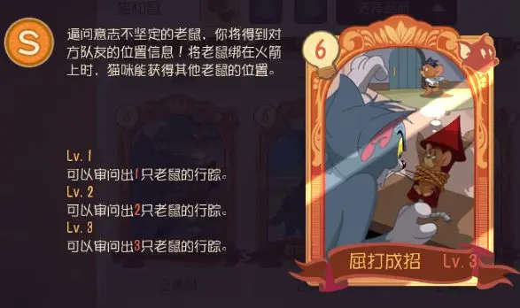

肉眼可以看出，Lv1和3是**完全质变**的。Lv3相当于全场透视。而且，无法通过数据调整屈打各等级的差距。

不然，你告诉我“可以审问出**2.5**只老鼠的行踪”要怎么表现呢？？  

  

##### **4.2.1.2    回家**

  

回家

其中质的飞跃出现在Lv3，两层护盾。相当于加强版第五人格“大心脏”（在他们的游戏中是必带）  

所以，我们可以看出，猫鼠的“平衡去卡组化”并不完全，仍然有部分卡组依赖等级。

**老玩家可以充分利用这些卡组等级差距大的知识卡，发挥自己的卡组优势。**

#### **4.2.2    卡组与流派**

        流派又叫战术。卡组的搭配是为了配合战术，而战术的实行需要恰当的卡组。两者相辅相成，当然，特殊情况下可以实行与卡组相反的战术（例如携带铜暴卡组前期4飞。）
    
        在以下出现的卡组搭配都是较为公认的，艺术卡组、未被广泛认可的暂不考虑。以下卡组不作为你搭配卡组的依据。**如果你和该部分的意见不一，以你的为准。**

##### **4.2.1.1    汤姆和杰瑞**

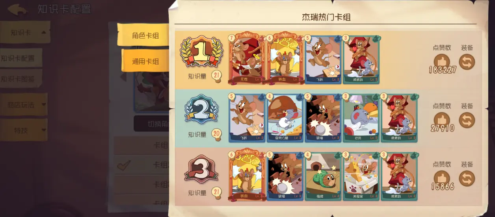网易推荐的杰瑞卡组搭配

知识卡搭配是每个角色都能碰见的话题，一个较经济便捷的解决方案是用推荐卡组（如上图）  

对杰瑞而言，但常用的“6663”卡组却并无呈现。

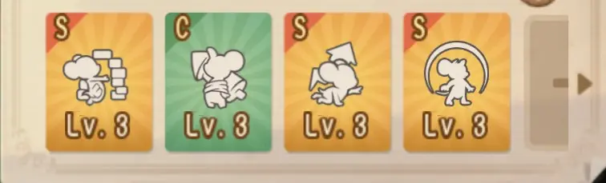杰瑞的“6663”卡组

  

从猫方看，就说汤姆，6663倒是在推荐卡组内：

汤姆推荐卡组

不过，“776”呢？  

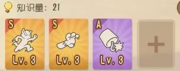

汤姆的“776”卡组
 

由此，官方给的卡组推荐依然是“仅供参考”。既然官方不太靠谱，那玩家只能自己砥砺前行。在老玩家们的努力下，**很多角色的卡组呈现越发****多元化，不再“一家独大”，“万能卡组”不再吃香。**

##### **4.2.2.2    库博**

一个卡组对应一个流派，而一个流派下属有很多个卡组。

例如库博主要分3个流派：

**前期流**    蓄力＋熊燃＋8费

**天堂流**    蓄力＋渊博＋7费

**铜暴流**    铜墙＋暴怒＋7费

​	  在上面3个流派中，前两项是主要知识卡，通常出现S卡或熊燃。

​	  最后一项“x费“则表示灵活知识卡，主要起辅助作用。例如在前期流的“8费”中可以带细心＋心灵手巧，也可以细心＋猫液，甚至可以只带知识渊博。

##### **4.2.2.3    图多盖洛（仅考虑第一武器）**

图多盖洛（香水）本来就是个靠守火箭守奶酪维持生活的，所以流派不是很重要，因为打法差不太多。大体上都是抓老鼠，喷香水，守火箭；抓不到老鼠喷香水，守奶酪。**不过，不同卡组往往会造成有些不同的效果。**

**铜墙**    3级香水要什么暴怒

**渊博**    更快升级到3级香水

**击晕 **   你救不下队友的

**熊燃**    在前期放飞老鼠总比在后期扯皮强多了。因为鼠推奶酪要在一个指定的地方（洞口）才能完成，砸墙缝却可以远程输出。

所以会有渊博熊燃，击晕熊燃等卡组，少部分的还会带蓄力。那都是S3的打法了。

或者，你说：小孩子才做选择，我前后期都要！那就出现了铜墙＋熊燃，细心守奶酪必带，剩下五费就有人带了个恐吓。

笑死，根本推不动。

  

##### **4.2.2.4    苏蕊［重要］**

**广义上认为，苏蕊流派有以下2个：**

**前期流**  击晕＋熊燃＋7费

**铜暴流** 铜墙＋暴怒＋7费

各位是老玩家，铜暴下限高上限低，没什么要说的，就说说前期流。

我在2021.11,苏蕊出现的2周内，开发出了屈打成招的前期流，颠覆了”前期流“击晕的限制。

详见该视频”入门篇plus“：

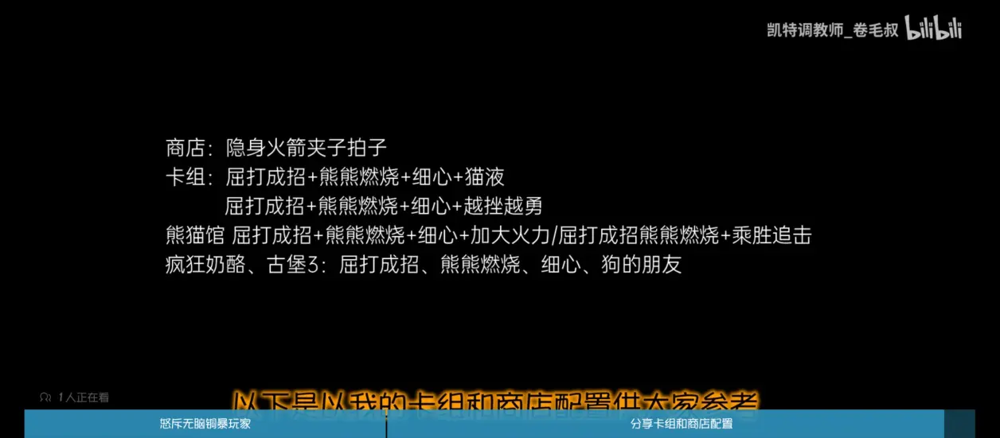

视频截图
 

时隔5个月，2022.4.1，我在《意识养成课·支线1·苏蕊常见误区》又提到了卡组问题：

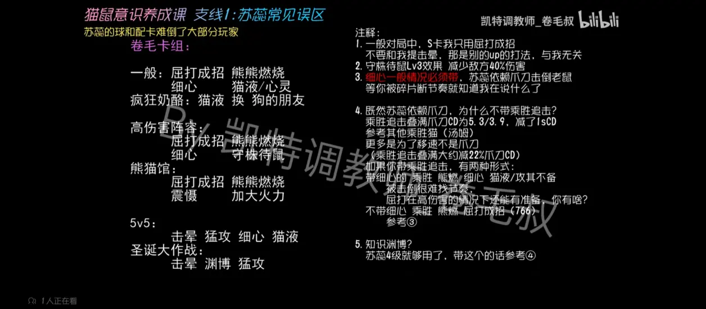

视频截图
 

一石激起千层浪，我用了5个月的卡组，瞬间就成了众矢之的。

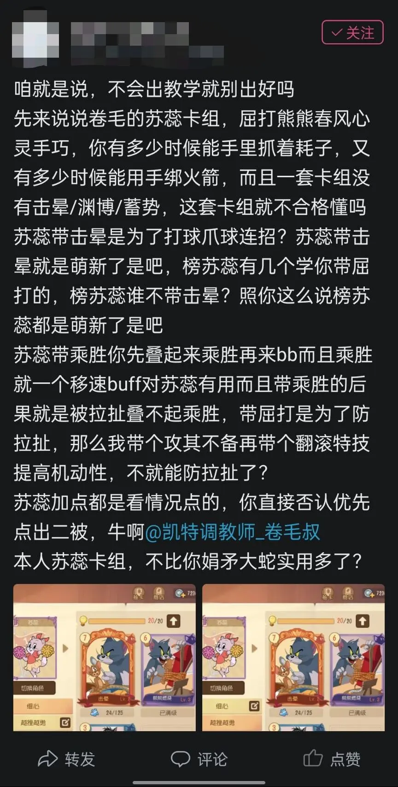  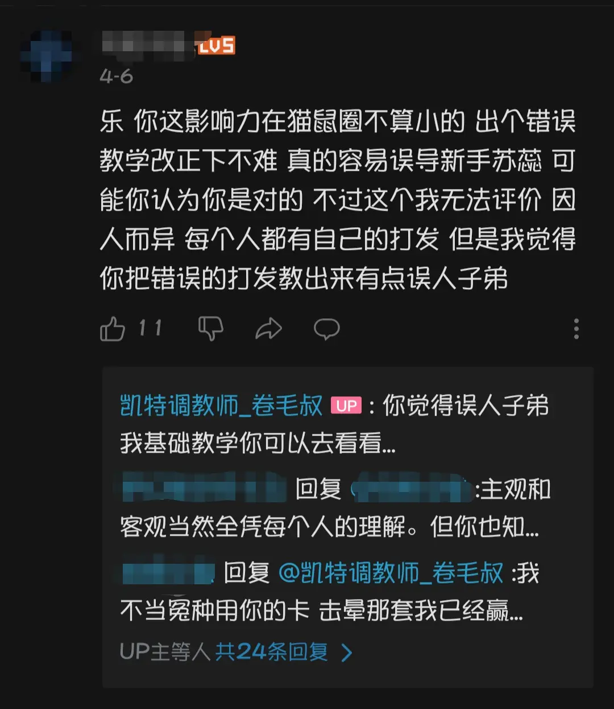

（上图的动态和评论是分开来的！！）
 

**我在这姑且不重复我卡组的意义了。我们从宏观意义评价这样的行为：**

在4.2.1.1我们知道了：**卡组逐渐呈现多元化。也就是说，打法不再有唯一的标答，都是开放性的。加点灵活、带卡灵活。绝不是一家独大，一个人说了算的。**

**他们对新兴的打法完全否定，这种行为原因可能有三：**

1.唯大up是从，（击晕卡组是大up们的玩法）唾弃我这样的小up。表现了他们的**盲目性**

2.他们停留在”猫带卡，击晕蓄力渊博，三选一“的时代。表现了他们的**版本局限性**。

3.一点都听不进别人的任何打法。表现了他们性格刚愎自用，表现了他们的**性格局限性**。

某大UP用了我这套卡组，输了，然后屈打苏蕊就被贴上了”没前途“的标签。他们抛弃了**我这个流派需要****长期练习的事实。**假使效果这么立竿见影，不就有很多人在用吗？早被削了！

**你以为这是流派的良性竞争优胜劣汰？实则是不同的以up为核心的粉丝群体之间的勾心斗角。**

**如今，猫鼠的格局正在向着多极化发展（换个说法叫百家争鸣），如果在这种情况下寄希望于单一打法，单一up，单一卡组，那么一定会翻车。**  

**也不要在评论区争论苏蕊卡组的事情了，能明白我打法的总是能明白的，不能明白的就随他们去了。**

### **4.3    武器**

剑菲的两个武器
 

#### **4.3.1    成就系统**

我们知道，第二武器需要在角色的“成就”积分到达80才能获取足够材料解锁一个第二武器。**成就系统需要在角色专精到达“新锐”且等级11级开启。**

在角色成就中，任务分为2个部分：

1.战斗任务（纯靠肝）2.皮肤任务（可以用RMB砸）

**战斗任务**占据75积分，通常涵盖**第一武器的掌握**（例如杰瑞大铁锤命中猫）、**主动技能的运用**（例如罗宾二段跳协助队友逃脱）和**游戏行为的积累**（例如使用该角色胜利x局等）。早期的角色中，战斗任务难度较低。至于像雪梨和天使杰瑞的任务就略显阴间。

**皮肤任务**占据75积分，通常是“拥有该角色1/2/3/4个皮肤”，能获得5/10/20/40积分。但不要忘了，出第二武器的都是较老的角色。他们出的皮肤也非常多（点名表扬泰菲）。所以一般情况下完成皮肤任务不成问题。

**从积分构成看****，单凭“战斗任务”或“皮肤任务”是根本无法解锁2武的。****（2武要80积分而战斗/皮肤都只占了75积分）也就是说：**

**即使你是氪佬，也需要额外练习该角色才能获取2武器。**

**对于0氪党，你只需要1个该角色皮肤就行了**。大不了辛苦点肝战斗任务。如果你连个普通货架上白嫖的B皮都没有，那能怨谁呢？

**结论：根本没必要担心皮肤会造成无法获取第二武器。除非你真的真的，连网易送的白嫖A、B皮都没有。**

  

#### **4.3.2    第二武器**

　　第二武器利用率较高的现象**很普遍**。这是由于它们更适应版本现状，能应付灵活多变的情况。例如布奇的旋转桶盖，CD短、控制强、效果好。有了它几乎没人会再去用第一武器。

　　但这并不意味着第一武器一无是处。例如国王权杖，遇见图多盖洛就考虑携带。还有一些绝活哥，例如杰瑞大铁锤和泰菲大炮的跳放。

　　有一些角色是第一武器和第二武器**五五开**的，这要看情况。例如剑客杰瑞遇到苏蕊或莱特宁倾向格挡，而遇见塔拉则带剑舞华尔兹主动出击。

　　第二武器**搁置**的情况也比较多。例如罗宾汉杰瑞的登山飞镐、图多盖洛魅力甲油¹。特殊情况下，例如面对5v5时，图多指甲油较香水优势大。而且经过一段时间有效练习，能打出出其不意的效果。

注释：¹该文章写于早期指甲油的时期。现版本，经过加强的甲油已经成为了高下限低上限，强度类似于香水流的“追击类角色”。

>各个武器、角色风格迥异，擅长不同。
>
>**——《意识养成课·正片5·友方平衡下》**

**这不仅仅在鼠的友方平衡适用，这条规则猫鼠双方都通用。这无疑给我们更多的选择与搭配。我们要牢记这句话，日常中对它们的特点充分了解，才能在实战表现的更灵活多变。**

五、总结
----

### ★★5.1老玩家发展模型

如果**用纵轴表示技术（Top），横轴表示时间（time）**

把time=0时视作庆典季第一天，有2个老玩家同时入游戏，用绿色和黄色曲线表示他们发展的过程。从S0~S12，他们的t-T图像如图所示

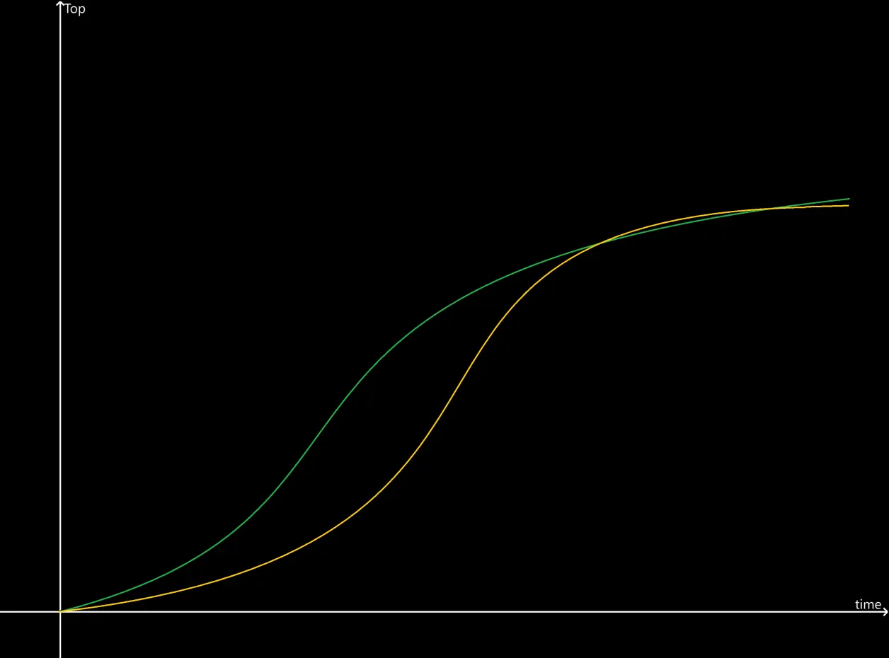

2个庆典季老玩家的t-T图像[图像最右端横坐标为S12]

**黄色曲线表示的玩家叫小黄（和图茨无关）****绿色曲线表示的玩家叫小绿**

我们依据**(即下图红色箭头，绿线与黄线的竖直距离)把图像用4个点分成3段**

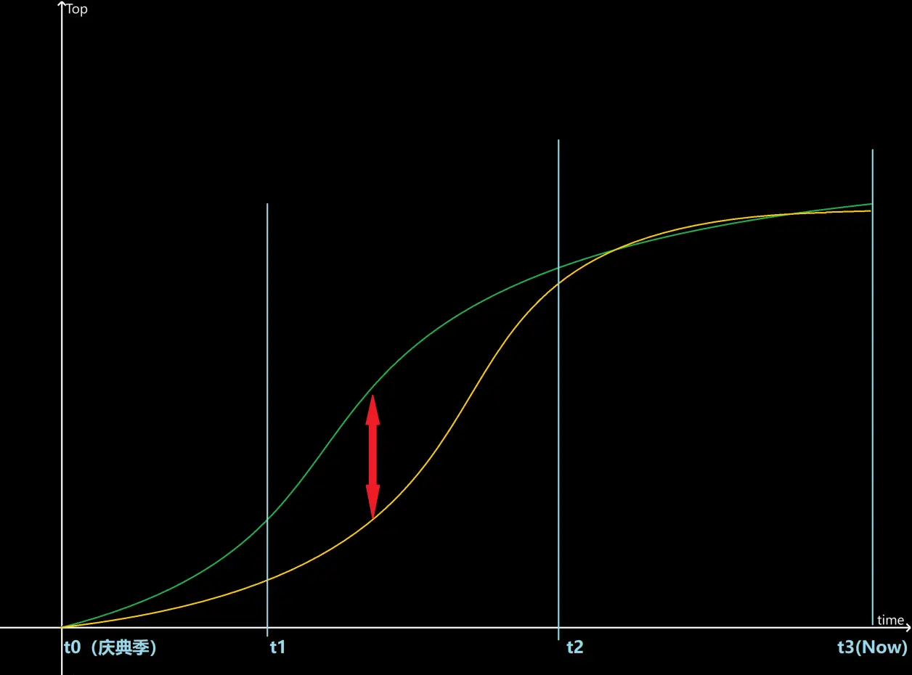

把这图像分成三段
 

我们一段段分析：

当t0~t1时：刚入游戏的小黄小绿差距不大，尚未搞清楚猫鼠机制，此时不可以导入过多过复杂的游戏机制。对应的，庆典季的游戏机制也很简单，**胜负也不在乎，没有成型的技术，而是随意打一打；**

t1~t2：小黄小绿已经入游戏一段时间了。由于自身的思想差距，对游戏的理解开始分化。这时各种各样的小图也开始出现。但总体不太复杂，**靠现有的较简单的机制可以拉开差距；**

t2~t3经过了长期发展，小黄小绿逐渐到了瓶颈，他们的技术也差不多，几乎是重叠在一起了。很多的这样的“小绿”和“小黄”打排位天天撞一块，**每次都是五五开，那他俩就近似相同了，无法对他们进行高下的区分。**

**所以，老玩家之间要适当放大差距。**那么，要怎么把他们区分开呢？

　　要想区分玩家，拉开差距，就需要提升可操作性。首先可以**让玩家的决策变得更多**：例如增加角色数量，增加特技，增加商店模式，将地图面积增加等。其次是**增加决策难度**：推出强度不明显的角色、卡组，使玩家不容易做出正确决定。

　　这些拉开差距的举措，犹如“放大镜”放大了小绿和小黄的差距，**放大了很多玩家在战术、意识上的漏洞。**
　　不难看出，**有很多玩家没能跟上版本脚步**，很多玩家森林牧场打猫，猫输；打鼠，鼠输。又因为人对失败记忆更深刻，所以骂牧场的人不在少数，**这就是牧场人送外号“策划墓场”的本质原因。**

> 猫鼠只有胜负两个游戏结果。
>
> **——《意识养成课·正片2·胜与负》**

　　如果你想不通，有个更简单的办法：如果你看到的人全在骂森林牧场，说明他们都输的多，那就很奇怪，输的人多，那么到底是谁赢了这些玩家呢？很明显，**有多少人输的精光就有多少人胜的流油****。你没看到罢了。**那显而易见，如果你觉得你打大图，玩猫玩鼠都很吃力，一定是你/你的团队技术有一定问题。

　　类似的，商店模式对两边都是公平的，如果你觉得商店模式让你打的有些乏力，那是你的策略出现了问题。

　　如果出现了面对新版本、新玩法、新机制束手无策的情况，还是冷静下来思考自己的打法，想想有什么需要改进的。而不是拿起键盘，开始一顿喷，带节奏。

  

### **5.2 新玩家难以顶替、难以取代老玩家的游戏地位**

回到视频末尾的新老玩家t-T图像

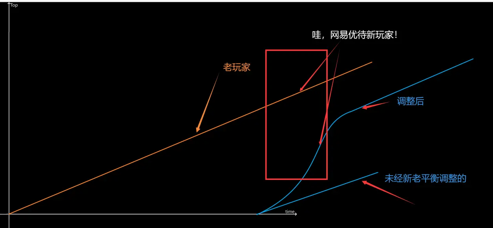

新老玩家t-T图像
 

对于“网易不把老玩家当人”的解释有2：

1.网易对新玩家的福利数量较自己以往的都高

2.网易对新玩家的福利会动摇老玩家的地位

对于解释1，他们的视野只包含图上红框的范围，没能看到全部情况，我不予置评了。我只希望他们能看到我的解释，把视野拓宽些。

对于解释2，从图上看，根本不用担心新老平衡的调整会使得新玩家顶替老玩家的位置。因为新玩家经受不起“放大镜”的检验。

有些老玩家无法跟进版本，他们将何去何从？
 

但如果某些老玩家（橙色线）不积极向上反而成了常值函数开始消极（黄色线），或以老玩家自居而傲慢不羁呢？那你会不会**被后来者取代**，我就不得而知了。

  

### **5.3新老平衡前景**

新老平衡的关键要素不在于新玩家，他们一无所知。不在于策划，他们想尽了办法。而在于老玩家是否愿意接受。

推广到整个游戏，猫鼠的兴衰已经不是由策划掌握了。**猫鼠的命运掌握在我们所有人手中。**希望各位老玩家们砥砺前行吧。

  

-END-
 

  

# **6.2 新老玩家是否真的处于同等地位？**

本文作为《猫鼠意识养成课 · 正片 6· 新老平衡》的补充内容的**第二部分**

请观看完**《序》~《正片 6》**的视频再阅读，否则会难以理解

一、新老玩家的性质决定对待方式
---------------

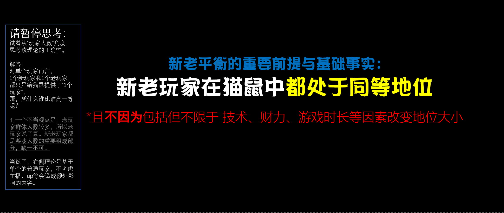

　　在《意识养成课 · 正片 6· 新老平衡》的 1:50，我提出了 “**新老玩家在猫鼠中都处于同等地位**”，这是基于玩家人数的属性决定的，也是在单个玩家的情况下得出的结论。就像无论是插班生还是其他学生，都是班级里的学生，一个也不能少。
　　扩大到群体上，这套理论似乎也说的过去。就像老玩家是玩家群体的主要组成部分，新玩家是 “重要组成部分” 一样。并不是因为新玩家非 “主要” 就可以抛弃新玩家，并不是因为老玩家”不重要“就可以怠慢老玩家。这是相辅相成的。  　　
　　既然两者都需要，就要从官方的角度考虑，他们对**网易**有怎样的正面意义。

 **老玩家**代表着游戏的核心风评，有人蓄意攻击游戏的时候老玩家的声音是最权威的。他们和游戏精神共同构成游戏的灵魂。

 **新玩家**代表着游戏的路人缘，在大众眼里的样子个人认为通常由新玩家决定。同时新玩家的涌入是手游收入增加的主要来源，也能增加玩家数量，改善匹配机制，加快匹配速度。[匹配机制将在数据篇解析]

　　那么，既然对猫鼠意义不同，对待方式也不同。不同的对待方式已经在《正片 6· 新老平衡》和《拓展 2· 森林牧场为什么叫策划墓场？策划对老玩家做了什么？》中详细说明了。这里没必要再次赘述。

二、游戏性质决定对待方式
------------

如果按收入来源将游戏分类，有一种是没有氪金上限的，所有投入的金钱都能转化为游戏实力，这种由少数大老板养活整个游戏团队游戏我们称之为金字塔型，大部分页游都是这种类型。

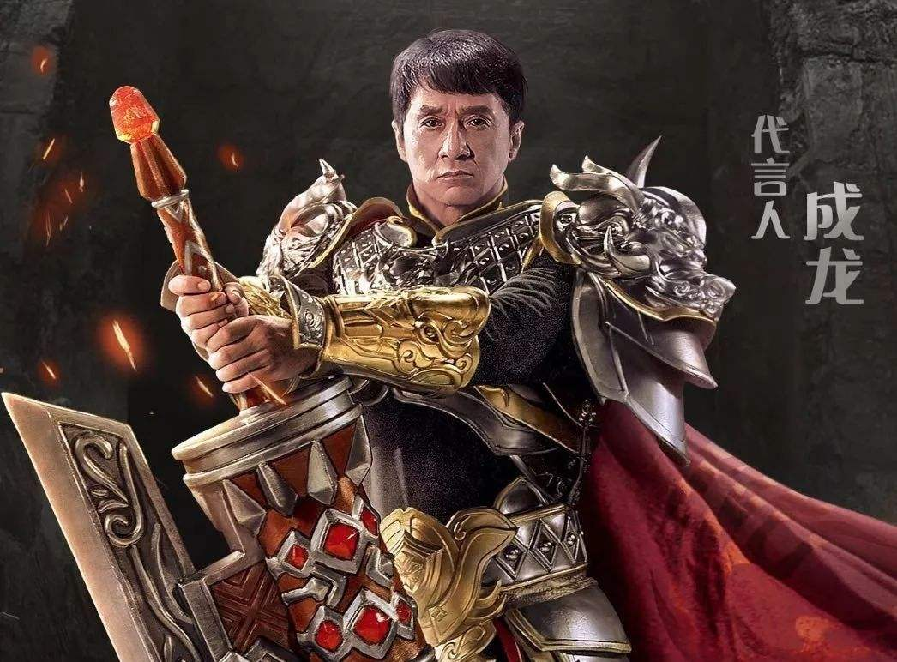

典型的诸如传奇，不氪金就被暴打。由此 “真传奇” 就显得特别火热。  
 

图为成龙代言的 “真传奇” 宣传照
 

　　另一种有隐形氪金上限（集满所有皮肤），且氪金无法影响游戏实力本身，依靠广大普通玩家提供游戏收入我们称之为平民型，大部分手游都是这种类型。那么我们可以发现，猫和老鼠显然是平民型游戏，扩大玩家群体是它的根本动力和行为逻辑，媚新是无可厚非的。

　　只有更大基数的玩家群体才能改善目前的匹配机制和玩家整体素质，才能带动游戏良性发展，增强内生动力。

三、对待方式不同是新老矛盾爆发的直接原因
--------------------

### **3.1 新老矛盾的性质**  

新老矛盾是一直存在的。有以下两条性质：

新老矛盾的实质

**1. 老玩家对于新的游戏内容的需求和新玩家的游戏基础相对固定之间的矛盾。**

**2. 老玩家游戏资源丰富和新玩家游戏资源贫瘠的矛盾。**

这印证了：

> 猫鼠玩家的差距是客观存在的，存在普适性、全面性、扩大性的特点。
>
> 《猫鼠意识养成课 · 正片 1· 差距》

《正片 6》中的一系列举措表明，**策划对新玩家进行了全方位提升。**

动机上：表面上，这是为了改善新老矛盾 [该矛盾不可解决]；主要目的是吸新（这里只提到对新玩家的提升，没有固老）；根本目的是网易公司作为企业的战略，要赚钱。

结果上：导致了新老矛盾的爆发

　　而这为新老矛盾增添了以下性质

 **3. 老玩家获得资源数量平缓与新玩家获得资源数量骤增的矛盾**

矛盾的 1＆2 是新玩家对老玩家的矛盾，但很明显第 3 条是反过来的

体现在实际上，就是老玩家对新玩家的敌对情绪。

矛盾的 2＆3 都聚焦于游戏资源。

新老矛盾是不可以完全解决的。例如，只有氪金渠道获得的高质量 A 皮白送，显而易见，这种做法一定会惹怒花了真金白银去氪金的老玩家。

虽然在实际游戏中这样的现象是存在的，但新玩家并不是受益者，老玩家并不是吃亏者：

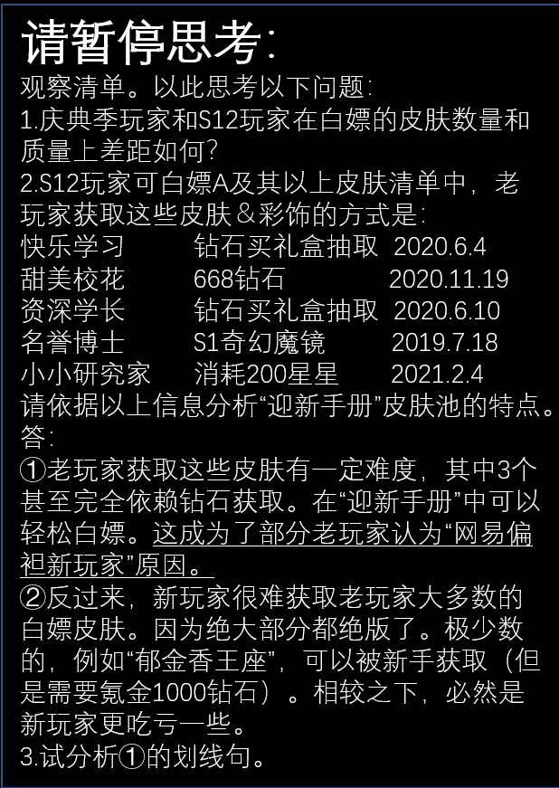

***请思考①与②——（意识养成课 1 正片 6》12:06***

我不得不向大家摆一些事实：

**1. 新手要老玩家嫖的皮肤，得用钻石买！而且不便宜！而且不是每一个都能买！（如上图②）**

**2. 网易早已经对这些用钻石买皮肤的玩家进行了补偿（补偿内容为 50 皮肤碎片，不要觉得皮肤碎片很好拿，你可以用这些碎片兑换其他皮肤，详见下文）**

新玩家白嫖的这 5 个皮肤与彩饰中：  

——小小研究家和名誉博士是 “可嫖可不嫖” 的，没白嫖到不能怨策划 ：

　　前者是 2021.2 在消耗星星的活动中获取，后者是 S1 奇幻魔镜（金币抽取）；当然，现在，你也可以在商城中用皮肤精华兑换 [名誉博士]。  

——快乐学习和资深学长是钻石购买。

　　不过，最近这系列皮肤返场，如果你抽到碎片，可以用兑换券白嫖。**但不能白嫖彩饰。**

**——老玩家彻底无法白嫖的有且仅有甜美校花**

 **但，作为老玩家你，有白嫖的 “白狐少女” 及其彩饰的你要什么这皮肤呢？**

**不得不提一嘴**皮肤碎片兑换券**。靠这些碎片甚至也**可以白嫖其他要用钻石买礼盒抽取的皮肤**（例如天使杰瑞小鸭鸭等、恶魔杰瑞火云大王等。我敢相信在座的老玩家有一些是通过这种方式白嫖的这些皮肤。**

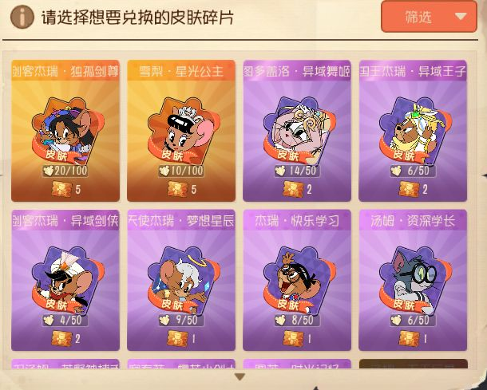

A 皮每个碎片需要 1 个皮肤碎片兑换券 
  

A＋皮每个碎片需要 2 个皮肤碎片兑换券  
 

S 皮每个碎片需要 5 个皮肤碎片兑换券  
 

上图中的 A 皮为一些可以白嫖的皮肤（注：兑换任何级别的皮肤都需要至少一个碎片，且 S 皮需要至少 30 碎片才能开启兑换）

**皮肤碎片兑换券是长期游戏获得的，氪金获得这些碎片的机会也极其少****。**分散在每周的活动中。**新玩家不可能持有大量的兑换券。而老玩家却持有大量兑换券！**

这再次印证了 “0 氪的条件下，游戏时间越长，皮肤越多。”

不过，从游戏资源的稀缺性来说，根据追涨杀跌的定律，你内容越贬值越没有新玩家，越没有新玩家游戏越没有活力，陷入无限自我贬值最终自取灭亡的窠臼。

但这个矛盾是良性的，它会促使游戏作出更新，但随着游戏的更新，只会无尽的放大差距。就像猫鼠增加开局经验蛋糕、增加商店模式、增加特技玩法，这都是大家**很难发现的隐形的老玩家福利**，某种意义上迎合了老玩家的核心利益，即前面提到过的新游戏内容需求，并且玩法更为复杂提高了新玩家入坑难度，使得猫鼠已经成为门槛较高的游戏。除非游戏停止更新但仍然能吸引老玩家。当然，这种游戏是存在的，比如斗地主等。但是对于商业运营的游戏来说，停止更新等于死。这和你送再多的皮肤无关，玩家对玩法内容都不在意了，皮肤又算什么呢？

**3.2 新老平衡的维护的痛点难点在于老玩家**

那这个问题真的没办法解决吗？如果猫鼠想要吸新固老，只能不断迭代玩法，大加大改知识卡、维持一定出新地图的频率、改变原有角色定位等，这种做法才能拉近新老玩家在每个版本的起跑线，才是解决新老玩家平衡的核心。

　　　　 **很遗憾的是，过于激进的修改，会让老玩家完全重新适应版本，会激化新老矛盾。这是完全不可行的。**

**四、新老玩家地位在新老平衡面前有 [明显差距]**
---------------------------

我们刚才看到，对新老平衡的讨论，在改动上是基于新老玩家双方，而改动造成的舆论效果却全部是围绕老玩家。在没改动之前，并没有类似” 网易不把新玩家当人 “的言论。

这说明，**新老平衡在舆论上的体现是一边倒的****。由老玩家占据绝对优势。**

**这意味着，新老玩家在新老平衡面前显然是绝对不平等的。**

**例如在游戏圈子中，较有影响力的那些 UP、主播、战队队长成员往往是老玩家。他们的言论如果都是一个观点，足以改变些什么。**

**新老矛盾一直存在，而新玩家一侧没有爆发，老玩家爆发了，也可以印证上述观点。**

《正片 6》和《拓展 2》都是以老玩家的视角呈现在各位面前，换句话说，这些视频是给老玩家看的。新老平衡的关键要素不在于新玩家，他们一无所知。不在于策划，他们想尽了办法。而在于老玩家是否愿意接受。

五、部分老玩家加剧了新老矛盾
--------------

### **5.1. 大 up 及其观众的影响**

且不说接不接受了。不是每个玩家都拥有思考的深度。能不骂就不错了。

部分老玩家（包括大 up、主播）以此骂策划、骂官方。更有甚者，**手头领着奖励还在表达不满。（老玩家开小号）**

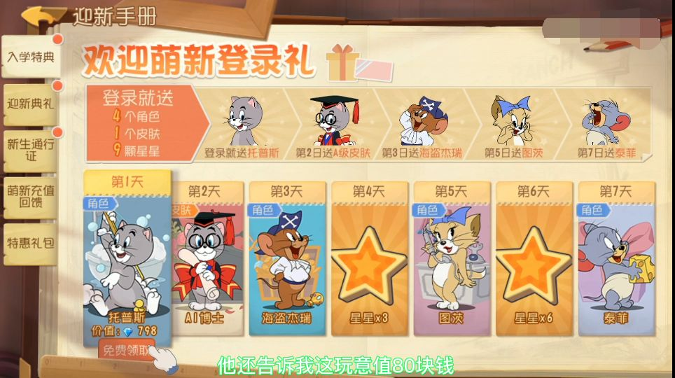

某 up 视频截图
 

up 的影响力是较大的。即使那些 up 没有明面表示，也能造成玩家群体开始跟风” 共鸣 “：

我们作为学习了《意识养成课》的玩家，现在回头看这些评论，就会觉得他们是有些愚昧无知的。

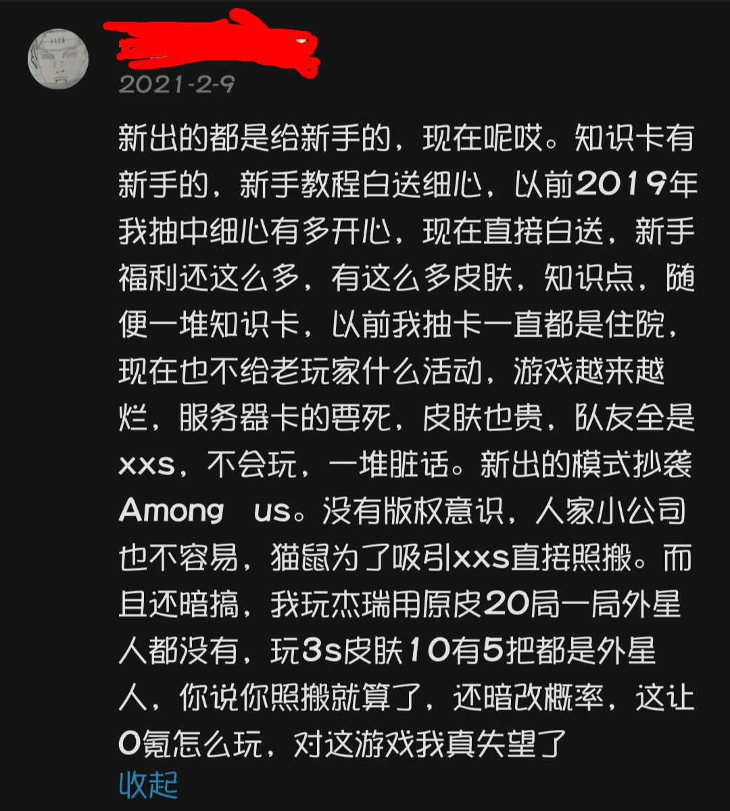

某条评论
 

  

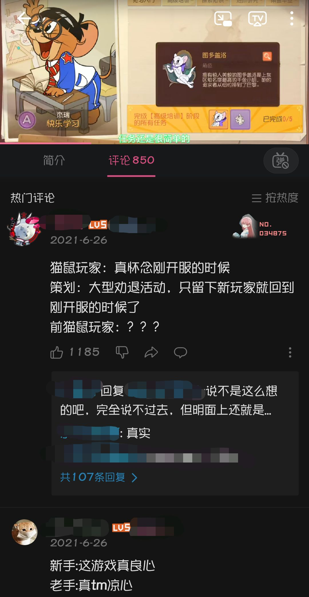

某大 up 视频评论区
 

**当然，这不怨他们，不然我们做《意识养成课》的目的是什么呢？**

### **5.2 部分老玩家片面的炒作大大加深了矛盾深度**

在 5.1 中，部分老玩家，大肆渲染 “猫鼠策划偏袒新玩家”，利用自己树立的名声（老玩家舆论上优势巨大）大造声势，这样的内容传播速度显而易见比理性实际的声音传播快。

例如：新玩家可以白嫖的猫鼠学院皮肤，如果有老玩家通过钻石购买这些皮肤，会获得补偿。

**而颇为奇怪的是：网易对那些氪金老玩家的补偿没有被注意到，“新玩家可以白嫖老玩家氪金的皮肤” 这件事却被无限放大了。**

**某些 up、主播，他们一边端起碗吃猫鼠流量，放下碗痛骂厨子（猫鼠）。天底下哪有这样的美事？！这样的行为之后我们会着重谴责，这里暂时不展开。**

-END-

-------------制作名单--------------  
Made by 意识养成课制作小组：T＆J Savior  
**总编辑＆剪辑： @凯特调教师_卷毛叔 【本文主要作者】**   
数据处理＆分析： @SJTU-XP    
文案优化＆理论： @小薯条有点软    
吊图制作＆素材： @Cipher赛弗
