# 7.外服

必须的前置知识

* [《正片1：差距》](../part.i-current-abstract/1.gap.md)
* [《正片6：新老平衡》](../part.ii-balance/6.-xin-lao-ping-heng/)

## 学习目标

* <mark style="color:blue;">**（B级）猫鼠服务器结构（上）**</mark>
  * <mark style="color:green;">（C级）了解猫鼠服务器的分类，理解内服vs外服的对应关系。知道国服、国际服、日韩服、台湾服的开服顺序及运营地区。</mark>
  * <mark style="color:blue;">（B级）知道3个外服版本内容基本一致。能运用“</mark><mark style="color:blue;">**数据是否互通**</mark><mark style="color:blue;">”来区分不同服务器。</mark>
  * <mark style="color:green;">（C级）初步了解渠道服也是国服的一部分，这将在《先锋与共研》再次提及。</mark>
* <mark style="color:purple;">**（A级）猫鼠内外服务器的对比**</mark>
  * <mark style="color:green;">（C级）知道不同的发展道路促进了</mark><mark style="color:green;">**中外交融**</mark><mark style="color:green;">。能从游戏中找出中国与外国的文化并加以区分。</mark>
  * <mark style="color:purple;">（A级）不同的发展道路造成了玩家的认知偏差，包括平衡、福利、风气。</mark>
    * <mark style="color:red;background-color:yellow;">**（S级）外服平衡**</mark>
      * <mark style="color:blue;">理解外服比国服平衡差的原因</mark>
      * <mark style="color:orange;">了解玩家对外服的“情怀”评价，能</mark><mark style="color:orange;">**类比运用《新老平衡》**</mark><mark style="color:orange;">解释这一现象。</mark>
      * <mark style="color:orange;">能根据实际情况批判国服老玩家以“情怀”为由</mark><mark style="color:orange;">**转战外服、贬低国服现版本**</mark><mark style="color:orange;">的行为</mark>
    * <mark style="color:green;">（C级）知道外服福利比国服差</mark>
    * <mark style="color:blue;">（B级）外服风气</mark>
      * <mark style="color:blue;">知道</mark><mark style="color:blue;">**老凡哥**</mark><mark style="color:blue;">与</mark><mark style="color:blue;">**Kanomatsu**</mark><mark style="color:blue;">的主要事迹</mark>
      * <mark style="color:blue;background-color:blue;">**知道外服的风气差的主要现象：种族歧视、国籍歧视**</mark>
    * <mark style="color:red;background-color:yellow;">**（S级）明白部分国服玩家盲目追捧外服是盲目崇洋媚外的象征，这对国服发展极为不利;作为国服玩家，学习争做自信的猫鼠玩家,努力在猫鼠的新时代提升自我。**</mark>
  * <mark style="color:purple;">（A级）理解不同服务器有着不同受众对象，因此有着不同发展道路及其造成的正负面影响。</mark>
* <mark style="color:green;">（C级）意识到</mark><mark style="color:green;">**国服也存在一定不足,**</mark><mark style="color:green;">但这不应成为玩家批评国服、转战外服的理由。</mark>

## 设立外服是猫鼠在全球发展的必由之路

&#x20;      一款游戏有规模的一大特征是全球发展与运营，全球运营基本依赖服务器的推广，也就是我们所说的“内服、外服”。所以**设立外服是猫鼠在全球发展的必由之路**

&#x20;      网易作为一个中国注册的公司，肯定是发展国服在先，再推广到其他国家。但受限于网络、政策、审查等不可抗力的因素，无法直接把国服游戏给外服游玩。所以对猫和老鼠手游而言，要全球性发展，就得因地制宜地发展：简单的说，是受众、也就是玩家不同：

## 不同的服务器的受众不同，发展道路各有差异

&#x20;      国服主要对应中国人，外服主要对应外国人——所以衍生出了不同的发展道路。言外之意，不同的服务器的受众不同，发展道路也各有差异。那我们就得区分“服务器”

就现在而言，猫和老鼠共有4大服务器：

<table data-full-width="true"><thead><tr><th width="103" align="center">服务器</th><th width="405">总部地址</th><th>支持语言</th></tr></thead><tbody><tr><td align="center">国服</td><td>
广东广州天河区科韵路16号广州信息港E栋网易大厦

<strong>猫鼠运营于  浙江杭州滨江区网商路599号</strong>
</td><td>简体中文</td></tr><tr><td align="center">国际服</td><td>中国香港特别行政区上环秀萍商业大厦</td><td>简、繁中，英，泰语，印度尼西亚语</td></tr><tr><td align="center">日韩服</td><td>中国香港特别行政区上环秀萍商业大厦</td><td>英、日、韩</td></tr><tr><td align="center">台湾服</td><td>中国台湾省台北市大安区罗斯福路3段26号6楼</td><td>繁体中文</td></tr></tbody></table>

国服，国际服，日韩服，由网易游戏运营；台湾服，由恩奕互动娱乐有限公司（运营的大部分是网易的国服游戏）运营。

国服，又叫做内服，_后三个我们统称外服_

区分服务器的标准是数据是否互通

这4个服务器间的数据均不互通

例如你在国服上了双皇，你在3个外服就是没有这记录的

你在国际服上了双皇，在日韩服也是找不到的

国服下属有网易官服和诸多的渠道服，他们的数据是互通的：例如华为、小米、oppo、vivo、4399等的渠道服。但他们都属于国服，只不过用了不同的形式登录罢了

其中我们接触最为密切的是国服。作为中国玩家，由于防火墙的存在，无法直接获取任何一个外服，这为外服蒙上了一层神秘的面纱。部分国服玩家越过重重阻拦“开眼看世界”。

## 不同的发展道路<mark style="color:red;">促进了中外交融</mark>

一天，天使汤姆遇见了2个国服玩家，看到他们在吵架，他前去劝阻。但在听了杰瑞的话后他不免疑惑：外服真的是国服玩家的天堂吗？让我们一同解答他的疑惑

我认为，可以按照周恩来总理“求同存异”的方针来看

相同点上，他们作为猫和老鼠手游的不同服务器；基本玩法，战斗流程，规则都是一致的

所以如果你国服玩得好，从理论上说可以无障碍的接轨外服，反之亦然。

然而，国服、外服之间虽有大同但存小异；且3个外服的所有内容几乎一致，就把他们当做一个服务器说

国服与外服的差别是由于发展道路不一致导致的。这带来了较多的好处，其中最重要的是促进了中外交融

我们知道，中华文化博大精深、源远流长；在国服，我们可以观察到大量的中国元素

例如经典之家虎丘（国风）地图、熊猫馆地图，还有基于中国传统神话改编的天宫地图

皮肤上，典型的有

国服S7赛季的武林风云系列皮肤——它们宣扬了坚忍不拔、锄强扶弱的武道；

岁首红梅系列皮肤——为猫鼠增添了一丝诗意。

鱼戏莲系列皮肤——歌颂了江南采莲，春意盎然的场面

以上这些元素它们都或多或少的在外服出现，

向全世界发扬了中华文化，宣扬了我们的民族精神；

而外国文化也向中国传播

首先猫鼠本身就是源自美国的文化

在其中，也有别的文化融合的影子

典型代表是樱花系列皮肤——例如樱之歌姬、浪漫樱花

这些来自日本的文化，或多或少的也出现在国服玩家的眼中

当然，这些外国元素在外服发展的也生机勃勃；以日韩服为首的外服也曾出现过经典之家（樱花）地图，在2023年上架了国服

看到这些，天使汤姆不由得感叹道：猫和老鼠手游中不同国家的文化互相碰撞，真是一道靓丽的风景线！

## 不同的发展道路<mark style="color:red;">造成了玩家理解误差</mark>

在他陶醉于其中的时候，我们需要泼一盆冷水——不同的发展有利自然也有弊！

首当其冲的是造成了玩家理解误差，而且在不同的方面上，这样的误差都或多或少。主要体现在平衡、福利、风气等方面。

### 平衡

<figure><figcaption>
各服务器开服时间轴
</figcaption></figure>

发展时间决定玩家水平，是建设平衡的基础。

最早的一个外服为国际服，开服时间为2020.7.19；对应的，国服公测早了1年左右这意味着国服发展时间也长了整整一年！玩家也得到的更好的积淀。所以就实力水平而言，国服玩家平均水平必定优于外服！

那么他们（外服）的游戏平衡有什么特点呢？可以用[正片6·新老平衡](../part.ii-balance/6.-xin-lao-ping-heng/#xin-wan-jia-kuo-he-lao-jiao-se-wu-qi)的思想去理解：

外服玩家入游戏晚，发展水平低所以其游戏平衡是适用于发展水平低的玩家，机制较简单，容易操作上手。国服玩家发展水平高所以国服游戏平衡是恰好反过来的；由外服玩家编纂的猫鼠wiki中有不少的漏洞、问题，而国服玩家基本熟知，一眼就能看出来。

但国服的发展水平不是一蹴而就的。其内因是国服发展时间长，外因是国服逐渐提升难度的游戏机制，导致的国服对玩家游戏理解的要求也日益提升。

#### _**外服平衡与“情怀”的联系**_

&#x20;      曾经，国服玩家的总体实力也极为低下，尤其是外服还没开服的时候：而这段时间恰恰对应国服庆典季到S2的时间，是某些国服老玩家玩家口中“情怀”的所在。

&#x20;      他们口中的情怀，定义是“对老赛季的回忆”，可以做形容词,表示游戏接近老版本的样子。老玩家回忆老赛季，这是正常现象。但如果一味地沉浸在其中，这就是落后版本的象征。因为随着时间推进，玩家水平提升是无可避免的。庆典季的游戏平衡是适应实力低的玩家群体的。你怀念庆典季可以，但把那时候的平衡系统等等的照搬到国服S12（现已S17）赛季，非但不能解决问题，还会产生更多问题。

&#x20;      所以对于国服，游戏平衡与情怀不可兼得；类似的，外服较国服版本落后，所以比国服有“情怀”。

&#x20;      部分国服玩家不能理解这个就罢了，更有甚者，在他们的口中，情怀已经曲解了、变质了：

①    情怀成为了部分国服玩家盲目追捧外服的借口

&#x20;      现在的外服的平衡系统大约相当于国服在一年前的水平。有些国服玩家过去玩，美其名曰感受情怀，还能帮助外服玩家提升游戏水平。我很难理解：你到底是借着你在国服领先一年的游戏理解在外服虐菜，还是追求情怀？在这一刻，真实情况已经图穷匕见了。

②    情怀已经成了部分up、主播吸流量的工具

&#x20;      有些国服up宣传老赛季比赛、老版本；以此获得老玩家群体的点击率，这本身倒没什么批评的。但是他们中的一大部分是打着情怀的幌子，渲染出一种伤感的气氛，大有物是人非之感；让我们涕泪俱下，不能自已。

&#x20;      殊不知，这些up实质是在鼓动玩家批评谴责现有版本平衡甚至隐藏地向玩家传达退游的信号；这对现版本的猫鼠是极其不利的

&#x20;      如果作为老玩家互相交谈，提到以往赛季，大家都没忘记，那就足够了。真正的情怀是完全不需要大张旗鼓的表现出来的。这是属于老玩家的珍贵记忆，必须防止有些小人将情怀歪曲和污名化。遇到这两种情况必须加以抨击谴责！

总体看，外服与国服发展水平不一，直接单纯比较平衡系统没有可比性。但在部分方面外服做的明显不够好，例如角色获取。

在国服，正常的能用金币购买的角色外，亲友邮局可以通过邮票，抽取金羽毛获取限定角色。外服和国服角色获取方式大致一致，但其例外是马索尔。在国服，你通过长期的游戏经验还可能白嫖马索尔等邮局角色，但马索尔并不在外服邮局中，能且仅能通过1680钻石获取！

类似的情况在国服中也出现了，那就是天使汤姆：定价998钻石，但是依然可以靠活动免费领取。所以国服可以凭借玩家长期努力免费获取所有角色，但外服则完全不能。

再例如知识卡，这个抽卡机制和国服原抽卡机制一样，很容易造成“要抽的卡抽不到，不要的卡抽一堆”。在外服，如果你抽不到，往往只能加大氪金数量获取知识卡。国服不存在这样的问题。由于[《正片6：新老平衡》](../part.ii-balance/6.-xin-lao-ping-heng/#zhi-shi-ka)提到的改动，你可以抽取对应碎片。知识卡获取、升级速度肯定较快。

从这两个例子上说，外服的平衡系统与氪金很密切；也就是说，外服氪金能从角色、知识卡等游戏机制上让你变得更强；而国服氪金则对你这方面的提升肯定也有但效果是极为有限的，用长期的游戏白嫖的奖励是很容易追平那些氪金玩家的所以要侧重于在游戏经验、游戏时长方面的发展。才能让国服玩家变得更强。

在这个方面上，外服平衡要差于国服。

### <mark style="color:blue;">福利</mark>

接下来看福利。我把福利分为3类：以赛季为单位的货架、以周为更新频率的活动、和新手福利

#### <mark style="color:blue;">货架</mark>

我们先来比较国服与外服的货架资源数量。

就以2022.6的国服S12和外服S6为例，他们普通货架和黄金货架的资源数量如图所示

我把他们分成了这么几类：皮肤、知识卡、虚拟货币、其他

<figure><figcaption>
同时期（2022.6）国服S12与外服S6货架资源统计。注意：此处列出的是双方货架都有的资源
</figcaption></figure>

然后，国服的普通货架与外服普通货架对比；国服黄金货架和外服黄金货架对比；将较好的涂成绿色，一样的就是黄色，较差的就是红色

然后，在每一个类别里，分别数一下，国服与外服各自占优格子的数量。除了知识卡打成平手外，其他方面国服均胜出，但胜出的幅度并不大

除了这些国服、外服货架都有的资源外。还有一些资源是对方货架没有的：例如外服的熟练度、国服的人气礼物等。

从整体看，国服货架的资源种类更多样，奖励较丰富。但外服仍在部分方面占优势；例如金币数量、普通货架的扫货币数量等。

***

**那领取这些奖励需要消耗我们多少时间呢？**

外服货架满级300级，国服满级500级；但是，外服没有通行证加速器、以及挑战任务，这大大延缓了外服货架满级的速度。

经过计算，在仅全部完成通行证任务的情况下，国服在第6周到达100级（领取S皮）和第15周到达500级。而外服到达100级和满级的时间是第9周和第25周。

***

**那货架能升到满级吗？**

这还要看赛季长短。国服每赛季14周，外服每赛季18周。国服只要做一做其他日常活动就有活跃度，能升到满级，而外服货架升到满级，较国服而言极为困难。

<mark style="background-color:green;">基于奖励和升级难度两方面，</mark><mark style="background-color:green;">**国服货架整体优于外服。**</mark>

***

#### <mark style="color:blue;">日常活动</mark>

除了货架，还有每周更新的日常活动，这些活动奖励如何呢？基于控制变量法的思想，我提出先对比国服外服类似的活动。具体的比较方法请参考评论置顶的拓展篇内容

国服2021.3有时间旅行活动，而外服在2022.4推出了时光旅行皮肤。

<figure><figcaption>
左：国服时间旅行；右：外服时光旅行
</figcaption></figure>

<figure><figcaption>
资源对比列表
</figcaption></figure>

经过对比，国服在该活动的奖励明显落后于外服，且时光碎片还可以兑换各种物资，尚未计算。是否意味着国服活动就一定落后于外服呢？并不是外服一周一般性是更新一两个活动，而国服要更新一大串活动，分摊到每个活动上，奖励是较少的；这个是国服在活动上的显著问题。

我们应该把外服一周的活动和国服一周的活动进行比较。就选取2022.5.26/2022.6.2的两周活动进行比较：

<figure><figcaption>
左：2022.5.26 右：2022.6.2
</figcaption></figure>

发现这些活动各有优势，但仍然是国服的优势较多；所以，总体上外服活动也略微逊色于国服

***

#### <mark style="color:blue;">日常活动</mark>

首先是国服与外服都共有的萌新登录礼包和新生通行证。接着将其他的新手活动的奖励做汇总

<figure><figcaption>
萌新登录礼包和新生通行证
</figcaption></figure>

<figure><figcaption>
其他的新手活动的奖励
</figcaption></figure>

可以看出，国服新手奖励基本全方位吊打外服

综上所述，国服福利整体优于外服

### 风气

最后说风气

作为国服玩家，我们对自家的风气心知肚明——并不怎么样。外服的风气如何呢？我们采访到了2位重量级选手：

首先是日韩与国际服玩家、前日韩服榜1猫：老凡哥。他因为实力与段位遥遥领先于其他猫，碾压日韩鼠车队，再加之他是中国人的缘故，受到了大量的歧视，被日韩玩家嫉妒与谩骂，一气之下选择退出日韩服！

<figure><figcaption>
老凡哥在日韩服被种族歧视
</figcaption></figure>

其次是著名国际服玩家、画师Kanomatsu。她的作品在外服屡受歧视与攻击、盗用；最终转战B站等中国平台发展。

<figure><figcaption>
Kano在国际服遭歧视攻击与作品盗用
</figcaption></figure>

除去普遍存在的素质人、杠精外，如果国服玩家转战外服，还要增加<mark style="color:red;">**种族歧视、国籍歧视**</mark>等；由此我们可以看出，<mark style="background-color:red;">**外服风气环境较为恶劣**</mark>

## 部分国服玩家盲目追捧外服是<mark style="color:orange;">崇洋媚外</mark>的象征

综上，国服在平衡、福利优于外服；外服在风气上要差于国服；难道外服就这么让我们心驰神往吗？

所以，部分国服玩家盲目追捧外服是崇洋媚外的象征！

就如同现在的某些人，只要套上了外国的标签，哪怕空气都是香甜的。只能说要么他们缺乏对客观事实的判断能力，要么他们的技术太弱，跑到外服去吊打老外了。

听完我们的分析，天使汤姆非常愤怒，转而对那个国服玩家大打出手了。

### <mark style="background-color:green;">外服的优势不可抹灭，需要正视</mark>

但不能说外服在国服的面前黯然失色，其优点是不可回避的。例如外服由于更晚制作，其底层代码更加成熟，导致游戏运行的流畅度比国服高；同样的设备打同样的对局，国服率波动的情况可能比较严重

再有如，外服会出现一些国服没有的画面内容，夏日古堡，经典之家樱花就是典型例子

另外，外服呈现了一定的皮肤优势：

第一点，外服魔镜中能够抽到AP皮肤。外服星海幻影魔镜中，时光梦想师就在奖池中，海盗宝藏之王魔镜也出现类似的情况，在里面出现了碧蓝水手、发条木偶。这些AP在国服往往需要花费近百元购买

第二点，外服的皮肤精华能兑换一些皮肤，但它们在国服需要充值获得

不过反过来，部分国服能免费领取的皮肤，外服也需要购买才能获取。此外，外服能够让新玩家认识到较老版本的猫鼠。我们要正视外服的优点，合理利用。

## 正确看待内外服差异

既然国服与外服差别这么大，我们应该怎么做呢？

### 外服：学习国服，提升自我

对于外服玩家，应该尽快提升自我，要充分认识到外服与国服的发展不平衡不充分，外服起步时间晚造成了外服的水平落后。外服玩家应该积极向国服看齐，向国服的优秀玩家学习先进的打法与思考方式，与国服玩家积极互动合作、友善往来。

对于国服玩家，在对待外服玩家的时候，要发挥礼仪之邦的优良传统。欢迎一切<mark style="color:red;">尊重国服</mark>的外国友人。

### 国服：<mark style="background-color:orange;">做自信的猫鼠玩家</mark>

如今，猫和老鼠的国服正在经历前所未有的变革。在策划组积极的改善下，猫鼠正在转型为技术、娱乐一体的社交型手游。在《猫鼠意识养成课》的大力宣传下，形成了新的理论体系，刷新了玩家对猫鼠的认知。猫鼠正在走向新时代。

所以，作为国服玩家，我们应该做一个自信的猫鼠玩家。

要热爱猫鼠，尤其对国服有强烈认同感。在猫鼠舆论急转直下的时候，能发挥自己的责任感、使命感；能够挺身而出，维护猫鼠手游与玩家的尊严。

要对国服的基础与环境有底气。经过了3年的沉淀，猫鼠国服已经是一个成熟的游戏；拥有一定数量的玩家群体，硕果累累，与中华传统文化相结合，必定能得到更好发展

所以，还要对国服、外服的猫鼠手游的发展都充满信心。这份自信不是妄自尊大，也不是故步自封。在猫鼠的新时代，面对各种打法流派的碰撞和价值观念的冲突，我们需要培育理性平和、不卑不亢、开放包容的心态，而不是盲从权威、盲目追捧；只有这样，才能给猫鼠带来更好的未来。

# 猫和老鼠外服的一些细节补充

本文作为《猫鼠意识养成课 · 正片 7· 外服》的补充内容

请观看完《序》~《正片 7》的视频再阅读，否则会难以理解

通过阅读本文，你将解决以下几个问题：

1.  为什么要做外服视频？外服视频的思路是什么？
    
2.  内外服福利是怎么比较的？具体参照来源是什么？
    
3.  玩家盲目追捧外服的本质原因是什么？
    
4.  视频最后部分 “做自信的猫鼠玩家” 是在说大话吗？
    
5.  3 个外服有什么区别？如何了解其他的外服信息呢？
    

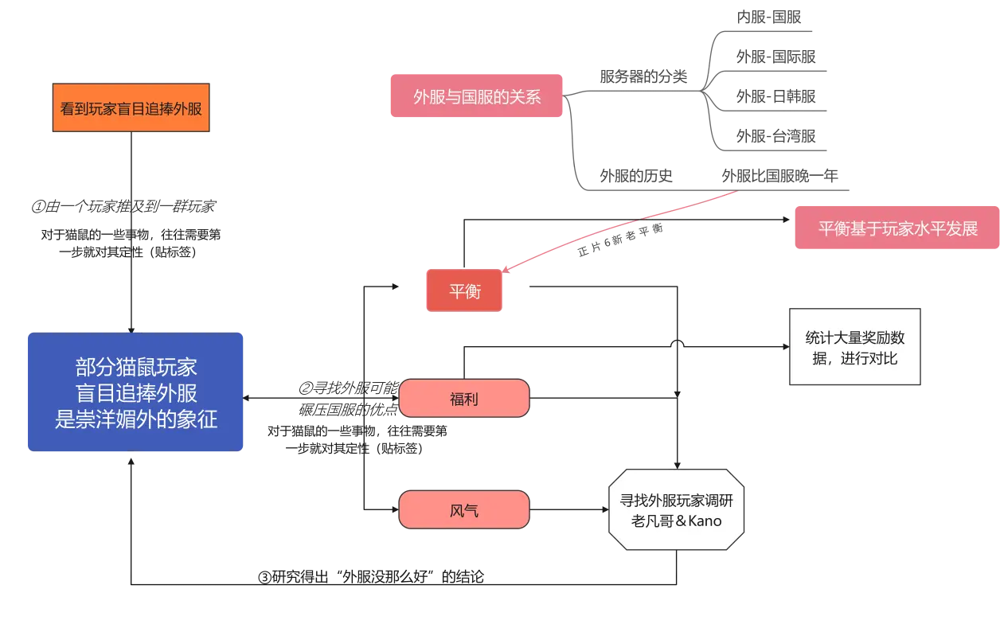图 1

## 〇、Chat GPT对《外服》视频的概括

　　该视频讨论了猫和老鼠手游作为一款全球运营的游戏，其服务器的设置和不同地区的发展道路。由于网络、政策和审查等因素的限制，国服和外服的数据不互通，因此不同服务器的受众和发展道路也有所不同。
　　视频认为，国服和外服虽然有不同，但游戏的基本玩法、战斗流程和规则是一致的，且这种不同**促进了中外文化的交融，也丰富了游戏的文化内涵**。接着作者讨论了国内外的《猫和老鼠》游戏的平衡、福利和风气方面的比较。视频认为，国服和外服有利有弊，不能单纯地对比，而要根据不同的玩家需求和发展阶段选择适合自己的版本。

*   从平衡方面来看，国服发展时间长，玩家水平高，游戏平衡适应实力高的玩家群体，；而外服发展水平低，游戏平衡适应实力低的玩家群体。但国服平衡较为不依赖氪金，因此外服平衡比国服差；
    
*   从福利方面来看，国服的货架、日常活动和新手福利都优于外服；  
    
*   从风气方面来看，视频中提到了国服玩家存在的素质问题，也采访了两位外服选手（老凡哥、Kanomatsu），介绍了外服玩家分别在日韩服和国际服中所受到的种族歧视、国籍歧视与攻击，从而呈现出外服的风气较为恶劣。
    

同时文章也指出了外服的优点，例如更成熟的底层代码导致的流畅度更高、拥有一些国服没有的内容以及皮肤优势等。

最后，视频呼吁国服和外服的玩家们应该合理利用各自的优点，并且在猫鼠手游的新时代中，要培育理性平和、不卑不亢、开放包容的心态，为猫鼠的发展带来更好的未来。

总的看：本视频主要讨论了国内热门手游《猫和老鼠》在国服和外服的差异。视频分析了两者在平衡性、福利、风气、技术、皮肤等方面的优劣，并指出了一些国服玩家盲目追捧外服的崇洋媚外现象。作者呼吁玩家：应该积极认识到两者的差异，并在合理利用外服的同时，发挥国服玩家的责任感和使命感，维护猫鼠手游和玩家的尊严，同时也应该对猫鼠手游的发展充满信心。

　

## 一、为什么要研究外服

本来外服是不在我的计划表上的，这个是纯属加出来的。缘由是我在某猫鼠群里遇见了一个跪舔外服的玩家。故做这期视频以驳斥他。图 1 就能很好的表示我的思维过程。

我比较喜欢在暗处发功。就像这期视频从我加入计划表，直到 7 月中旬展示给各位看，花了不少时间。我对自己做视频的标准是：你们看到一分钟视频，我就要工作一小时。那这个视频其实是不只 20 小时工作量，哈哈

这篇文章主要向大家介绍我在视频中未能解释清楚的点，希望大家花点时间看完。

## 二、外服的研究方法

在视频中，我们在平衡，福利，风气三方面对国服、外服进行对比。这是我能想到的玩家盲目追捧外服的可能的 3 大原因。在下文，我们只对前两个进行详细阐述。

### **2.1 平衡**

说的难听点，外服就是在国服屁股后面走。

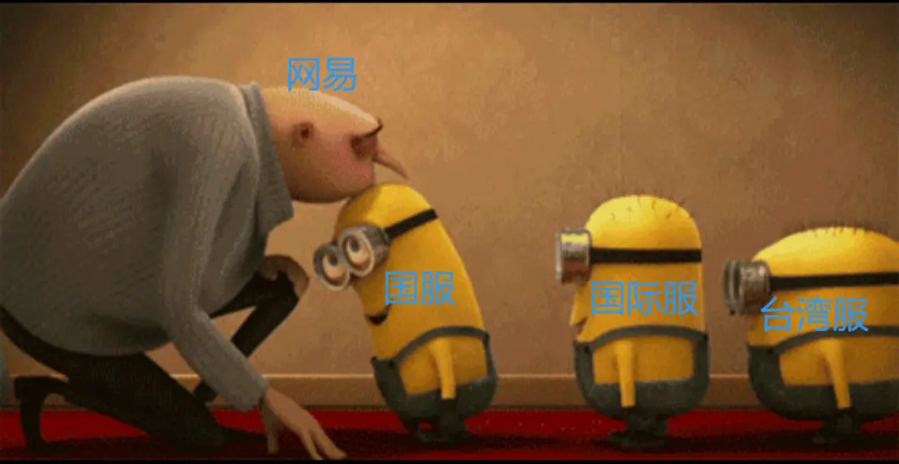

各个服务器排队依次接受网易 “更改”

或者换个说法：国服 = 共研版本的外服

相关的原因什么的已经在视频中说了，这里不重复。

但我要补充的是，我们要树立一个正确的平衡观念：**平衡没好坏，只有适合 / 不适合。**而这样的适合 / 不适合，绝不是听玩家说的。猫鼠可是为数不多的 “两边都在哭弱” 的不对称手游。而且玩家看待平衡肯定存在局限性。这个我们将在之后展开讨论，**不过我们目前只要知道 “绝大多数的玩家目光并不长远” 就足够了。**

　

#### **2.2.1    分类法**

福利的比较方法简单粗暴，但工作量很大。请让我举个例子：

例如，在视频中活动比较的第一个例子：

国服时间旅行    VS    外服时光旅行

首先统计他们的奖励数量，统计标准如下

1. **只要是能免费获取的，就计入统计**（包括但不限于花费金币银币购买，抽取星星或邮票赠送的）不计入统计的有（花费钻石购买的、消耗钻石才能获取的、充值赠送的）

2. 对于每日刷新的活动（例如 7 日签到，每日天梯这种活动）以**最大可获取量**计算（例如 7 日签到就算 7 天奖励；每日天梯活动持续 10 天，以十天都打满的奖励计算）

3. 对于任何活动，均**假设你这些有白嫖奖励的任务都能完成。**

**然后我们得到如下的奖励分类图，其中外服 “时光旅行” 持续 14 天，国服持续 10 天（也能潜在的得出外服活动迭代频率低的结论。）**

图 1 统计得到的图

然后要做的事情很简单粗暴，把它们放在一个表格内，国服外服对比，好的涂成绿色，差的涂成红色。**之后数一下各个服务器绿色格子的数量，借以评价服务器奖励多少。**

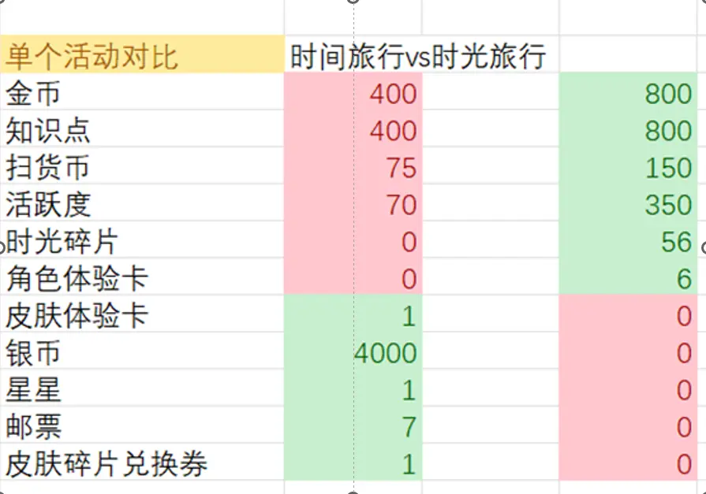

图 2 左国服 右外服

该对比方式存在一些**显著问题**：

1.  **你没法保证奖励都能领到。**例如泰菲 · 小小研究家在该定义下就是免费皮肤（2021.2.21 更新公告提到，小小研究家皮肤可通过抽星星 / 邮票 120 个获取，彩饰是抽星星 / 邮票 200 个），那又有几个人能拿到呢？**当然，另一种情况是这个活动需要花费大量时间肝、需要邀请人（例如 “天使汤姆降临”），这种活动你拿不到能抱怨谁呢？**
    
2.  **奖励的价值不同。**假设某一周的活动如图 3，基于这个比较方法，外服这活动不就比国服奖励多了吗？这一定是错误结论。
    

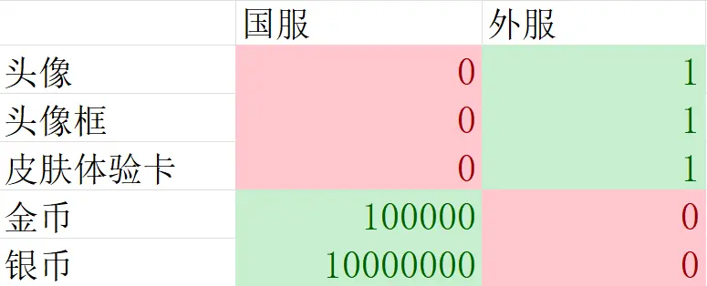图 3 这是假设的极端情况. jpg

#### **2.2.2    网易计价法**

基于上面法则的缺点，我提出另一种对比方法，就是把所有的的资源的价格算出来。（一般性单位为钻石）**例如某周活动送 500 知识点，商城里购买知识点（不计算礼包等）价格是 60 钻 = 250 知识点，那么这 500 知识点价值 120 钻。因为网易在推广的时候常常使用这个方法，所以叫 “网易计价法”。**

使用该法则的参考视频：

该法则本身除了计算较为复杂之外其实没啥缺点，但**玩家看着这个结果往往是不会买账的**：“哇，一周的福利居然价值这么多，鬼才信。”  

典型例子除了【网易对黄金货架的推广 “奖励高达 22888 钻石”】之外，还有 “变变魔术” 的原价。

例如图 4：

1 个 A 皮＋500 知识点＋3 星星

=（668+180+120）钻

这样的计算方式是没有问题的。

**但，有多少玩家诟病过这个原价，说着 “就这点东西也值 XX 钻石” 的话呢？**

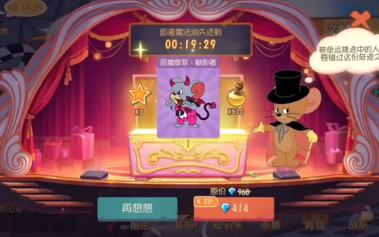图 4

玩家不会买账的原因，究其根本是玩家不认为这些游戏物资值这个钱。

具体解释如下：

1.  **网易在计算物资价格的时候，是以单独购买的价格为准的。**
    
    例如星星在商城单独购买，是 60 钻石 1 个，然而有谁会去购买这个价格的星星呢？更多的人选择 1 天买一次 10 钻石的星星，**就算是氪金大佬，他们恐怕也会选择星星礼盒，那也是比原价买星星便宜的。**
    
    **换而言之，网易计算商品原价通常是以 “最大值”（没有任何折扣的情况下）计算的，这能表现其优惠力度大，是一个促进销售的手段。**
    
2.  **玩家从网易手上领取资源太多了，导致玩家对福利价值认识逐渐模糊。**
    
    说人话：**网易太良心了，玩家太刁了。**这是一项很 “反猫鼠玩家” 的结论。我怎么会赞美网易呢？请看下面的 2 个例子：
    
    ①    典型的例子是 **2 周年免费的 S 皮音乐家 · 星海乐章**，有多少人认识到了 “网易送了我六千钻石的皮肤（**或者退一步，价值一百多颗星星的皮肤**）” 呢？他们又认为这个皮肤的价值是如何的呢？等到三周年，这个皮肤以极为昂贵的价格返厂的时候，他们又要开始吐槽 “网易坑钱圈钱了”。
    
    ②    第二个例子是活动 **“天使汤姆降临”。**天使汤姆免费赠送这件事情因为其 998 钻石的定价**一笔勾销**。我们没听见几句网易发免费角色受到的表扬与认可，谩骂倒是有一堆。我不知道是因为他们拿了 998 钻石买天汤，还是这些人对网易的固有偏见使然。
    
    ③    第三个，是网易平常的**优惠力度就较大**。什么 60 钻石 A 皮、10 钻石星星等。长此以往，在很多人观念中潜移默化的认为，星星只值 1 块钱，A 皮应该 6 块钱甚至免费。
    
    **这样的例子其实非常的多，到街上一抓一大把：**周年庆送 A 皮 “喂狗”，新手奖励“少” 等等。无一不在表现着以下的事实：
    
    **相当一部分****玩家对猫鼠福利价值的理解是取最小值的。**
    

**同样的游戏物资，为何在不同人的嘴里，价值就不一样了呢？**我们可以对《正片 2· 胜与负》的思想类比，得到这样的一句话：

> 不同人对游戏物资价值的**判断准则**，随着**判断人的利益**而变化。

换而言之，

——**网易为了增加玩家数量，**希望**树立** **“善待玩家” 的形象**，所以会**在合理范围内****夸大**自己**送出福利的原价** / **折扣商品的原价**。

——**玩家**因为**贪婪的本性****，希望领取更多福利。**所以会**有意识的降低****自己拿到手福利的价值 / 折扣商品的价值，并****以 “价值低” 为理由**（发的福利少、售卖道具的折扣力度低下）**谴责网易。**

进而说明了：

　　如果说网易是**在合理范围内**夸大，那玩家则会**因为对网易的既有认知与偏见****极不合理的夸大网易售卖的道具价格或是降低自己拿到手福利的价值。**

例题：

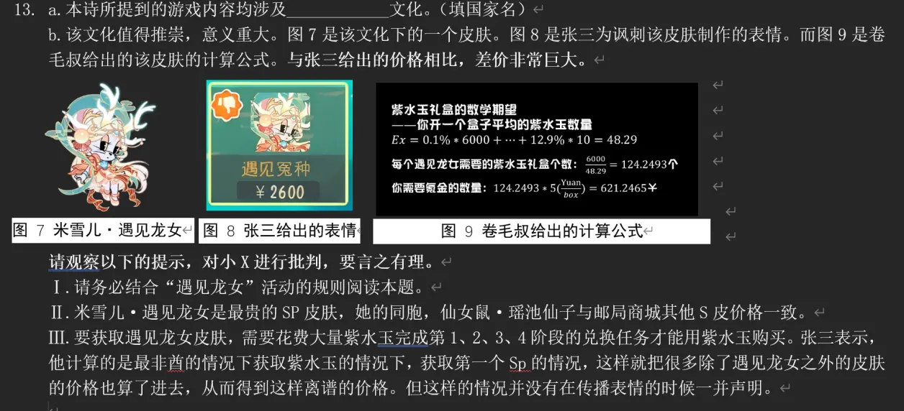例题

解析：

观察表情，**结合客观事实看**，该皮肤**确实价格奇高，也固然冤种。**  

但这里请暂时抛弃对该皮肤的原来的认知，思考下面的内容：

**从提示 Ⅲ 看：**要获取遇见龙女皮肤，需要花费大量紫水玉完成**第 1、2、3、4 阶段**的兑换任务才能用紫水玉购买。张三表示，他计算的是**最非酋的情况下获取紫水玉的情况下，获取第一个 Sp 的情况**，这样就把很多**除了遇见龙女之外的皮肤的价格也算了进去，从而得到这样离谱的价格。**但这样的情况并没有在传播表情的时候一并声明。

这其实说明了：

1.  **张三偷换了 “皮肤价格” 的概念。**把 “获取皮肤的必要支出” 与该皮肤价格划等号。实际上，只应该计算与 “遇见龙女” 皮肤对应的 “6000 紫水玉” 的价格。**因为你在买这个皮肤之前，还买了 S 火箭等等内容，这些也要算在 “遇见龙女” 头上吗？？**
    
2.  该 SP 事实上没有官方的明确定价（即使有也应该参照 “遇见龙女”、即一根金羽毛的价格计算）。他贸然以**最非酋**的方式计算。这种情况在实际抽奖中是极其难以产生的。
    

**从以上两个角度看，这表现了 Ta 对网易的刻板印象，过分的夸大了该皮肤的价格，对猫鼠不利。**

对我们的在做视频中产生的数据感兴趣的，可以看如下链接

https://docs.qq.com/sheet/DT0pjTUpHS3BSa0h4

## 三、网易促进中外交融的**副产物**及其**副作用**

### **3.1    中华传统文化与商业挂钩**

促进中外交融大部分意义上是好事。但不完全是好事。

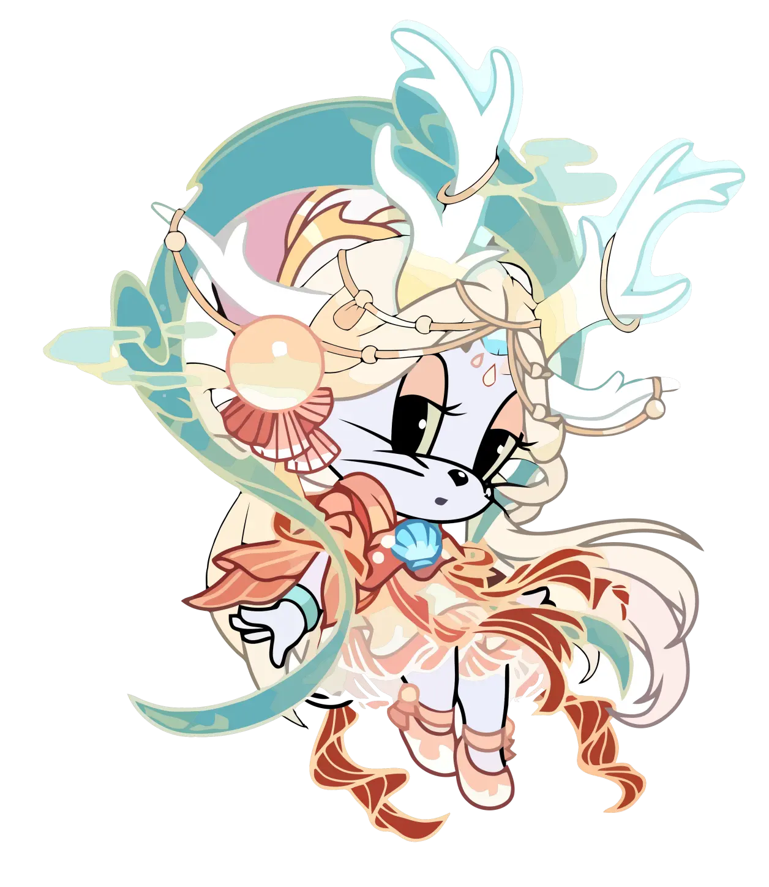

图 6 米雪儿 · 遇见龙女

还是说米雪儿 · 遇见龙女，不论我在上一章节是如何批判张三的，这皮肤价格奇高这事确实是既定的。中华传统文化很多是非物质的，是精神上的。**用价格高昂的商业行为去传播我们的民族精神，这是我无法领教的。**

**3.2    传播部分国家的文化的方式不当**

**有一个皮肤让我极为不爽，就是樱之歌姬。**

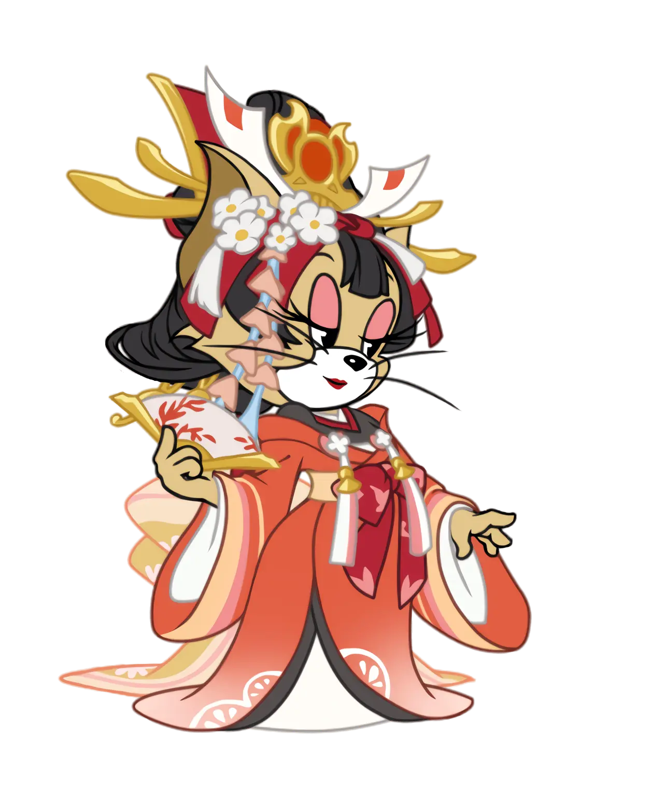

图 7    樱之歌姬

其他樱花皮肤还说的过去，但这个，妥妥的囸系元素。我是很讨厌的。这样的想法也得到了部分粉丝的支持。

当然不是说你玩这个皮肤就会怎样，而是希望大家谨慎对待外国文化。

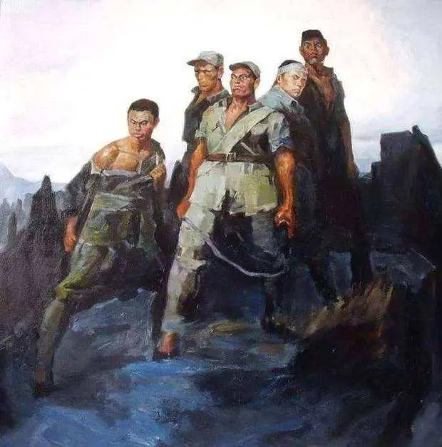

狼牙山五壮士

## 四、玩家盲目追捧外服，除了崇洋媚外，还有什么？

——作者小薯条，有删改

　　首先我们明确一点：玩家都是用脚投票的。无论有多少人吹猫鼠外服活动多好，事实就是外服冷的像冰窖，玩过猫鼠外服的都知道外服匹配一局要多久，游戏体验有多差。如果外服真的有那么好，怎么可能没有人玩？那些吹外服的人有多少真正玩过外服喜欢外服，又有多少只是拿着一张外服的活动截图发泄情绪？为什么甚至连本来就在国外的许多知名 up（精分豆花酱、kanomatsu）也要在国服玩猫鼠呢？
    
　　我们可以先试着假设 “外服福利就是比国服好”，并且正是因为这一点导致的国服玩家追捧外服。然后我们能用用《正片 6· 新老平衡》的思想去类比理解：

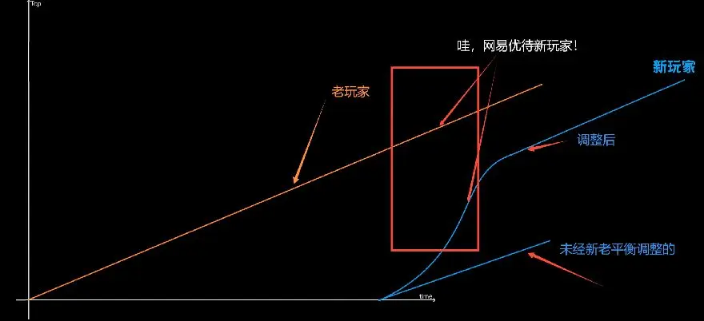如果把这里的蓝色线替换为外服 ···

这里的蓝色线表示的 “新玩家” 其实就是“外服玩家”，为了减小外服与国服的差距，外服福利应当比国服好。

由此，可以推导出外服一些活动优于国服的底层逻辑：

1. 外服因为玩法较为落后，游戏体验比不上国服。所以需要大量优质活动吸引玩家（包括国服玩家）。

2. 用投入产出角度来看外服。国服更新领先外服，外服大量照搬，技术含量极低，根据价值规律自然不应该与国服售价等同。

3. 外服活跃度低，各种资源价值不能与国服简单比较。道理就像不能把 500 人民币和 500 日元直接对比。

4.“凡人贵远而贱近”，抗压能力弱的人会产生一种离自己远的东西都是好东西的自卑情节。

而根据我们的研究结论看，**猫鼠外服活动不比国服好**。至于那些宣扬猫鼠在中国骗氪在外国良心的，只能说非蠢即坏。

即使如此，依然有大量国服猫鼠玩家宣传外服，为什么呢？

**玩家想去外服的浅层原因：**

1. 不想和国人玩。可能曾经被国服素质玩家恶心过。（然而这种问题无法通过换服解决。素质人无处不在，外服稀少的玩家、大量的人机凑数，使得被恶心概率下降，造成一种错觉。）

2. 好奇心。被去过外服的玩家路透活动，产生好奇。

3. 在国服收到了某些打击试图在外服寻找平衡。狭义的说，是他们技术太菜，去外服吊打老外了。

### **深层原因：**

#### **1. 崇洋媚外**

先下定义：**一味地吹嘘外服、贬低国服这就是崇洋媚外的象征。**而崇洋媚外的根本是弱势文化对强势文化的崇拜。我们作为国服的中国玩家尚且自贬自毁，何谈文化吸引力和文化自信？

从法的性质角度而言，崇洋媚外的行为甚至就是**典型的犯罪**，是从属于仇恨性犯罪的犯罪属性。所谓仇恨性犯罪是指不经由任何分析与考证，而是通过污蔑与歪曲的方式去攻击特定群体，给特定群体的生活与生命带来严重干扰的行为，就是仇恨性犯罪。崇洋媚外与客观对比国内与国外的强与弱、先进与落后、优与劣等是完全两种性质的行为，因为前者的认知是建立在**仇恨情绪**上的，其目的是为了制造对立情绪，毁灭特定族群；**而后者的认知是建立在客观理性的基础上的，其目的是为了正视差距，提防差距，缩小差距，最后造福自己的祖国。**

**更何况，是祖国养育了自己，**但个人的心理与行为却要反咬祖国一口，这对于全人类而言都是难以接受的反社会性行为，有违人类基本感情**。**

#### 2.奴性精神

**啥叫奴性精神？浅薄地说，就是缺乏斗争精神，一味顺从。**

当然现代人的奴性不会以直接的方式表现出来，而是藏在非常隐秘的性格之下。他们从根本上就不认同道理，只信服强权逻辑。

他们普遍不擅长独立思考，**他们只相信各种形式的 “奴隶主” 的话**，对强权者的理念不加思考的全盘接受。当强者和弱者对抗时，他们一定会最先站在强者一方，比如战争年代的汉奸、卖国贼等。追求生存安全，是他们活着的最优策略。任何家国情怀民族大义都必须为他们的自我利益让步。

也就是说一个充满奴性的人，是没有人性的。在他们的理念里个人利益优于一切，对强权的崇拜，实质上只是一种自保策略，只要一有机会他们就会向比他们更弱的人拔刀。

吹嘘外服者何尝不是如此，表面他们是在羡慕外服，实质则是站在自封的受害者的角度对国服玩家进行打击和伤害。明明国服有更好的游戏体验，仍然不管不顾，就像一个当了一辈子奴隶的人在平等社会难以自适。

#### 3.自卑情节。

当一个人陷入了自卑的境遇之后，就会变得特别没有主见，有时候自己明明已经认定的事情，别人的三言两语就可能左右他的思想。有多少人是真的经常玩外服并且喜欢外服？又有多少是被外服就是比国服好的声音洗脑？**没有大量体验外服就轻易得出这些结论的人，就是极度的自卑心理。**

越是自卑的人，往往表现越敏感，越需要自尊。在游戏中表现为某些活动不如自己的意就否定游戏。且他们常常心理不平衡，把自己弱化。在任何环境、任何方面都感觉不到自身价值，永远在质疑环境，质疑游戏。内心自卑通常都会比较怨天尤人、不去从自身的角度去思考解决问题，身上充满了负面情绪，习惯性地抱怨别人、抱怨游戏。

#### 4.逆反心理。

玩家维护国服，维护游戏，一定是假的。官方公布的这些人全部都要质疑，为游戏说话的玩家一定是收钱的狗托。“唯上是反”、“唯制度是反”、“唯先进是反” 又何尝不是另一种盲目跟风？

这部分玩家具有鲜明的针对性、反抗性、偏激性、自发性、盲从性、滞后性等特点。考虑到猫鼠玩家平均年龄，这种心理也不是不可以理解，但不能以此作为影响他人游戏体验的借口。

如果你想成为一个更好的自己，就要时时自省，我们都应该反思一下自己在游戏中是否有这些表现，如果能通过这些文字，让大家不仅成为更高质量的玩家，更能成为独立思考、坚定正直的个体而不是与乌合之众为伍且浑然不知，我们将感到非常荣幸。

我们猫鼠玩家要形成合力，推动这个游戏更加有趣且合理。亲爱的小伙伴们，共勉！

## 五、强调自信，是在说空话吗？？

> 所以，作为国服玩家，我们应该做一个自信的猫鼠玩家。要热爱猫鼠，尤其对国服有强烈认同感。在猫鼠舆论急转直下的时候，能发挥自己的责任感、使命感，能够挺身而出，维护猫鼠手游与玩家的尊严。要对国服的基础与环境有底气。经过了 3 年的沉淀，猫鼠国服已经是一个成熟的游戏，拥有一定数量的玩家群体，硕果累累，与中华传统文化相结合，必定能得到更好发展。所以，还要对国服、外服的猫鼠手游的发展都充满信心。这份自信不是妄自尊大，也不是故步自封。在猫鼠的新时代，面对各种打法流派的碰撞和价值观念的冲突我们需要培育理性平和、不卑不亢、开放包容的心态，而不是盲从权威、盲目追捧。只有这样，才能给猫鼠带来更好的未来。

我们在视频末尾，强调了树立信心的重要性。一定有某些玩家觉得，我是在说大话：**猫鼠就这个鸟样你还充满信心？网易狗托吧？**

猫鼠的生命力、发展之前景在于**创新**，创新需要**无畏的勇气**，而这份勇气来源于我们对猫鼠坚定的自信。较之于外服，国服有优秀的中华文化交相辉映，有更前卫的游戏打法和思考方式，这是属于国服玩家独特的发展道路，我们当然应该充满信心。
    
自信和自大的区别是能否客观认识到自己的缺点。对猫鼠也一样。国服猫鼠当然不是完美的，当然是需要改进的。你可以对猫鼠不自信，**但其前提是你有改变现状的能力。**要么你任职于先锋共研，积极测试平衡系统调整；要么通过某些渠道向官方建言献策。**总而言之，你对猫鼠不自信，那就为之做些实质性的举措。这也算是为游戏发展贡献了自己的力量。**
然而很多玩家已经不是 “客观认识猫鼠现状” 了，他们在里面已经添加了 “过量” 的调味品，夹带了不少私货。**他们既抱着极其悲观的想法喷网易、喷策划，高呼 “猫鼠凉了”，当你问他们有什么实质意见时，又是支支吾吾半天说不清楚，调转矛头问候策划亲妈了。（亦或者是一味削弱 XXX 的结论）**

**→请问，这些人对游戏发展有任何帮助吗？←**

他们对于猫鼠的认识无外乎，能用一句话概括清楚：

**骂策划就能解决的事情，**那我们为什么要__呢？

这个下划线，能够填入各种**正面意义**的动词，例如思考打法、探索、练习技术、建言献策等等。这些可以填的词语无外乎需要**耗费自身努力**（例如耗费脑力思考、耗费时间练习、耗费时间建言献策等）。而他们粗暴地将问题 “简单化”“极端化”，这样的思想是猫鼠的一大危害。体现了他们的**懒惰、无能、愚昧****。这样的思想将在《运营》部分着重谴责。**

所以，对于 “做自信的猫鼠玩家” 这个问题，其实很简单，**要么你去做些除开 “喷” 以外的实际的工作，你要是做不到前面的，那你就只能充满信心。**

**至于如何 “充满信心”，我倒是建议你们参考人教版《道德与法治》- 九年级上 -“自信的中国人” 这部分。这里姑且做些摘录与修改：**

> **要做一个自信的猫鼠玩家，首先我们要热爱猫鼠，维护猫鼠的总体、大局利益（**这里应该和单方面维护策划组或者玩家利益区分开**），敢于同破坏猫鼠稳定的行为（**例如无故辱骂策划与官方，与玩家寻衅滋事、挑起事端等**）作斗争。**
>
> **第二、我们要以自己是国服的猫鼠玩家而感到无比的自豪，不崇洋媚外。在外服及其猫鼠玩家面前不卑不亢，落落大方。**
>
> **最后，我们要为猫鼠已有的发展成绩感到自豪。**

**我告诫各位：**

**不要坐在别人开的小船上，既不加油划桨，也不掌舵扬帆。而是选择疯狂扭动你的屁股，自诩是在 “自我拯救”，实则是在加速这条船的死亡速度。**

## 六、走入外服

### 6.1几个外服的最主要区别是？ 

用一个小口诀记住：

**国际能练手，素质看日韩，  
要想整活去台湾，  
外服发展好，国服是源泉！**

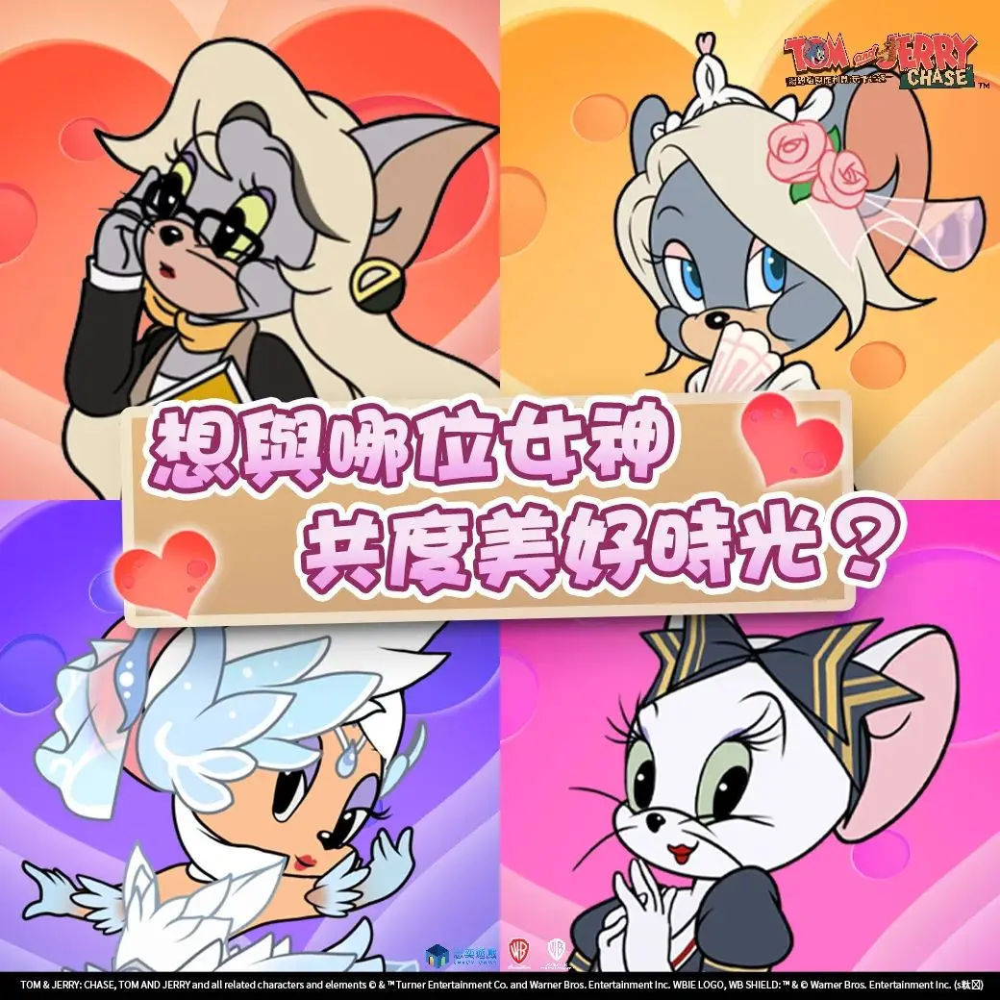

台湾服的整活配图

### 6.2了解更多的外服信息：

外服也有不少的社交平台，我们可以通过这些平台，了解游戏版本更新等内容，也可以让玩家充分了解外服。

部分网站由于 **防火墙** **无法直接访问**，以**蓝色字体表示。**

#### **6.2.1    官网：[加载较慢]**

**国际服** http://www.tomandjerrychaseasia.com/m/

**台湾服** https://www.tomandjerrychaseasia.com/m/tw/

**日韩服** http://www.tomandjerrychaseasia.com/m/jp/

### **6.2.2    主流社交平台**

#### **6.2.2.1    国际服**

脸书 [需要脸书账号]

https://m.facebook.com/tomandjerrychasehk

instagram                   

https://www.instagram.com/tomandjerryofficialgame/

油管                            

https://youtube.com/c/TomandJerryChaseAsia

推特                            

https://twitter.com/tjchaseasia

#### **6.2.2.2    台湾服**

脸书 [需要脸书账号]    

https://m.facebook.com/tomandjerrychasetw/

LINE[需要 LINE 账号]  

https://liff.line.me/1645278921-kWRPP32q/?accountId=281ihush

油管

https://youtube.com/channel/UC-nj3n5I_pqJZYNX1nC4n-A

巴哈姆特（台湾电子游戏交流平台）[加载较慢]

https://m.gamer.com.tw/forum/B.php?bsn=36686  

#### **6.2.2.3    日韩服**

油管

https://youtube.com/channel/UCmQpOD6LszzMCqjAXmz20UA

推特

https://twitter.com/TJChase_JP?t=OISEIRf_k6osUOIa6p2mDA&s=09

LINE[需要 LINE 账号]  

https://liff.line.me/1645278921-kWRPP32q/?accountId=366jceis

### 6.3 前往外服

**百说不如一见。给一些有志之士提供进入外服的钥匙，是非常必要的。**

**声明：**

前往外服游玩，**必须基于理解《猫鼠意识养成课 · 正片 7· 外服》及其拓展部分。**

请严格遵守对应服务器的风俗、规则、法律。**若读者阅读本文后进入外服由于任何原因受到处罚、攻击等，与本人无关。**

**别tm给国人丢脸！**

** 经过反复讨论与斟酌，我们不公开公布外服的进入方法。欲了解详细的外服下载方法，可以前往粉丝群 820864347 咨询。**

**-End-**

------------- 制作名单 --------------

意识养成课制作小组：T＆J Savior

总编辑＆剪辑：      @凯特调教师_卷毛叔[本文主要作者]

数据处理＆分析：  @SJTU-XP

文案优化＆理论：  @小薯条有点软 [本文次要作者]

吊图制作＆素材：  @Cipher 赛弗
