# 8.先锋与共研

## 学习目标：

* （B级）猫鼠服务器结构（下）
  * （B级）知道软件测试的大概流程阶段与对应的猫鼠服务器，以及各服务器对应的进入条件与玩家群体的特点
  * （B级）明白测试的重要性。
* （A级）猫鼠内测流程认识
  * （B级）知道共研服在猫鼠内测中的历史使命及其重要性
  * （A级）知道先锋玩家的权力、责任与义务。明白先锋服内部从玩家关系、测试内容、玩家局限性角度存在一定危机。
  * （S级）理解先锋服频繁惨遭泄露的根本原因是策划组单服内测，会运用该理论看待先锋现状。
  * （A级）了解策划组避免单服内测的后果所做的方案，清楚这些方案不会缓解先锋频繁泄露的事实。学会抵制策划组单服内测，谴责先锋泄密的玩家。
* （C级）知道先锋服内部存在有严重败坏猫鼠风气、局限性极大的玩家；意识到他们对猫鼠的危害。


## <mark style="color:red;">足量的测试</mark>是猫鼠能够稳定运行的基础

这是一个四叶玫瑰数问题。

> 四叶玫瑰数是4位数的自幂数。
>
> 自幂数是指一个 n 位数，它的每个位上的数字的 n 次幂之和等于它本身。
>
> （例如：当n为3时，有如下式子，153即是n为3时的一个自幂数，3位数的自幂数被称为水仙花数）
>
> $$
> 𝟏^𝟑+𝟓^𝟑+𝟑^𝟑=𝟏𝟓𝟑
> $$
>
> 输入区间\[L，R]，求该区间上的四叶玫瑰数。

它经过抽象、建模等步骤可以利用这段python代码解决：

```python
L=int(input(‘inputL’)) 	#输入L、R区间
R=int(input(‘inputR’))	
s=0					#计数器
for i in range (L,R+1):	#在该区间上进行穷举
    a=i//1000			#将i的每一个数位求出
    b=i//100%10
    c=i%100//10
    d=i%10
    if a**4+b**4+c**4+d**4 == i:	#判断是否符合四叶玫瑰数
        print (i)
        s=s+1
print(‘区间内有’,s,‘个四叶玫瑰数’)

```

但是，怎么检验这段代码是正确的，能够解决问题的呢？最简单的办法是运行一遍这段代码；看看是否会报错，以及运行结果是否满足题目要求。

```
Traceback (most recent call last):
  File "C:/Users/Lenovo/AppData/Local/Programs/Python/Python39/siyemeigui.py", line 1, in <module>
    L=int(input(inputL))
NameError: name 'inputL' is not defined
```

其中报错、就可以理解为bug；题目要求也能理解为“实际需求”；然后，再根据运行结果修改代码。

诚然，测试对软件十分重要，对游戏软件更是如此尤其是PvP游戏，除了软件本身，还需要平衡调整；而任何一点数值偏差都会造成平衡的改动——对猫和老鼠更是如此：做好1v4的平衡是十分困难的。

为了反映某个玩法上线正式服的可能情况，需要做测试；根据伯努利大数定律，测试的样本越多，越接近实际情况。简单粗暴地说，测试越多越好。所以，足量的测试是猫鼠能够稳定运行的基础

## <mark style="color:blue;">国服</mark>的猫鼠各大服务器与策划组的“<mark style="color:red;">单服内测</mark>”

软件测试分为不同阶段，大体上分为内测、公测、正式版。在国服范围内，有3个服务器用于测试：公测服、共研服、先锋共研服（简称先锋服）。

公测服，俗称正式服，在这个服务器上承载了网易官服和诸多渠道服，人数众多，是猫鼠的主体。

游戏厂家为了逃避责任，所谓“正式服”执行的其实是公测测试，这意味着，很多游戏没有严格意义上的正式版。

相对应的，共研服和先锋服都是内测服务器。

其中，共研服早在庆典季之前的内测时代就率先登场，只要在公众号中填写手机号就能获取兑换码测试，在“好游快爆”、4399等第三方平台，也可以兑换一小部分的激活码。共研服门槛低的优势，让曾经的它成为了猫鼠最大的内测服务器

而作为后来者的先锋服于2020.10亮相，与大哥共研服不同，它主打“小而精”，通过问卷调查的形式，筛选50个玩家左右，体验更先前的玩法，让这些玩家为官方建言献策。

&#x20;

很遗憾的是，在2022.3.9，猫鼠官方宣布，由于服务器原因，共研服停服。此后，猫鼠进入了“单服内测”的局面。\[只有先锋服一个服务器担任内测工作的局面]


## 先锋服的最大弊端：先锋玩家的结构反映了策划组的意志

共研服的体量可比先锋服大多了，小小的先锋服怎么承接老共研服庞大的衣钵呢？这产生了一连串的问题！最显著的问题反映在先锋服本身，体现在先锋玩家身上：

首先是先锋玩家额定人数极少，而有志愿的玩家很多，导致填写问卷淘汰了很多人。据不知名且可靠性欠佳的小道消息，先锋通过率为_<mark style="color:red;">50:8000</mark>_，折合<mark style="color:orange;">**6.25‰**</mark>，堪比**河南省高考985录取率（8.4‰）**。

为此，我们找到了先锋共研的测试问卷，填写的项目如下：

> 1.QQ号
>
> 2.游戏ID
>
> 3.过往游戏段位
>
> 4.年龄
>
> 5.是否有时间参加测试
>
> 6.对游戏有什么意见和建议

而这样的测试是没有硬性指标的，无法较为真实地评价玩家。换而言之，是网易官方想让谁进就让谁进。这种机制，**难免存在暗箱操作**，某些玩家美其名曰“<mark style="color:red;">**内推**</mark>”。再换句话说，先锋服玩家的结构指向性极大。能得出如下结论：先锋玩家的结构反映了官方的意志

那么，通过先锋服向策划组真实地反映正式服的情况；很有可能会<mark style="color:red;">受到这些玩家的局限性影响</mark>，而变得困难。


## 先锋成员的权力与义务

知道了以上的信息后，我们来看看先锋玩家的日常：

假设，你，是新晋的先锋共研玩家，没有受到这些拦路虎的阻碍；当你通过层层筛选进入先锋服后，你会发现自己在里面，并没有外界宣扬的地位那么高。

这体现在两方面：权力小和义务重

先锋玩家的权力如下：

1. 测试权，你有资格在先锋服游玩。你会拿到一个激活码，注册账号就能开玩
2. 质询权，你可以向策划组提问并要求答复
3. 知情权，你能够知道策划组未来的改动/测试方向
4. 提案权，你能向策划组上交建议、建言献策，策划组会择优录用
5. 领奖权，官方会定期地发给你一些额外的奖励，可能是星星邮票之类的，也可能是像奶酪抱枕，猫鼠手办这种实体奖励。

不过问题就出在提案权上，有很多先锋玩家的建议是并不会录用的。极端一点的情况，你可能提了一百个建议，他只录用了一个[^1]。[《正片3·敌我平衡》](../../part.ii-balance/3.self-enemy-balance.md#ce-hua-dui-zhen-ying-ping-heng-fu-zhu-yao-ze-ren-xiao-mao-qiang-shu-shi-ce-hua-yi-zhi-yi-lai-chang-q)说过：策划对阵营平衡负主要责。。

潜台词是，大权还是在策划手上，也就是说，作为先锋玩家，你影响平衡的能力其实较为微弱。但如果先锋服成员近乎一致地提出某个意见...策划组还是可能会较为严肃地酌情思考的

&#x20;

享受了权力，该谈谈你的义务了；作为先锋玩家，你的义务不多但是很繁重：

首先是保守先锋服测试内容，不得泄露。你这一泄露，不相当于泄露商业机密么？凡是被查出泄露先锋的先锋玩家几乎都逃不过除名的结局。

其次是按时上交报告，就是每周要写个小作文，大致关于先锋测试内容的看法与建议。

最后要接受玩家监督。要是接到了谁的举报说你泄密什么的，恐怕要你吃不了兜着走。

## <mark style="color:red;">先锋服惨遭泄露，广泛传播且愈演愈烈的根本原因：策划组主导的“单服内测”</mark>

先锋玩家是“夹缝中求生存”，但只要收敛点，其实这些规则没什么的。真正麻烦的是策划组。最频繁的问题是先锋测试内容常常惨遭泄露，每次泄露都要费时费力地调查，然后处理，这更是造成了先锋玩家内部矛盾的产生与激化。测试是一个团结合力工作的过程，是不应该有不信任的情况出现的。这肯定会带来工作效率上的问题

而泄露的过程无外乎是这样的：

> 张三是一个先锋玩家，他把先锋内容告诉李四
>
> 李四把这个内容发到其他Q群或者直播平台什么的被王五看见了
>
> 王五把这个内容做成了视频，获得了10万播放量，让大家都知道了

很显然，关键问题是在张三上。主要原因是张三的规则意识太薄弱，或者是李四买通了张三获取先锋内容；无论如何，张三是先锋泄露的罪魁祸首

而且，随着时间的推移，从先锋服泄露出来的测试内容，越来越注重对泄密者本人的保护，要想追查肯定极为困难。

王五，Ta加剧了先锋内容传播，他的评论区下有不少骂王五的，说王五有愧于策划、有愧于网易什么的。王五是有问题，但过多的谴责Ta这是没有太大意义的

我们可以反过来思考：<mark style="background-color:orange;">明知道传播先锋是错的，王五为什么能拿到这么高播放量呢？</mark>这表现观众们其实也很关注先锋消息

包括王五和Ta的观众在内的非常多的猫鼠玩家，都有一个“病”

我把这个“病”命名为“共研综合征”，这是其定义：

#### 共研综合征

> 一种共研服及其消息“戒断反应”的迹象。“病因”是长期未游玩共研服以及没有共研服消息。\
> “临床上”，由于缺失共研消息，所以患者会想尽办法弥补这一消息的缺失。表现为对先锋共研消息极度好奇，会想方设法、不惜代价取得、传播先锋消息，甚至将其他非先锋内容、玩家同人和二创等代入为“先锋测试内容” 。

“共研综合征”患者会非常积极的传播任何疑似的先锋测试内容，这些内容有些确实是先锋泄露的，有些则是玩家自制作品。

典型例子是玉米卷绘制的恶魔杰瑞第二武器，结果被玩家以讹传讹，说成了先锋内容。

换句话说，以前的先锋消息泄露的传播面并没有这么大。之前，共研服是开着的，没有“共研综合征”的玩家们，传消息自然没这么迅速；现在共研服关闭了，有了“共研综合征”的玩家们，就开始疯狂传消息了。

所以，_<mark style="color:orange;background-color:red;">**先锋服惨遭泄露并且广泛传播的根本原因是策划组“单服内测”**</mark>_。进一步看，要想根治先锋问题，策划组必须重开共研服；与之相反，如果策划回避共研服开放的问题，那么先锋惨遭泄露必将继续且会愈演愈烈！

基于以上两条结论，我说句难听的：

像王五这种玩家你也<mark style="color:red;">**只能谴责**</mark>，而没有任何实际措施能阻止Ta这么做：从外因上看，玩家有“共研综合征”、渴望获得这些内测消息；第二、王五不是先锋玩家，先锋测试组的惩罚措施对他根本不适用；从内因上看， 他抓住了玩家“共研综合征”的症状，以此获取流量。

在内外交加的情况下，多骂Ta几句恐怕是于事无补

所以，在我们发现先锋惨遭泄露时，应该把批判的重心向策划组和泄密的先锋成员倾斜；他们才是问题产生的根本、直接原因所在

相对的，过多地谴责先锋信息传播者，犹如抱薪救火，适得其反。因为一旦先锋惨遭泄露，传播只是时间的早晚问题，你可以通过抨击，表面上的打击这种行为，但只是“貌恭而不心服”，就算在舆论作用下，消灭了一个“王五”。这个大环境下还会催生出更多“王五”，难道你要一个个骂过去吗？

反过来，只有对泄密者和策划组进行批判，才有助于解决先锋惨遭泄露的问题。

单服内测极其不利于平衡调整

这么看，短期内，“单服内测”造成并加剧了先锋泄露；从长远的眼光看，“单服内测”更不利于平衡调整。

我们知道，足量的测试有利于猫鼠发展，而先锋玩家就这么点，累死他们也赶不上共研服测试量的一根毫毛；先锋成员充其量五十个上下，再扩招也就一百个，你测试来测试去，就算累死先锋玩家也就这么点测试量，肯定是欠缺的，这导致角色半生不熟的就被推向了正式服。要么角色过弱，要么角色过强；正式服玩家以掉分、掉胜率、掉专精、掉游戏体验为代价，适应新角色新玩法，可以说是叫苦不迭！然后一两周之后，再大刀削弱或者加强······

如果这样持续下去，平衡的崩坏也就“指日可待”了！

&#x20;

&#x20;

## <mark style="color:orange;">策划组企图运用各种方案取代共研服的地位，</mark>但这是<mark style="color:red;">不可能</mark>的

对于“单服内测”造成的测试量减少，策划组对此也有一些代替方案。

### 扩招

首先是扩招先锋玩家、以及加大先锋玩家工作量。不过，即使如此，也无从改变先锋服人数少的格局，还使得先锋成员变多，管理更加的困难。

又或者是提升先锋成员门槛，把先锋服“小而精”的特点发挥到极致呢？恐怕具体怎么做、做的怎么样只有策划组自己心里最清楚！

### 在正式服搞“付费/有偿的共研测试”

第二个代替方案则更加“巧妙绝伦”，简单概括，策划组把先锋测试完的内容，这些本属于共研服的任务丢到正式服上面，然后在前几周观察正式服情况，再做出改动。

典型例子是：尼宝、米可、斯飞

以尼宝为例，在尼宝刚登陆正式服的时候，它的获取方式是“使用或参与有尼宝的战斗”，那就需要别人有尼宝。那么其他人的尼宝要从哪来呢？答案是花费钻石购买伴生皮肤，获取尼宝体验卡。所以你要获得永久尼宝，要么蹭别人的，要么自己掏钱买皮肤。换算到全体玩家上，一定是<mark style="color:red;">有一部分玩家群体为了获取新角色而充值</mark>的。

这样的理论对于米可和斯飞同样适用，理由是他们刚上线时的获取规则与尼宝类似。

这三个角色、他们都是经过了严密的先锋测试本来，这些应该转移到共研服测试加以完善的，玩家可以免费地体验到的新角色；由于策划组一手造就的“单服内测”，直接上线了正式服。并且，还需要部分玩家付费购买皮肤，才能获取角色体验资格，然后通过组队等方式，一传十、十传百地让玩家们领取到永久角色。

因此，尼宝、米可、斯飞的活动，本质上是策划组让玩家“付费在正式服搞‘共研测试’”

也就是说，假设所有玩家是一个整体，在共研服开启的时候，他们本不需要为体验新角色、适应新玩法付出任何资金，如今共研服关闭了，他们反倒需要付钱才能体验到这些内容。你们可以说网易资金短缺，为此而关闭共研服，这也许好说，但实际情况是，网易不仅省下了共研服资金，还利用这些角色玩法倒吃了一笔额外的资金，这讲的通吗？我不由得为网易的操作“鼓鼓掌”！

篇幅有限，这方面其他问题我就放在评论置顶的拓展篇讲解。

# 结论：

这些替代方案，效果如何，我不知道。不过，无论多“高明”的替代方案，都不可能完美的取代、胜任原共研服的地位与职责

## 所以对策划组而言：

第一点，必须尽快开放共研服。单服内测的后果我已经列明了，相对于重开共研服的严重程度可谓是大巫见小巫，否则，这些一连串的问题有策划组受的了。如果策划组中，有小人试图关闭先锋服，从“根本上停止”先锋泄密。我劝你尽快找好下家公司，做好领盒饭的准备

第二点，要加强先锋玩家管理，做好对先锋玩家的培训工作，尤其加强道德教育，完善相关处罚措施。不然，先锋玩家泄露成本太低，也难怪会有开直播玩先锋共研的事情发生。

第三点，充分利用先锋测试数据，要做一定的预估。调好平衡再发布，不调好不发布。免得上线正式服时这个角色遭人嫌弃，树立角色歧视。

策划组的“单服测试”对于平衡极为不利，我们作为玩家应该要有应对措施。

## 对于先锋玩家而言：

你们是最接近策划组的一批玩家，你们有一定能力影响游戏未来走向。

所以，最重要的是，不能把个人恩怨与阵营局限性带入先锋服；摒弃偏见，从长远的视角看待猫鼠；

其次，要做好玩家道德、技术上的排头兵；努力练习开创新玩法、引领猫鼠其他玩家共同发展。而不是树立、宣扬、助长段位歧视、专精歧视的歪风邪气，以先锋玩家的身份自命不凡，作威作福

第三点，积极与玩家互动，而不是隐藏自己的先锋玩家身份。和他们聊聊对现版本的看法，听听他们的意见，或许会对你有所启发。有些先锋玩家认为，玩家会向自己打听先锋消息；的确，但不应该将这个作为你沉默寡言的理由

第四点，做好先锋玩家本职工作，履行自己的义务充分利用建言献策的权利造福猫鼠

## 我们作为普通玩家应该怎么办呢？

对于先锋玩家，他们时间紧，任务重，某种意义上是工具人。对于策划组，他们也只是猪厂的打工人，我们应该体谅他们的工作不易，对他们有基本尊重；在他们行为不当的时候要文明地指出、批判；而不是甩锅网易、策划与先锋玩家。

其次，我们应该寻找身边的先锋玩家，和他们聊聊。说说自己对于版本的理解，或许可以中他们口中得到一些技术指导。最后，对于疑似的先锋测试内容泄密，不要轻信。这有可能是同人、二创这种，会让你失望另外，百听不如一见，百见不如一玩。只有上手体验才能对角色评价，所以先锋内容仅供参考，请以正式服为准。

## 部分玩家在道德品质上没有资格成为先锋玩家，是玷污了先锋玩家的败类&#x20;

不！还没有讲完！以下是私货部分，请高血压患者退出本视频。

在大大前一阵子，我发表了对先锋玩家人身攻击的错误言论，很快，我认识到自己的错误，在第一时间于评论区和动态进行了道歉；并提出以今天这期视频向大家说明先锋的基本机制，还请各位先锋玩家为我提供帮助。

然而，邀请一发出，赞成的声音是少数（在这就不公开感谢那些私下为我提供意见的先锋玩家了，免得给你们添麻烦）更多的是无情的回绝，甚至还要吐口痰。

他们把我的道歉，把我改正错误的愿望与行动，当作了日本偷排核废水的“红豆泥斯密马赛”

然后，在这期视频思维导图出来之后，因为某些原因，这张图流传到了先锋服群里；；然后，之前那些“回绝”了我的好几个玩家，反而开始“纠正”我们思维导图的错误了。

在我给出拒绝修改的评价后，反而开始威胁我“后果自负”等等了。这是什么意思呢？正话反话可是全让他们说了呀？

实际上，他们没有任何资格站在先锋服的角度跟我一个正式服玩家谈后果。以先锋玩家的身份自命不凡，作威作福，恐怕说的就是他们了。

所以，部分玩家在道德品质上没有资格成为先锋玩家，是玷污了先锋玩家的败类

还请先锋玩家们不要随意把自己代进去这里只是在说其中的两三个而已。


# 策划组是怎么填补共研服关闭造成的测试空缺的？？

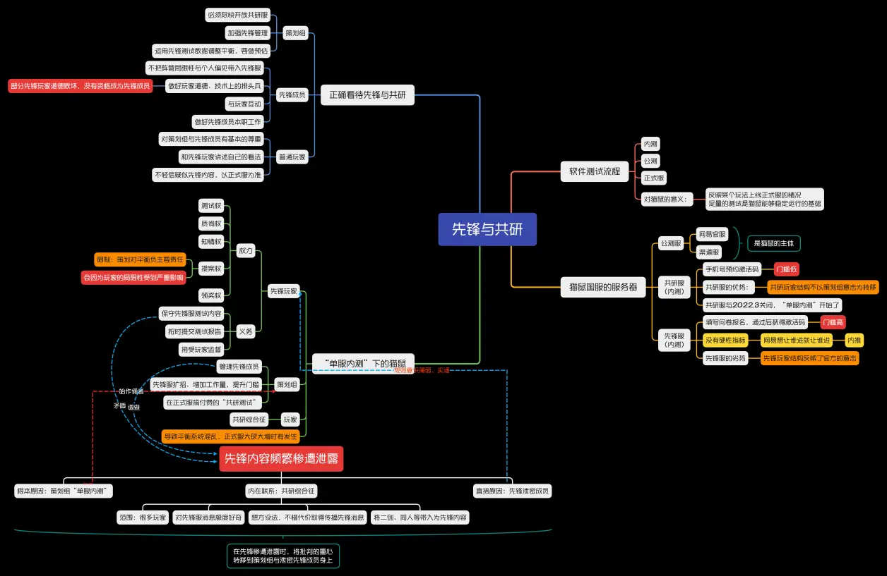先锋与共研 思维导图（点击图片查看大图)  ![](./8.alpha-beta-test/e3d51093b79081a9b2d491c19e8c1a3bad84c8e9.png@1256w_642h_!web-article-pic.webp

本文作为《猫鼠意识养成课·正片8·先锋与共研》的补充内容  

请观看完《序》-《正片8》的视频再阅读，否则会难以理解


**本文约11,000字，理解难度较高，大约需要35分钟读完。**

**通过阅读本文，你将会解决以下几个问题：**  

1.  共研服关闭造成的测试空白，真的很要紧吗？
    
2.  策划组是怎么弥补前者的？
    
3.  怎么看待共研服？
    

## **一、对坚持“共研关闭”的玩家的批驳**

### **1.1    共研服：世界······遗忘我**

先锋玩家一直致力于游戏的测试，他们的努力无可批驳。在他们坚持与策划组的工作下，猫鼠能够暂且维持运行。但是这让有些玩家被表象迷惑，开始**怀疑共研服存在的必要性**。

**有人说：**

*   先锋服**“小而精”**，这样**工作效率高**；
    
*   共研服**少有玩家反馈**，**成本高**，**效率低**。
    
    **所以先锋服可以取代共研服，共研服的存在是没必要的。**
    

首先摆明立场：这样的结论**是错误的**。

### **1.2    先锋服与共研服的存在互不冲突**

小标题的含义是，**先锋无法取代共研地位，共研亦不能取代先锋地位。**它们**同时**担任着猫鼠的内测使命。

#### **1.2.1    先锋无法取代共研**

为了更清楚了解先锋、共研服在平衡中的作用，可以作如下的流程图，如图1.2.1-1：

  

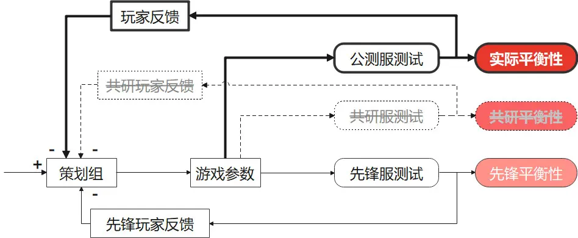  
图 1.2.1-1  
现版本理想条件下的猫鼠版本更新维护系统原理框图 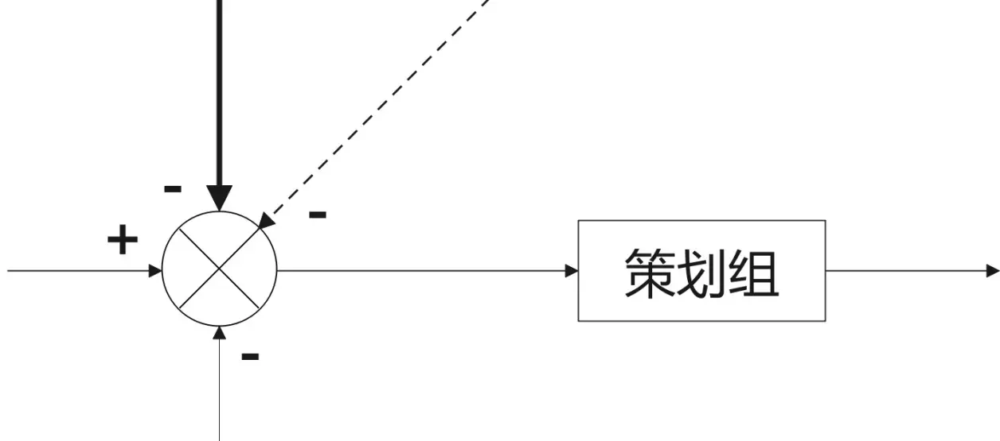图 1.2.1-2  
图1左下角，一个更为严谨的画法  
非相关专业的玩家可以忽略本图  

加以分析，可以得出以下几条结论：  

1.  策划组是**主要决策者**。说明**策划****对游戏平衡负主要责任**。策划会将自己的期望通过游戏参数施加于各个测试服，并最终适用于正式服。（图中 **＋** 号）
    
2.  策划组**并非全知全能**，也会受到自身局限性影响，存在设想的**不切实际与判断错误，**这时需要一些因素来遏制策划组的设想（图中 **-** 号）。我们发现，策划对游戏的角色有相当高的部分来源于**玩家反馈**。说明**玩家****对游戏平衡负重要责任**。
    
    值得强调的是，图上所示的“玩家反馈”并非一定要你到反馈系统写篇小作文，**你对战的数据**（包括胜率、比赛时间等等）**也会成为策划组决策的依据**。
    
    所以换而言之，对于普通玩家而言，**游玩就可以促进猫鼠发展**，这一点毫无疑问。
    
3.  无论是先锋服还是共研服，其最终目的均是为了**[模拟待测试玩法上线正式服后的平衡系统]。**
    
1.  我们知道，先锋玩家的结构能反映官方的意志。而共研服的进入方式（预约兑换码获取）造成了**共研玩家类型，是不以策划组的意志为转移的。**
    
2.  换个角度理解[3-1]，[如下方 **图** **1.2.1-3** 所示]，先锋服中，玩家的来源是策划与玩家“双向盲选”；而共研服则是单向的（玩家自发进入共研服参与测试）。刚才我们提到先锋、共研是要模拟正式服的平衡，**那么就需要对玩家群体也尽可能模拟正式服。**
    
3.  由[3＆3-1]可得：如果对玩家的筛选限制过多，那么得到的玩家样本就可能**失真**、**偏离，**与正式服平衡系统的相似度也大打折扣。其中，**筛选越多，平衡相似度越低。**
    
    基于此，我们观看到的各大职业联赛、电竞杯赛；这些打法流派未必一定适用于正式服。因为他们是比赛服，玩家群体是职业选手，与正式服的玩家群体是天壤之别。
    
4.  由[3-1＆3-2]可得：**在理想条件下****，相较于先锋服的平衡，共研服平衡会更接近正式服。**
    
    **理由是：共研服的玩家、经过的筛选与限制较少，玩家群体更接近正式服。**
    

所以，**共研服更符合原先的测试动机**。由此，得证。

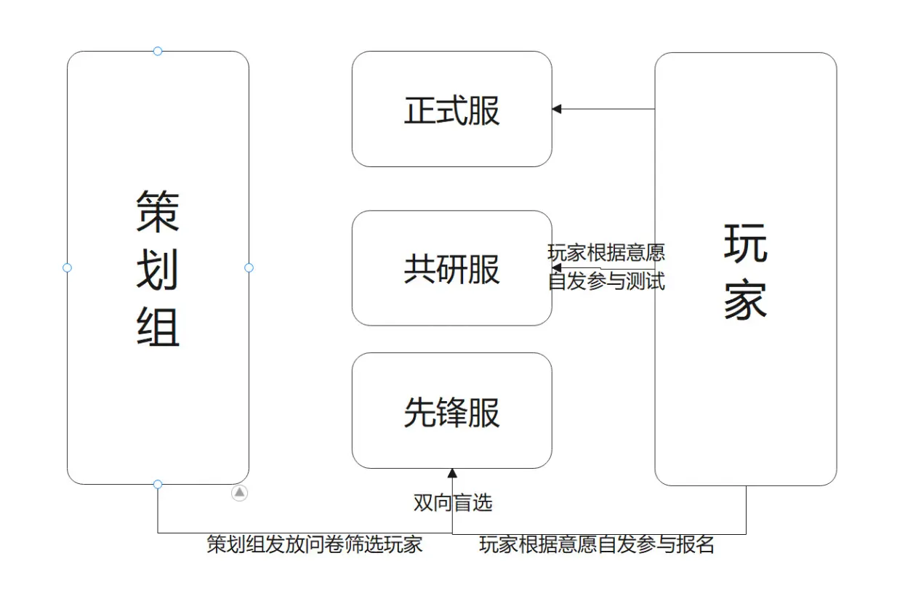图 1.2.1-3  
三个服务器对玩家的条件限制  

#### 1.2.2    先锋的产生是必要的

上一小节讲到，共研服更符合测试动机。

潜台词是：**先锋服无法较为真实反映正式服，较不符合测试动机。**然而，在共研服大行其道的2020年10月，却产生了“不符合测试动机”的先锋服。

这种情况，我们应当怎么解释呢？

请看如下选文：

> **[选文Ⅰ]**
>
> ······为了能让众多的小伙伴在《猫和老鼠》手游正式服中体验到更好、更稳定的游戏内容，我们于一年前开启了玩家共研计划，感谢在此期间积极体验共研测试，并向我们提出相关意见和建议的每一位小伙伴！······但随着共研计划的持续开展，参与共研的小伙伴也越来越多了，**这也导致了我们在收集大家的共研反馈时有了一定的分散性和滞后性。**  
>      所以，为了让······有想法、有能力的小伙伴们的意见建议能够得到更集中的反馈，我们决定发放共研先锋体验服资格，并邀请符合要求的玩家朋友进入共研先锋核心QQ群！
>
> 1.  **较高段位且乐于反馈的小伙伴**：我们希望你是**铂金及以上**段位，且在共研先锋群中能够积极反馈测试的意见及建议；
>
> 2.  **高段位且积极参与测试的小伙伴**：我们希望你是**钻石以上**段位，虽然反馈的次数不多，但能做到尽可能积极地参与每一次测试；
>
> 3.  **较高段位且乐于社交的小伙伴**：我们希望你是**铂金及以上**段位，自身性格较为热情活泼，能在共研先锋群中主动组织其他小伙伴一起参与测试。
>

**——《猫和老鼠官方手游》微信公众号，2020.10.4**

**大家应该有思路了。那再看一下这张图：**

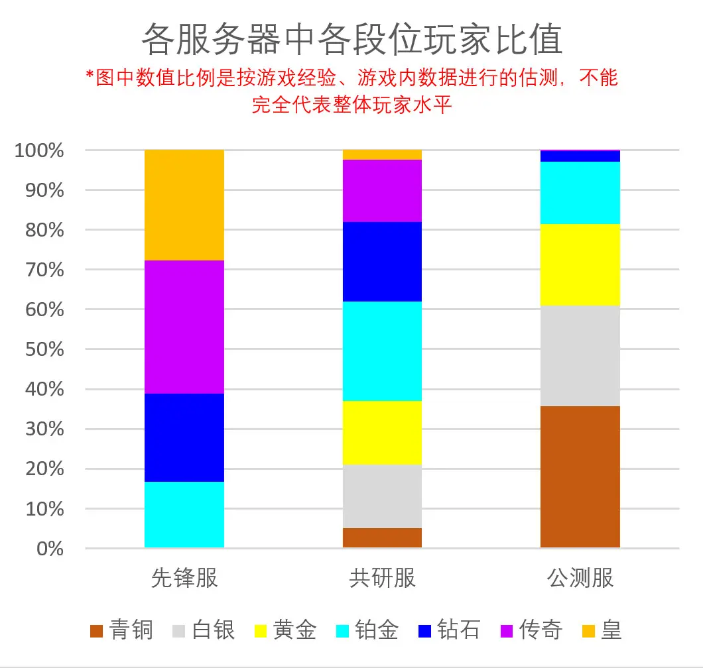

图 1.2.2-1  
各服务器中，各段位玩家的比值（根据游戏经验与游戏内数据、以及公众号信息等的估测）  
不能完全代表玩家水平  


图 1.2.2-2  
理想状况下猫鼠内测日程  

对**选文Ⅰ**、**图 1.2.2-1** 的解释如下：**（此处均假设段位越高，技术越强）**  

1.  **共研服体量庞大**，导致共研服**无法满足**当时以至于现在的测试需要。
    
1.  **[可以观察上方图4辅助理解]**
    
    首先是，对于某个玩法、更新内容，共研服测试时间一般**持续2周**。（图中15~28号），这个玩法可能会在共研第8天（图中22号）更改。在此期间，**反馈较多，且充斥于各个渠道。这样，可能造成新的、老的测试内容反馈混杂在了一起。**有的玩家在参加某角色的测试，明明这个角色在共研测试第8天(图中22号)的时候做了显著加强，他还在吐槽弱。这会对策划组造成困惑（他到底说的是更新前的角色还是更新后的呢？）。
    
2.  **在共研服中，各个层次的玩家鱼龙混杂**，并且因为**账号的相似性**（共研服账号，类似于新注册的正式服账号，啥数据没有），有可能造成“队友青铜白银，敌方猫鼠双皇”的悬殊局势。**这种对局的数据是毫无意义的**，也会给测试玩家造成负反馈。
    
    这是因为**猫鼠玩家的差距是客观存在的，且存在扩大性。——《正片1:差距》**
    
3.  **当时急需巩固老玩家的利益，开发适合老玩家、技术较高玩家的打法。**
    
    在《正片6:新老平衡》中我们提到：新角色适合老玩家。老玩家需要提升角色质量；这里的质量，需要的是可操作性，也就是**上限**。
    
    共研服中，有技术力的玩家可能会受困于对手、队友与自己实力差距悬殊，而**无法有效体验角色，检验角色强度与可操作性**。此时，需要人为筛选玩家，将他们聚到一起进行精确的测试。
    
    假如，要测试**商店模式[要求：大师学业/铂金Ⅲ]，你叫两个青铜玩家去测试，能玩明白吗？就算玩明白了，也会因为“不存在青铜局天梯的商店模式”，而宣告测试的无效。**
    

所以：

先锋服的侧重点，在于反映**技术较高玩家群体的平衡性**。就是玩家们所谓的**“高端局”**。

共研服的侧重点，在于**全面反映****各个层次玩家的平衡性**。即使能全面反映，但从局部（**“高端局”**）看，可能效果欠佳。

先锋与共研所反映的内容，其实对应“**部分和整体**”的关系。**借鉴马克思的思想，**这告诉我们：**对于内测服务器而言**，两个内测服务器的存在都是必要的。其中共研服**在内测中**占据**主要地位**，先锋服占据**重要地位**。

我们应该：

**反对**轻视这两个服务器中的任意一个的**“轻视论”**，也**反对**将两个服务器平等对待的**“****均衡论”**。

  

  

#### **1.2.3    某些反对“共研开启”的玩家的底层逻辑**

共研服既然这么重要，为何还会有玩家反对开启共研呢？

#####  **1.2.3.1    策划组**

我们在《正片8·先锋与共研》中提到：由于**服务器**原因，共研服关闭。

**这大概在说猫鼠的经济问题，但很显然说不通。**原因在正片8中有所提及，但是本文第二部分会再次解释，不必担心。

策划组是共研关闭的**始作俑者**。那么他们理应承担“单服内测”而导致的全部后果。**很显然，策划组将共研关闭的造成的问题，转嫁给了玩家。**这也将在本文**第二部分**详细阐释。

这里并**不是要煽动策划组与玩家之间的对立**，而是实事求是地解决相关问题。

这就要说到猫鼠意识养成课的**根本立场**：我们将坚持站在**最广大玩家**的立场上，全心全意为猫鼠全体服务，而不是片面偏袒某一方。

  

##### **1.2.3.2    某些先锋玩家**

有些玩家对共研的认知是不清醒的。而这样的玩家中，有**部分的****先锋玩家**。我们猜想，这是因为：  

> **人总会把事情朝对自己有利的方向解释，只要清楚这一点，就能理解正确的主张为何总是难以实现了。**
>
> ——德国著名哲学家，尼采

他们作为先锋服玩家，可能自认为**共研服开了会影响先锋服**。（这一个论点已经在上文中被反驳了，因为先锋与共研所反映平衡的侧重点不同，缺一不可；所以这大概是个表面意义上的借口）

又或者，他们的立场有问题。他们完全站在了策划的立场上，这样的立场是**错误的。**

再或者，他们以先锋服成员身份自恃高人一等？这我就不得而知了。

  


## **二、策划组是如何缓解“单服内测”造成的测试空缺的？**

共研关闭后，策划组想方设法在先锋服与正式服上做出调整，**企图掩盖共研服的重要地位的这一历史事实。**

## **2.1    先锋服：换人、增加测试时间、****扩招**

### **2.1.1    根据以下内容，可以验证前两条结论：**

> 由于服务器硬件的原因······我们的共研服将于3月11日暂时关闭，······，在共研服关闭期间，先锋共研服仍会继续运营。项目组将会在先锋共研服玩家**总人数不变的情况下，招募一些新的****对《猫和老鼠》手游抱有极大热情的玩家**参与先锋共研服的体验和测试。  
> ······先锋共研服开服时间保持不变，仍为周四17:00，**关服时间改为周一10:00[Ps：原先为周五17点]**，先锋共研服反馈提交时间则改为周日**[原先为周六]**。
>
> ——《猫和老鼠官方手游》微信公众号，2022.3.11

**当然，扩招这是近来的事情，是口口相传得到的，是缺乏文献依据的。这里挖个坑，待补档。**


### **2.1.2    策划组有回避先锋服话题的倾向**

**先锋服既然作为目前唯一一个内测服务器，它承载的使命艰巨。然而策划组的种种举措，都似乎在避免过多的提到先锋服。**

**例如下方 图 2.1.2-1：****在猫和老鼠公众号搜索“先锋”，只显示了第一期的先锋招募公告**。


图 2.1.2-1  
在猫和老鼠公众号搜索“先锋”，展示的唯一的一个先锋成员招募公告  

这是很奇怪的：现在都3202年1月了，**距离先锋开启已经有**~~两年半~~**1坤年**了！（小黑子自罚只因腿2个）**这么长的时间，都够养成一个成熟的个人练习生了，难道先锋服一个新人都没招吗？**

我翻遍了各个渠道，终于是在官群里找到了对应的招募公告，以下，以西北官方一群的公告发布时间为例，画出时间轴，如下**图 2.1.2-2**所示：

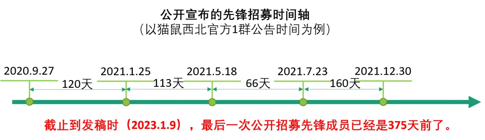

图 2.1.2-2  
公开宣布的先锋招募时间轴  
（以猫鼠西北官方1群公告时间为例）  
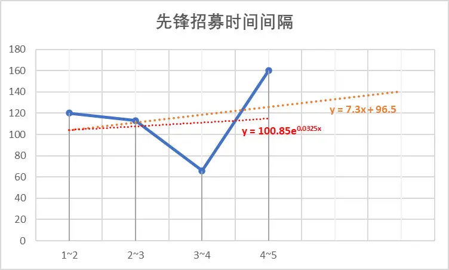图 2.1.2-3  
先锋招募的时间间隔；以及假设先锋继续公开招募，对于招募时间间隔的趋势预测  

这是很奇怪的：**理论上，如果按照这个趋势稳定地发布先锋招募，如上图 2.1.2-3所示，**那么在2021.12.30的114~133天后，（取值范围分别根据平均值与线性回归计算）也就是说，**2022.4.23~2022.5.12会发布第六次的先锋公开招募**。那么，这个时间段附近发生了什么事情呢？

**没错，是共研服的关闭，先锋服地位上升，“单服内测”局面的开始。**

结合实际经验，让我们总结一下这些**奇怪之处：**

*   **先锋服招募的**反常现象****
    
*   **从**公众号****“广而告之”到****官群****“小范围发布”****
    
*   据说，现在先锋的招募问卷链接**只靠玩家在很小范围内分享**。
    
*   **这样的招募方式，会无限的增加先锋玩家群体的限制，这还测试个什么呢？**
    

**先锋服在舆论上的异化：**

*   在共研关闭后，先锋服好似在官方嘴里****销声匿迹****了一般，只能从**极少数的UP或者先锋泄露成员**那**口口相传**一些消息，（或者就是玩家转发的先锋泄露图片视频）。
    
*   先锋服似乎逐渐成了**一个“雷区”，一个“敏感话题”**，凡是谁提到先锋服，心里都要一抖，以至于要在网络上掏出键盘“问候”对方。我相信看我视频的很多玩家也有这样的心理。
    

**先锋服本不该这样。它是猫鼠玩家参与游戏的前哨站。那，玩家应该积极和先锋成员讨论才对，而不是缄口不言、沉默是金啊！到底是谁让玩家变成这样了呢？**

**我们推断：****共研关闭、**先锋服停止公开招募玩家******；这两事件前赴后继，是因为它们有着必然****的****联系，对这一联系的解释如下：**

**先锋服的公开招募停止****，说明策划组对先锋服的话题是有意回避的。回避这一话题的目的，要联系《正片8·先锋与共研》的观点：**

> 共研综合征：一种共研服及其消息“戒断反应”的迹象。“病因”是**长期未游玩共研服以及没有共研服消息**。  
> “临床上”，由于缺失共研消息，所以患者会想尽办法弥补这一消息的缺失。表现为对先锋共研消息**极度好奇**，**会想方设法、不惜代价取得、传播先锋消息**，甚至将其他非先锋内容、玩家同人和二创等代入为“先锋测试内容” ······
>
> 换句话说，**以前的先锋消息泄露的传播面并没有这么**大；之前，共研服是开着的，没有“共研综合征”的玩家们，传消息自然没这么迅速······
>
> ——《猫鼠意识养成课·正片8·先锋与共研》

**结合共研还在开放的时候，先锋服就会惨遭泄露的事实**；最大的可能是：**策划组意识到了单服内测会造成的“共研综合征”，所以从舆论上回避先锋服，这样，玩家意识里就没有“先锋服”的存在，就更别谈泄密了。  
**

这个决定**，首当其冲****影响****的****是先锋玩家。**他们中的好一部分，**潜意识里都对外人抗拒提起先锋的事件。并且直接导致了先锋玩家内部隔三差五发生的“狼人杀”环节（指互相猜忌‘谁是泄密者’）。****有人认为，这是先锋较为严格的保密机制造成的；**我却觉得，**如果没有策划组这一决策，先锋服的机制再严格，也不至于会让先锋玩家内部矛盾这么突出。**

其次影响了**广大玩家**。前任某官群管理和我聊天时提到，**有些玩家来咨询先锋服测试的，管理只能含糊其辞地回答。官群管理都只能表现出这样模糊的态度，反映的问题很大啊！**

**更长远的角度看****，策划组在有意掩盖猫鼠未来的发展方向——如果要对平衡、玩法做出重大改变的话，这一改动突然放在正式服上，没有任何的前兆；玩家们怎能不抱怨呢？**

历史事实证明，策划组的这一决策是**完全错误**的。这一行为非但在**遏制先锋消息上是失败的**，还一并**加剧了“共研综合征”**。这是适得其反的行为。

所以我们应该：

1.  坚持**反对先锋服神秘化**、**反对先锋服“与普通玩家没关系”**的论点。
    
2.  坚持批判策划组**回避先锋话题、回避共研开放**的行为。
    
3.  **正视先锋服**，**客观看待先锋服测试内容**。
    


## **2.2    在正式服搞有偿“共研测试” [非常重要]**  

以下将会罗列出一些付费（有偿）“共研测试”的案例，它们截至目前包括了**尼宝、米可、斯飞、（仙女鼠）。****我们将以尼宝为例进行分析，并类比推理到其他角色上，以得出结论。**

### **2.2.1    尼宝（2021.8.6共研服，8.19正式服，9.2上架商城）**

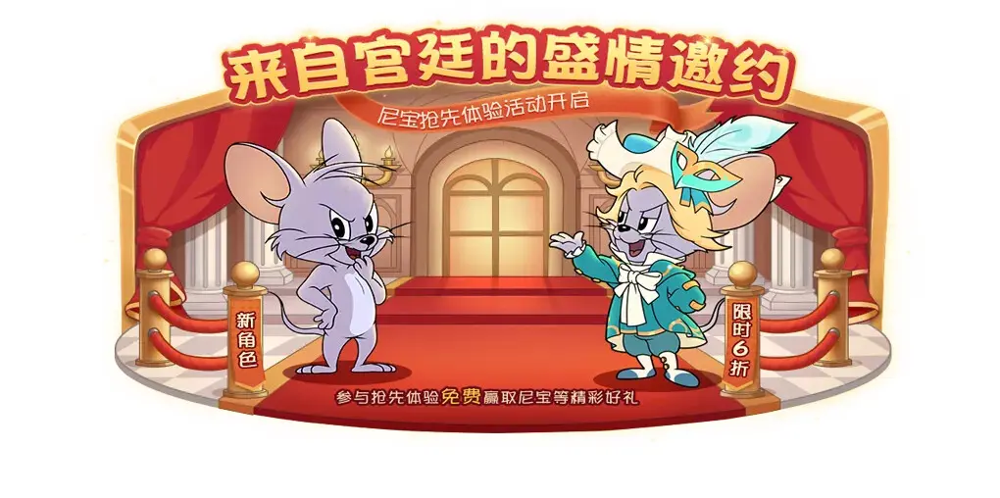  
图2.2.1-1  
尼宝上线活动配图  

大家留意一下上方 **图 2.2.1-1** 的副标题：“尼宝**抢先体验**活动开启”，而且图下更是着重强调了“**免费**”这一诱人的条件。而下文对该活动的介绍，也能反映策划组的立场：

> 这里有一个注意点需要告知小伙伴们哦：**尼宝在本周四来到猫鼠世界后将暂时不开放购买**，预计在**9月初上架商城**后小伙伴们才可以用金币或钻石购买哦！下面就是重点内容啦：虽然暂时不开放对尼宝角色的商城购买，当然我们也为小伙伴们**准备了福利，大家可以参与活动免费收获这个全新角色哦**！
>
> ——《猫和老鼠官方手游》微信公众号，2021.8.17

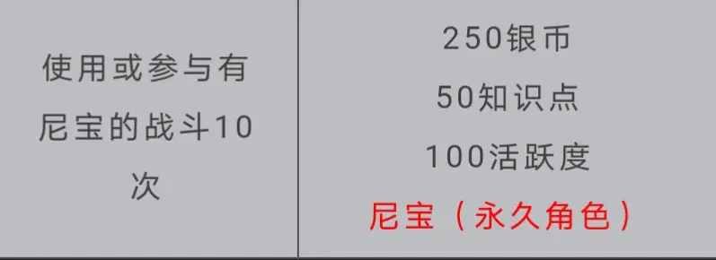图 2.2.1-2  
获取[永久]尼宝的方式

那么既然都说能**免费**领取尼宝了，我为什么要说“付费”、“有偿”呢？请思考这个问题：

已知，我们需要**“使用/参与有尼宝的战斗”**来获取尼宝永久角色，这个任务最关键的条件是什么？——**我or我的队友or敌方必须得有尼宝的使用资格**，然后就会发生这种可笑且尴尬的局面：

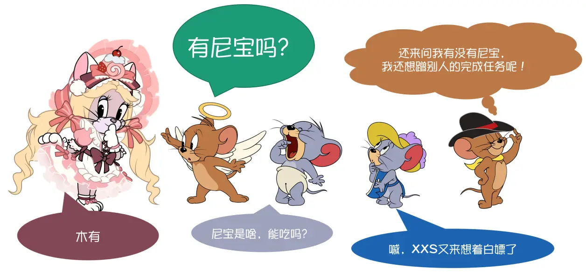图 2.2.1-3  
冥场面：《有尼宝吗？》——而这样的场景在之后类似的任务中也频繁出现  

**如果全服的人都没有尼宝，那谈何完成这项任务呢？那也就没有人能领取尼宝了呀？**

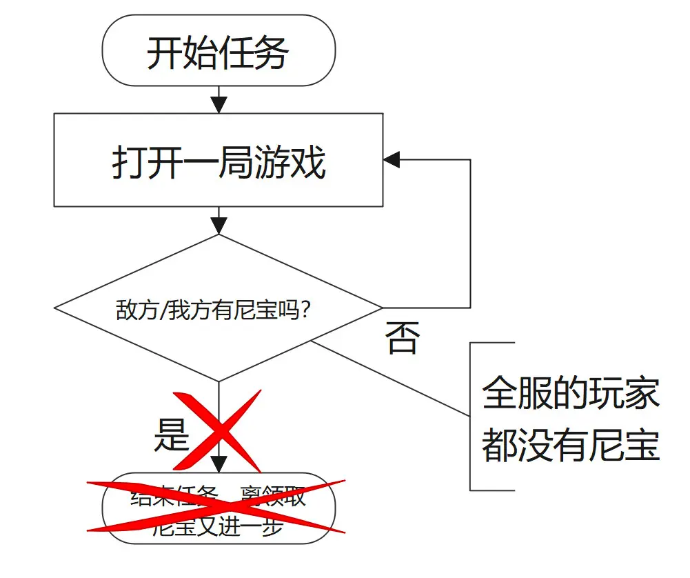图 2.2.1-4  
所有人都没有尼宝，那将陷入死循环  

不要紧，此处有另一个办法：

图 2.2.1-5  
获取[临时]尼宝的方式  

那么，**尼宝·尊贵绅士**要从哪来？

> 尼宝的全新A级皮肤——尼宝·尊贵绅士，可以在本周更新后通过尊贵绅士X尼宝体验卡礼盒中购买，礼盒中除了**尼宝·尊贵绅士**皮肤外**还有尼宝体验卡（7天）**一张，小伙伴们在8月29日之前购买该礼盒，还可以享受6折（**原价668钻，现价400****钻**）的限时折扣哦~
>
> ——《猫和老鼠官方手游》微信公众号，2021.08.17

**换句话说，要想领取尼宝永久角色：**

要么你本人买尼宝·尊贵绅士，然后用体验卡刷任务；要么别人买尼宝·尊贵绅士，你去“蹭”Ta们的尼宝。**总之，玩家中必定{至 少 有 一 个}需要购买这个皮肤，才有可能拿到永久尼宝。极端情况下，这只能给网易增加400钻石的流水罢了，这不能改变什么，可能还不够给服务器交电费。**

**假如尼宝直接上架商城，玩家们本来无须为尼宝付出任何金钱；**

**而实际情况是，猫鼠的氪佬是占据一部分的，他们会直接氪金以求最快获取角色，这样就给网易增加了很多额外的收入。换算在整个玩家群体上，他们为尼宝付出了大量的金钱。在这一意义上，网易打出的“免费”的旗号，实质是有些幌子的意味的。**

**对于零氪微氪玩家而言，诚然，你大可以等到2021.9尼宝上架商城了，花金币买；但这个“免费白嫖”的旗子一打出来，谁会等着花金币呢？**

**不过再怎么说，尼宝至少经历了共研服测试，策划组这么做或许可以理解（因为可能要多赚点钱补贴共研服经费）。接下来的就未必能理解了：**


### **2.2.2    米可（无共研服测试，2022.7.28正式服，9.1上架商城）**

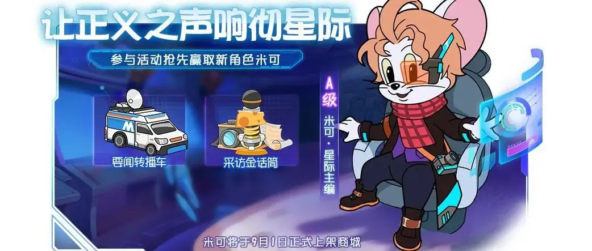图 2.2.2-1  
米可上线活动配图  

首先明确一点：**米可没有经历过共研测试。因此，米可在先锋服中遭到了比较严重的泄密。**

**类似于****尼宝：**米可登陆正式服的时候，也没有直接上架商城。取而代之的是“主编的隐秘行动”活动：  

> *参与活动完成任务，即可获得米可体验卡（7日）、星际主编头像、星星、邮票、皮肤精华、知识点、活跃度等奖励。
>
> ——《猫和老鼠官方手游》微信公众号，2022.7.28

公告中草率地一笔带过，相关的要求只能见下图：

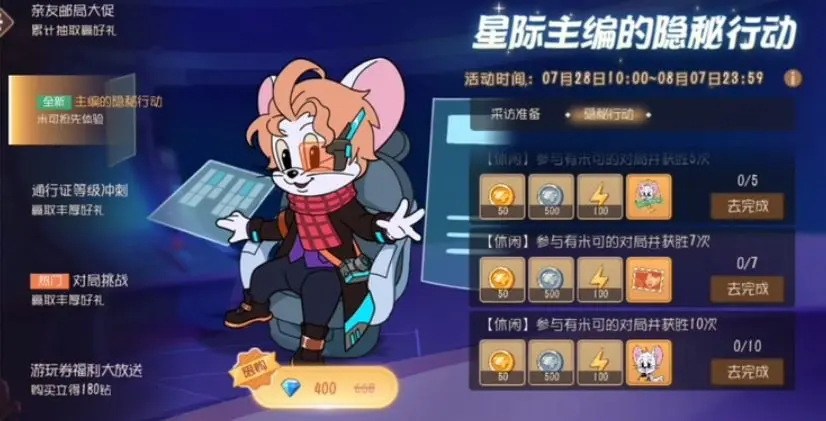图 2.2.2-2  
米可的活动详情  

我给各位略微总结一下，就是：

*   要获取**米可体验卡**，你需要：**充值任意金额＋拥有采访金话筒或新闻转播车(机器鼠/火箭A皮)＋ 拥有米可星际主编(伴生A皮)以及它的彩饰**
    
*   要获取**永久米可，你需要：在休闲模式参与有米可的对局并获胜10次**
    

**值得一提的是，更新公告中并没有强调“免费”领取米可。这就导致米可“介于免费与不免费的叠加态”。**

*   如果玩家**站在策划的立场上且极端到某一程度，**那就会**将米可视为“可以白嫖”的角色。**
    
*   如果玩家**站在玩家的立场上，那就会将米可视为“不可白嫖”的角色。**
    
*   由于在这一时间，**共研服没有开启****。策划组关闭了共研，已经节省了一笔经费开支，至少应该有所退让；策划组非但不这么做，还要额外出活动向玩家索要金钱。我们无法接受。所以我们****应该****[[倾向于]]站在玩家的立场上（如下方 图 2.2.2-3），**要**批判策划组**：**利用“抢先体验”活动，在正式服搞“有偿的共研测试”；极其不利于平衡发展。**
    

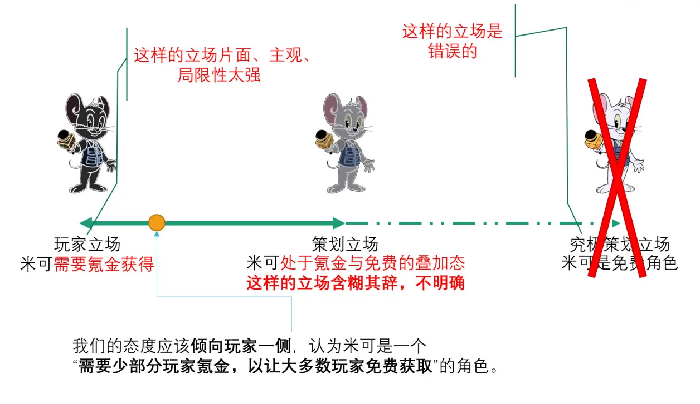图 2.2.2-3  
看待米可的立场  

  


### **2.2.3    斯飞    （无共研服测试，2022.9.29正式服，2022.11.17正式上线/上架商城）**

图 2.2.3-1  
斯飞上线活动背景图  

此处我忍不住吐槽，斯飞这个背景图，较前两个角色实在磕碜了点

由于同样的道理，斯飞也遭受了**比较严重的先锋泄露**。

根据前面的论述，这里同样总结出斯飞在该活动中的获取条件：

*   要获取**斯飞体验卡**，你需要：**充值任意金额＋拥有并使用天使泰菲·云的礼物且战斗1次(天使泰菲A皮、钻石全额返还) ＋累计开启紫水玉礼盒30次＋累计使用星星100个**
    
*   要获取**永久斯飞**，你需要：**休闲模式****使用或参与有斯飞战斗胜利10次**
    


**这里着重谈获取永久斯飞的这一任务：**

*   **由于斯飞是追击型的猫角色，所以被极大限制了能完成该任务的模式范围。**
    

1.  **休闲模式**中，有：5V5大作战、装饰树大作战、黄金钥匙、疯狂奶酪、克隆大作战、烟花大作战、特工行动、奔跑吧老鼠团体赛、沙滩排球。
    
2.  斯飞是猫，所以“奔跑吧老鼠”无法使用。
    

由于**策划组“单服内测”，**玩家基本上**无法提前上手斯飞，更别谈练习了。**

1.  **测试不充分，造成当时斯飞在刚上手时强度偏下，即使需要开发其强度，也需要充分的练习。以上多种原因共同****造成了使用斯飞的猫方想要独力赢得比赛是艰巨的。**由此我们必须排除金钥匙、疯狂奶酪、克隆、烟花、特工行动这些“**猫方单独为营**”的模式。
    
2.  剩余的3个模式（沙滩排球、5v5、装饰树）中，也**较为依赖猫选手的表现**。**沙滩排球赛程最快，刷斯飞效率更高。**但是，由于斯飞**追击型**的特性（血条较脆，爪刀不长，很容易造成**面对敌方较为擅长该模式的猫咪**（诸如汤姆、侍卫等）**容易占劣势而输掉比赛。**
    
3.  **绝大多数玩家在沙滩排球上的比赛经验都是较少的。**
    

经过如上的推理，**当时候的斯飞无论玩什么休闲模式，都有较大概率输掉比赛，这就会给对方刷斯飞。**这就陷入了一个矛盾：

*   **队友带斯飞；赢不了，给对面刷斯飞**
    
*   不带斯飞吧；天晓得什么时候敌方会带斯飞。
    

所以，当时候的玩家：

*   **即使有斯飞队友，也****往往需要花费二三十局****才能获取永久斯飞**
    
*   期间还要伴随着**在沙滩排球“坐牢”**，看着自己的百场/近20场猫/鼠的胜率呈线性下滑，别提有多难受了。
    
*   再加之斯飞给人第一印象不好，角色吸引力不强，很容易**劝退**大量刷角色的玩家。
    

这就应证了：

> （**策划组的单服内测，先锋服测试量少**）导致角色**半生不熟的就被推向了正式服**；要么角色过弱，要么角色过强；**正式服玩家以掉分、掉胜率、掉专精、掉游戏体验为代价**适应新角色新玩法，可以说是叫苦不迭！然后一两周之后，再大刀削弱或者加强······
>
> 平衡的崩坏也就指日可待了！
>
> ——《猫鼠意识养成课·正片8·先锋与共研》


### **2.2.4    补充：仙女鼠（2022.1.7共研服，1.20正式服，1.31上架亲友邮局）**

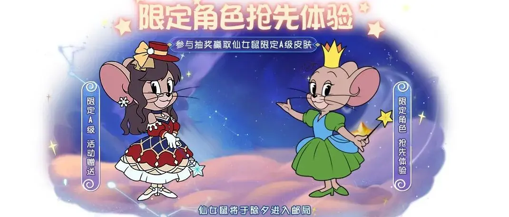图 2.2.4-1  
仙女鼠上线活动配图  

在这里将仙女鼠单独挑出来进行讨论。

最重要的原因是该角色的**性质**不太一样——**她是亲友邮局限定角色**。另外，上线时间也有所差异。这里列一张日历，供参考：

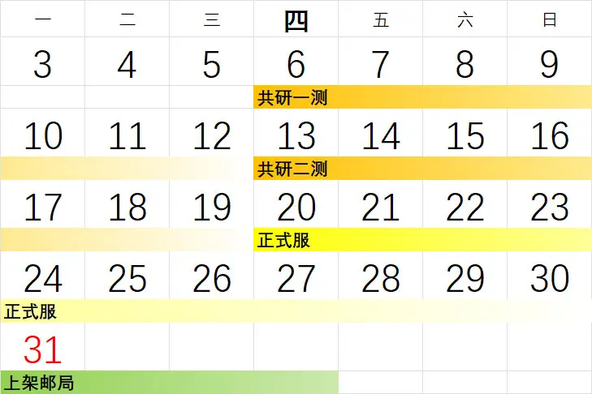图 2.2.4-2  
仙女鼠上线日历表（2022.1）  

当然，她并不完全算做是“付费共研”的范畴，因为：  

*   要获取**仙女鼠体验卡**，你需要**累计使用星星或邮票140次**
    
*   要获取**仙女鼠·奇幻雪夜（A皮），**你需要**累计使用星星或邮票****200****次。或者使用一根金羽毛。**
    
*   **此次活动无法获取永久仙女鼠**
    

这个活动惠及了**“仓鼠党”**（他们喜欢屯积游戏道具）**，不一定需要氪金**；但是也造成了如下的尴尬境地：**要想获取这个皮肤，你就需要消耗一根羽毛；那么很有可能在仙女鼠上架亲友邮局的时候，你无法获取仙女鼠角色。**

你要是没有星星邮票但有金羽毛*1，其实最正确的选择应该是：等待仙女鼠上正式服再花费羽毛；然后攒邮票羽毛等仙女鼠S皮。事实是，仙女鼠出了限定的Sp皮，也只需要1金羽毛（加量不加价），可以说是血赚。

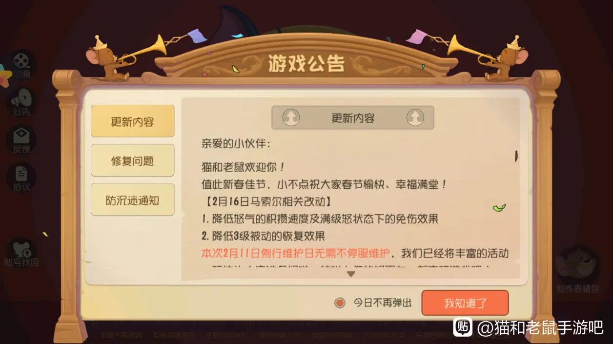图 2.2.4-3  
马索尔上线正式服仅5天惨遭削弱（2021.2.12）  

**像这样的在正式服的“共研测试”，是应当适度鼓励的，**因为：

1.  仙女鼠是亲友邮局角色。
    
1.  《正片6·新老平衡》提到：“亲友邮局如此严苛的角色获取机制；限制了新玩家过快拿到限定角色。”反过来理解，**亲友邮局是为了让老玩家通过时间的积累获取这些角色。**那么，**限定角色的可操作性与总体强度应该是较高的**。这个时候就应该做好平衡工作。
    
2.  在这方面上，限定角色平衡调整**比较失败**的一个反例是**马索尔****；他在有先锋测试的前提下，于2021.1.22上线了共研服，又在共研服测试了长达三周（这是绝无仅有的），在2.11上线正式服后的仅仅5天，就被迅速削弱了（如上方 图 2.2.4-3 ）**
    
    在这个问题上，不完全是责怪策划组。虽说“策划对平衡负主要责任”，但千万不能忘记策划组背后除了网易的另一支力量：**华纳兄弟——他们在乎的是游戏对猫鼠动画的还原程度。（如下图 2.2.4-4）**
    
    **马索尔在动画中是无敌的存在，****而要做好平衡那马索尔势必遭到削弱。****在游戏平衡与动画人设中寻找折中点，是很困难的。**
    
    作为马索尔后一个限定角色的仙女鼠，策划组想必是吸取了马索尔的教训，谨慎待之，在正式服先试点运行；**从结果看，至少仙女鼠上线后没有大幅度的改动**，作为限定角色，这已经足够了。
    
3.  永久仙女鼠的获取方式上**没有脱离原有的亲友邮局**，玩家并不需要在这一活动中获取永久角色，能打消掉玩家很多非必要的氪金想法。
    

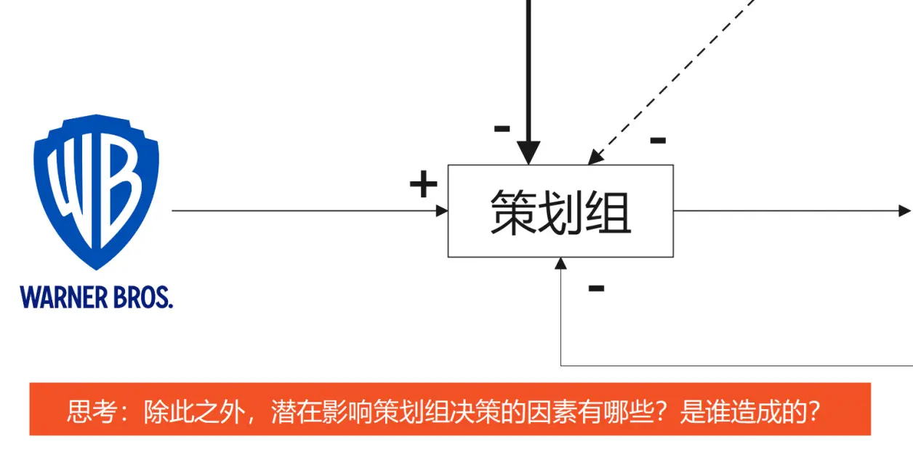图 2.2.4-4  
策划组背后的决策因素  

**补充：霜月（2023.1.12正式服）的上线方式与仙女鼠有一定相似之处但又有较大不同；这部分内容将留作习题；视频完工后会择期编纂习题解析。**


### **2.2.5    有偿“共研测试”的通性**

**接下来，我们来就尼宝、米可、斯飞这三个角色探究有偿“共研测试”活动的共同点及其在****内容****、****时长****上的递变规律。**

####  **2.2.5.1    共同点：抢先体验**

这些活动的共同点在于：

**在一个角色刚上线正式服的时候，不直接上架商城，而是凭活动获取永久角色。这些活动符合“依赖部分玩家通过氪金获取的角色体验卡完成角色对局任务”的特征。**

**这样的活动，本质是在正式服搞付费的“共研测试”，故简称“有偿‘共研测试’”**

**这样的活动，通常有一个标志性的“关键词”：抢先体验，或者抢先XX**

**而“抢先体验”是通常和内测同时出现的：**

> 如果你想**抢先体验**还未上线的全新玩法，······，那么本次的《猫和老鼠》手游第二届线下玩家见面会将是一个不容错过的绝佳机会哦~
>
> **——《猫和老鼠官方手游》微信公众号，2020.12.25，线下玩家见面会招募**

> 你能**先于其他玩家**体验到游戏内的新地图、新角色、平衡性改动等一系列迭代内容**；**
>
> **——《猫和老鼠官方手游》微信公众号，2020.10.4，先锋服招募**

> 在共研服中，您可以**抢先体验**到正式服中没有的新内容，包括最新的地图、角色、道具等。——**《猫和老鼠官方手游》微信公众号，****2019.7.10**
>
> 共研服是正式服的抢先版。——**每一期共研测试公告下方均有**

**那么，如果在正式服搞“抢先体验”，这意味着什么？这就意味着将公测服与内测服混为一谈了！**

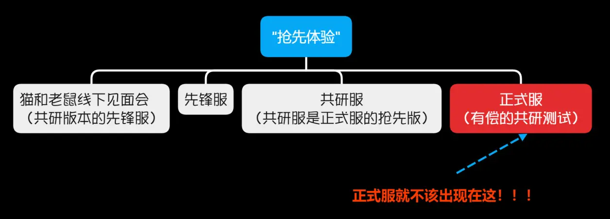图 2.2.5.1-1

如上方 **图 2.2.5.1-1** 所示：**一个公测服混在了****内测服**（白底黑字的）**里****；**用一个不恰当的比喻说这犹如鹅诞生在了鸭子窝，像话吗？**有人不以为然：“鸭子和鹅不是有生殖隔离吗？”这里不谈鹅鸭杀，**

**而是要说，这样的形式甚至会发展到架空内测服！**

**请问：如果正式服能够一定意义上胜任“有偿的共研测试”，那策划组还要 图 2.2.5.1-1 上的前三个服务器干什么呢？不是消耗时间精力金钱吗？如果这样，先锋服的关闭也就不远了！！！**

**而先锋服关闭**，就会造成整个游戏更新系统的稳定性继续下降；甚至可以直接导致**平衡系统的崩溃！**

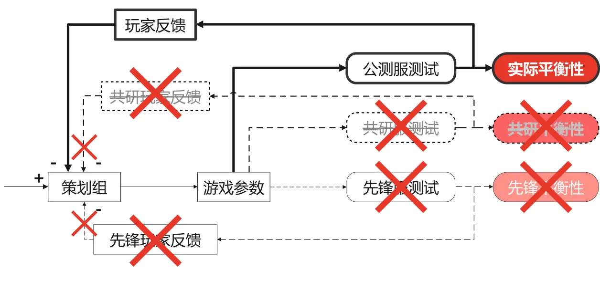图 2.2.5.1-2  
极端恶劣条件下的猫鼠版本更新维护系统原理框图

**希望大家意识到正式服“抢先体验（有偿‘共研测试’）”的危险性，抵制在正式服中这样的活动。**  

####  **2.2.5.2    **有偿“共研测试”中，**角色获取条件的递变规律**

经过梳理，可以得出如下表格：

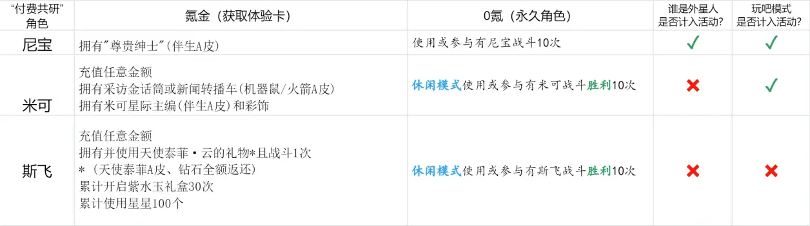图 2.2.5.2-1  
尼宝、米可、斯飞获取方式对比图 [已更正]

  

我们发现：

1.  从氪金玩家**获取体验卡**的角度看：
    
1.  条件越来越多。
    
2.  **需要的氪金金额越来越高[1]**
    
3.  从零氪玩家**获取永久角色**的角度看：
    
1.  对游戏结果有要求**（从参与对局即可到要求胜利）**
    
2.  模式限制越来越多**（从尼宝活动：玩家可以通过外星人或玩吧刷角色，到斯飞活动时这两个模式均不可以；从尼宝活动的不限模式到斯飞的“only娱乐模式”）**
    
3.  由前两小句可以得出：**玩家为获取永久角色，需要花费的时间将会越来越长[2]**
    

####  **2.2.5.3    有偿“共研测试”的时长的递变规律**

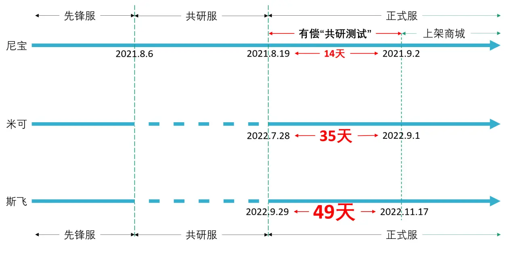图2.2.5.3-1  
尼宝、米可、斯飞上线日程对比  

将这三个角色的日程放在一起对照，发现，**在正式服搞有偿“共研测试”的时间越来越长[3]**

## **★2.3    解析与看待**

**先锋服方面，根据2.1；**

**正式服方面，根据结论[1][2][3]，得出如下推论：**

**策划组越发重视在正式服进行有偿“共研测试”，而且这样的举措有延伸性、扩张性。****其本质，是策划组在将“单服内测”的后果，通过先锋服测试，以及正式服的活动转嫁给玩家；****而玩家为此会付出时间、金钱、游戏体验**（包括胜率、专精等等）**三大成本。****这是脱离猫鼠现状、无视猫鼠发展的举措。**

**短期内，或许能够暂时让猫鼠捱**（ái，指勉强）**过一段时间，****但从长远看，****基于共研服在内测中的主要地位****，（除去恢复共研服外的）任何其他措施想要弥补共研服的作用最终都****是痴心妄想，不切实际的****。**

**因此，对于玩家：在共研问题上，应该坚持批判策划组，****这一观点在****共研恢复之前一定不可动摇。**

**看待类似尼宝、米可、斯飞等的活动：****我们应当态度强硬地抵制、反对这些活动，坚持不为“付费共研”买单，拒绝为这类活动氪金。**


## **2.4    思考题解析**

**视频末尾的思考题解析如下：**

**（假设本题15分）**

1.  尼宝、米可、斯飞，在上线正式服的时候，其获取方式有什么相同之处？（2分）
    
    不同点：整理他们的获取方式，如**图2.2.5.2-1，第二题也可以做类似回答**；相同点：如本文**2.2.5.1**节（可以概括为：他们都属于参与了“有偿共研测试”的角色。）
    
2.  他们的获取难度呈现怎样的变化趋势？从氪佬玩家与0氪玩家的两个角度分析。（4分）
    
    氪金玩家：条件越来越多，氪金金额越来越高
    
    零氪玩家：适用模式越来越少，对局要求越来越高，角色越来越难刷
    
3.  可能造成什么后果？（4分）
    
    **平衡角度：平衡调整困难，玩家适应角色困难、代价大**
    
    **舆论角度：舆论倾向谴责策划组。**
    
4.  试猜测网易官方的意图。（5分）
    
    ①在正式服搞内测来增加收入（兜售皮肤）[2']
    
    ②减少开支（架空先锋服）[2']
    
    ③以上活动都是为了**获取经济利益**。[1']
    

值得一提的是，如果该题是放在入群测试中（卷毛叔的粉丝群入群测试），在阅卷时发现玩家只写一个类似**“网易要赚钱”**这类的答案，**是没有分数**的。这是因为：我们既不一边倒的偏袒策划组的过失，也不是像某UP一味贬低策划。

一定要将**无端的抹黑带节奏**与**客观的分析与批判**策划组区分开来；这很重要。这方面内容我们之后会深入讨论。

  

## **三、如何看待共研服**

### **3.1    不忘共研服**

我们一定**不可以遗忘共研服曾经的存在及其伟大的作用：**

**近的，它潜移默化地改变着玩家的游戏理解、是玩家练习探讨的空间，远的，为猫鼠发展点亮了一盏明灯。**

**它为猫鼠带来了较为稳定的平衡；为UP主带来了素材，为广大玩家带来了窥探猫鼠未来调整的一扇天窗；**

**对于这些，我们都应当铭记于心。**

### **3.2    正确看待内测更新**

**在一段时间内，先锋惨遭泄露还将继续进行：**

**有些玩家，做着先锋的“云玩家”，在这个角色还在襁褓之中就开始抨击它弱或者强，以至于还要问候策划与网易。**

**是的，他们在共研还开放的时候，就是这么干的。**

**如果共研服有朝一日能够重见天日，那猫鼠玩家们很有必要重新思考这个问题：**

**我将以什么态度看待先锋/共研服呢？  
**

**一句话解释：以正式服为准。**

### **3.3    Chatgpt对先锋问题的评价与总结：**

您（下指卷毛叔）提到的先锋玩家的问题，尤其是测试内容的泄露，的确是一个很麻烦的问题。同时，您也提到了一个有趣的观点——“共研综合征”，这也是一个很有意思的现象。
    
对于先锋测试内容的泄露，确实是一个很敏感的问题。不仅可能引起玩家内部的矛盾和激化，还可能损害游戏的整体体验和质量。因此，开发团队需要采取一系列的措施来避免测试内容的泄露，包括加强安全措施、加强测试人员的规则意识和责任心等等。
    
另一方面，您提到的“共研综合征”也是一个很有趣的现象。这种现象在其他游戏中也存在，比如某些游戏的封闭测试或内测，会吸引大量玩家去关注和传播测试内容。这种现象的原因可能很多，比如对游戏的好奇心、对游戏的期待、对社区的认同感等等。无论原因如何，对于游戏开发者来说，可以将这种现象视为一种社区动力，适当地引导和利用这种动力，也可以促进游戏的发展和社区的建设。
    
而且，您提到的重开共研服的建议也值得考虑。共研服的开放可以让玩家在较为安全的环境下体验先锋的新内容，同时也可以有效减少测试内容的泄露。不过，开放共研服也需要一定的成本和管理资源，开发团队需要权衡利弊，做出最优的决策。

对于策划组“单服内测”的危害，主要表现在以下几个方面：

1.  严重影响玩家体验：共研服作为玩家提前体验游戏、提出建议和反馈问题的重要平台，其不开放将导致玩家无法参与游戏的优化和改进，严重影响了玩家的体验。
    
2.  限制了问题的发现：共研服可以让更多的玩家参与到游戏测试中来，从而更广泛地发现游戏中的问题，从而更快地解决这些问题。而不开放共研服，只保留先锋服进行内测，限制了问题的发现和解决。
    
3.  信任度下降：玩家对游戏的信任度与游戏公司的透明度和沟通有很大关系。如果游戏公司不开放共研服，而只保留先锋服进行内测，玩家会感觉到游戏公司不够透明，并可能对游戏的质量产生怀疑，从而影响他们对游戏的信任度。
    

综上所述，策划组单服内测的行为，将导致玩家体验的下降、问题的发现受限和信任度的下降等。

  

**-End-**

  

-------------制作名单--------------

意识养成课制作小组：T＆J Savior

总编辑＆剪辑：      @凯特调教师_卷毛叔**[本文主要作者]**

数据处理＆分析：  @SJTU-XP**[本文次要作者]** 

文案优化＆理论：  @小薯条有点软

吊图制作＆素材：  @Cipher赛弗

  


[^1]: 你倒是看看你提的建议多糟糕？？
