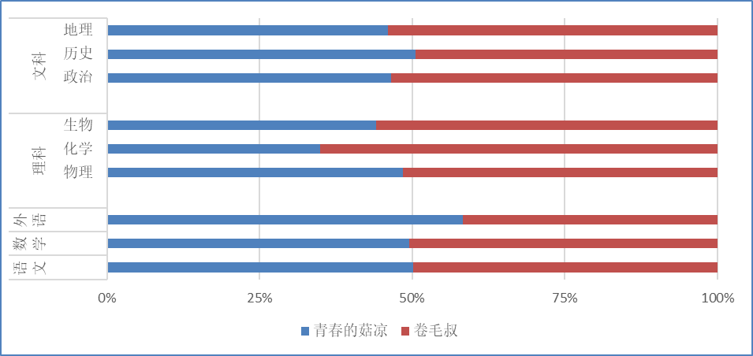

# 高中杂谈-孺子娘的故事

> <html>
> <body>
>
> <h3 style='text-align:center;'>致青春的菇凉</h3> 
>
> 
>
>
> 
 9.0gd;text-align:left'>嗨你好啊，青春的姑凉！

>
> 
 9.0gd;text-align:left;text-indent:21.0pt;mso-char-indent-count:2.0'> style='mso-bookmark:OLE_LINK1'>你整日想做那男孩的新娘！

> 
 9.0gd;text-align:left'>感受温度，来自他的手掌；

>
>
> 
 9.0gd;text-align:left;text-indent:21.0pt'>与他步入，爱的洞房。

>
> 
 9.0gd;text-align:left'><o:p>&nbsp;</o:p>

>
> 
 9.0gd;text-align:left'>真可爱啊，青春的菇凉！

>
> 
 9.0gd;text-align:left'> style='mso-spacerun:yes'>&nbsp; style='mso-spacerun:yes'>&nbsp;&nbsp;&nbsp;&nbsp;&nbsp;&nbsp;&nbsp;&nbsp;&nbsp;&nbsp;&nbsp;
> 无需装饰，朴素的容貌，

>
> 
 9.0gd;text-align:left'> style='mso-spacerun:yes'>&nbsp; style='mso-spacerun:yes'>&nbsp;&nbsp;&nbsp;&nbsp;&nbsp;&nbsp;&nbsp;&nbsp;&nbsp;&nbsp;
> &nbsp;稍加打扮，清纯的模样；

>
> 
 9.0gd;text-align:left'>你是家长口中的“好女孩”，

>
> 
 9.0gd;text-align:left'> style='mso-spacerun:yes'>&nbsp; style='mso-spacerun:yes'>&nbsp;&nbsp;&nbsp;&nbsp;&nbsp;&nbsp;&nbsp;&nbsp;&nbsp;&nbsp;&nbsp;&nbsp;&nbsp;&nbsp;&nbsp;&nbsp;&nbsp;&nbsp;&nbsp;&nbsp;&nbsp;&nbsp;
> 你是同学嘴里的“美女酱”。

>
> 
 9.0gd;text-align:left'><o:p>&nbsp;</o:p>

>
> 
 9.0gd;text-align:left'>你让亿些纯情小伙，

>
> 
 15.0gd;text-align:left'>让他们向往。

>
> 
 9.0gd;text-align:left'>他们是如此的痴迷，

>
> 
 9.0gd;text-align:left'> style='mso-spacerun:yes'>&nbsp; style='mso-spacerun:yes'>&nbsp;&nbsp;&nbsp;&nbsp;&nbsp;&nbsp;&nbsp;&nbsp;&nbsp;&nbsp;&nbsp;&nbsp;&nbsp;&nbsp;&nbsp;
> 痴迷的血液在心中滚烫。

>
> 
 9.0gd;text-align:left'>赤热的烈焰越焚越旺

>
> 
 9.0gd;text-align:left'> style='mso-spacerun:yes'>&nbsp; style='mso-spacerun:yes'>&nbsp;&nbsp;&nbsp;&nbsp;&nbsp;&nbsp;&nbsp;&nbsp;&nbsp;&nbsp;&nbsp;&nbsp;
> &nbsp;&nbsp;&nbsp;&nbsp;&nbsp;你仍然有着自己的期望。

>
> 
 9.0gd;text-align:left'><o:p>&nbsp;</o:p>

>
> 
 9.0gd;text-align:left'>真执着啊，青春的菇凉！

> 
 9.0gd;text-align:left'>别人笑你不屑把握机遇，

>
> 
 mso-char-indent-count:18.0'> style='color:red'>你说，他们不懂自己的意向.<o:p></o:p>

>
>
> 
 9.0gd;text-align:left'>唯独那个男孩经过，

>
> 
 9.0gd;text-align:left'> style='mso-spacerun:yes'>&nbsp; style='mso-spacerun:yes'>&nbsp;&nbsp;&nbsp;&nbsp;&nbsp;&nbsp;&nbsp;&nbsp;&nbsp;&nbsp;
>  style='mso-spacerun:yes'>&nbsp;&nbsp;&nbsp;&nbsp;&nbsp;&nbsp;你才会眼前一亮

>
> 
 mso-char-indent-count:9.0'> style='mso-fareast-language:ZH'>他威风堂堂，

>
> 
 mso-char-indent-count:15.0'>积极向上。

>
> 
 mso-char-indent-count:9.0'>俨然一副斯文的模样

>
> 
 mso-char-indent-count:9.0'> lang=EN-US><o:p>&nbsp;</o:p>

>
> 
 mso-char-indent-count:9.0'>真悲催啊，青春的菇凉 lang=EN-US>!

>
> 
 mso-char-indent-count:9.0'> style='mso-fareast-language:ZH'>不知是月老的红绳短<s><o:p></o:p></s>

>
> 
 mso-char-indent-count:18.0'> style='mso-fareast-language:ZH'>还是是丘比特的箭儿长<s><o:p></o:p></s>

>
> 
 mso-char-indent-count:9.0'> style='mso-fareast-language:ZH'>无论如何 OLE_LINK1'><o:p></o:p>

>
> 
 mso-char-indent-count:18.0'>他和你一样，有 style='mso-bookmark:OLE_LINK1'>了心仪的对象

>
> 
 mso-char-indent-count:9.0'>豆大的盐溶液被砸个稀碎

>
> 
 mso-char-indent-count:18.0'>化为气雾，弥漫在你的脚旁。

>
> 
 mso-char-indent-count:9.0'>痛苦与失败，在你的脑海中回荡。

>
> 
 9.0gd;text-align:left'>长话短说

>
> 
 9.0gd;text-align:left'> style='mso-spacerun:yes'>&nbsp;&nbsp;  style='mso-spacerun:yes'>&nbsp; style='mso-spacerun:yes'>&nbsp;&nbsp;&nbsp;&nbsp;从可盐可甜“乖乖女”

>
> 
 9.0gd;text-align:left;text-indent:94.5pt;mso-char-indent-count:9.0'> style='mso-bookmark:OLE_LINK1'>变成七嘴八舌“臭婆娘”。

>
> 
 9.0gd;text-align:left'><o:p>&nbsp;</o:p>

>
> 
 9.0gd;text-align:left'><o:p>&nbsp;</o:p>

>
> 
 9.0gd;text-align:left'>真纠结啊，青春的菇凉！

>
> 
 9.0gd;text-align:left'>你期待 style='mso-bookmark:OLE_LINK1'>敞开柔软的胸膛

>
> 
 mso-char-indent-count:18.0'> style='mso-fareast-language:ZH'>却逼迫自己插满锋芒，

>
> 
 9.0gd;text-align:left'>一切的一切，就在脑袋里转，

>
> 
 mso-char-indent-count:18.0'>一圈，两圈，直到这答案能让你明朗

>
> 
 9.0gd;text-align:left'><s> lang=EN-US><o:p>&nbsp;</o:p></s>

>
> 
 9.0gd;text-align:left'>快过来吧，青春的姑凉！

>
> 
 9.0gd;text-align:left;text-indent:94.5pt;mso-char-indent-count:9.0'> style='mso-bookmark:OLE_LINK1'>这些话都出自我的心肺肠：

>
> 
 9.0gd;text-align:left'>无论你的内心，

>
> 
 9.0gd;text-align:left'>多么自闭、或是多么奔放，

>
> 
 9.0gd;text-align:left;text-indent:52.5pt;mso-char-indent-count:5.0'> style='mso-bookmark:OLE_LINK1'>没人能真正给你一片高亮。

>
> 
 mso-char-indent-count:9.0'> lang=EN-US style='mso-fareast-language:ZH'><o:p>&nbsp;</o:p>

>
> 
 mso-char-indent-count:9.0'> style='mso-fareast-language:ZH'>走下去吧！青春的菇凉！ style='mso-bookmark:OLE_LINK1'> ZH'><o:p></o:p>

>
> 
 mso-char-indent-count:9.0'> style='mso-fareast-language:ZH'>走吧！望向天空，让心敲着暮色的鼓！ style='mso-bookmark:OLE_LINK1'> ZH'><o:p></o:p>

>
> 
 mso-char-indent-count:9.0'> style='mso-fareast-language:ZH'>走吧！莫失记忆，一起寻找生命的湖！ style='mso-bookmark:OLE_LINK1'> ZH'><o:p></o:p>

>
> 
 9.0gd;text-align:left;text-indent:-42.0pt;mso-char-indent-count:-4.0'> style='mso-bookmark:OLE_LINK1'>你的前路宽广， style='mso-spacerun:yes'>&nbsp;&nbsp;&nbsp;&nbsp;&nbsp;&nbsp;&nbsp;&nbsp;&nbsp;&nbsp;&nbsp;&nbsp;&nbsp;&nbsp;&nbsp;&nbsp;&nbsp;&nbsp;&nbsp;&nbsp;&nbsp;&nbsp;&nbsp;&nbsp;&nbsp;&nbsp;&nbsp;&nbsp;
>  style='mso-spacerun:yes'>&nbsp;&nbsp;&nbsp;&nbsp;&nbsp;&nbsp;

>
> 
 13.0gd;text-align:left;text-indent:31.5pt;mso-char-indent-count:3.0'> style='mso-bookmark:OLE_LINK1'>你的心底 lang=ZH style='mso-fareast-language:ZH'>清亮；

>
> 
 9.0gd;text-align:left'> style='mso-fareast-language:ZH'>肩上的清风， OLE_LINK1'><o:p></o:p>

>
> 
 9.0gd;text-align:left'> style='mso-fareast-language:ZH'>头顶的星空， OLE_LINK1'><o:p></o:p>

>
> 
 9.0gd;text-align:left;text-indent:73.5pt;mso-char-indent-count:7.0'> style='mso-bookmark:OLE_LINK1'>会告诉你方向； style='mso-bookmark:OLE_LINK1'> ZH'><o:p></o:p>

>
> 
 mso-char-indent-count:9.0'>你是你自己 style='mso-bookmark:OLE_LINK1'>的， style='mso-bookmark:OLE_LINK1'> ZH'><o:p></o:p>

>
> 
 mso-char-indent-count:16.0'> style='mso-fareast-language:ZH'>所有希望。 OLE_LINK1'><o:p></o:p>

>
> 
 mso-char-indent-count:9.0'>我期待看到你的嘴角

>
> 
 mso-char-indent-count:16.0'>再次微微的上扬

>
> 
 mso-char-indent-count:9.0'> lang=EN-US>&nbsp; style='mso-spacerun:yes'>&nbsp;&nbsp;&nbsp;&nbsp;&nbsp;&nbsp;&nbsp;&nbsp;&nbsp;&nbsp;&nbsp;&nbsp;
> 

>
> 
 mso-char-indent-count:9.0'>去思考吧！青春的菇凉！

>
> 
 mso-char-indent-count:9.0'>如果这首诗让你感到迷惑，头痛

>
> 
 mso-char-indent-count:9.0'> lang=EN-US> style='mso-spacerun:yes'>&nbsp;&nbsp;&nbsp;&nbsp;&nbsp;&nbsp;&nbsp;&nbsp;&nbsp;&nbsp;&nbsp;&nbsp;&nbsp;
> 请过阵子来品尝。

>
> 
 mso-char-indent-count:9.0'>你会明白，

>
> 
 mso-char-indent-count:9.0'> lang=EN-US> style='mso-spacerun:yes'>&nbsp;&nbsp;&nbsp;&nbsp;&nbsp;&nbsp;&nbsp;&nbsp;&nbsp;&nbsp;&nbsp;&nbsp;&nbsp;
> 这首诗的容量。

> 

>
> </body>
>
> </html>

## 目前可以透露的情报：

主人公：**艾姐**（和她本人姓名无关，昵称来源尚且不宜透露）

年龄：和我同岁，同班

关键词：态度端正、学习努力、严于律己、纯文科玩家

爱好：？

特长：英语，还有就是她的字写的不错！

# 目录

- #### ***一、菇凉的青春年华***

  - ##### *1.1 	无意作诗，暗指往事？*
  - ##### *1.2　强势互补的关系*
- #### ***二、如A股的好感度—断崖式熊市***

  - ##### *2.1　“浪漫”的摸头杀*
  - ##### *2.2　语文の小游戏*
  - ##### *2.3　物化“蠢才”，生物天才！*
- #### ***三、如A股的好感度—波动式牛市***

  - ##### *3.1　借书事件：真诚难寻*
  - ***3.2　军训琐事：失声难言，独咽苦衷***
    
    - ##### 3.2.1	交大老哥の好主意
    - ##### 3.2.2    “置换反应”
    - ##### 3.2.3　齐心协力
    - ##### 3.2.4    原来是，民以食为天？
  - **3.3　电动车的新人**
  - ##### *3.4    第六感选择？*
  - ##### *3.5　800m vs 1000m*
  - ***......***

- #### *四、“官配”CP？*

  - ##### 4.1    德育主任
  - ##### 4.2    语文老师
  - ##### 4.3    年级主任

## ***一、菇凉的青春年华***

#### *1.1 	无意作诗，暗指往事？*

如上方所示，《青春的菇凉》是我高一开学时写的诗。这首诗歌以我初中时观察到的姑娘与八卦为原型，写了这首诗歌。主要写了一个好女孩为情所伤，希望以本诗开导这类女孩。

### 1.2　强势互补的关系

## ***二、如A股的好感度—断崖式熊市***

*2.1　“浪漫”的摸头杀*

*2.2　语文の小游戏*

*2.3　物化“蠢才”，生物天才*

#### ***三、如A股的好感度—波动式牛市***

*3.1　借书事件：真诚难寻*

***3.2　军训琐事：失声难言，独咽苦衷***

3.2.1	

3.2.2    “置换反应”

3.2.3

3.2.4    齐心协力

*3.3　电动车的新人**

*3.4    第六感选择*

3.5　800m vs 1000m

 　　事情是这样的：我高一的时候，由于身体因素，缺席了我报名的运动会，我自认为“欠我们班级”一个1000m没跑。

 　　高三以后，我们学校居然搞运动会，还召集高三学生。为了，了却“旧债”，我毅然报名了1000m。然后，由于高三，我们前面又经历了三年疫情，体质岌岌可危，结果，全年级只有2个男生参赛了......不要认为我们两个男生就”稳了“——该项目是按照全高中部的学生成绩排名的，而不是分年级比赛......类似的，女生800m那里，只有艾姐一个，正所谓*“茕茕孑立，形影相吊。”*

 　　体育老师让我们跑长跑的排成一排，由于只有3个人，我理所应当地站在艾姐旁边；老师向我们宣布，男女生一起跑，只不过圈数不同。*（注：我们的操场一圈200m，也就是800m 4圈，1000m 5圈。）*她转过来向着我，嫣然一笑，说：“我还没和男生一起跑过长跑呢”，她顿了一下，“那这样，如果你被我追上了，那我就赢了。“”

  

  	<em>值得一提的是，艾姐是一个比较热爱锻炼的女生。常能在体育课上见到她独自拉伸跑圈。此外，她的羽毛球技术也很好。曾经我有幸和她切磋过，犹如老叟戏顽童（诸如发球的时候往我右侧肩膀打球，让我难以接住等......），她也是乐此不疲。总之就是，同学们看了乐子，她逗了我，受伤的只有我一个。</em>
  

　　我略微有点慌张。想起来，曾经多次让男女生一起跑圈的时候，我都跟在艾姐后面“吃风阻”。现在却要我发挥全部实力，何其难也！何况，要是被她追上，那岂不是很难看吗？

　　在开跑的时候，我请她优先在我前面跑（嗯，我一开始想的还是吃风阻，并且试探一下她的速度）；结果是，我以4:40完赛，并且我最终领先了她半圈。

　　等到我跑完，我早就嗓子里闻到了血味，躺倒在地上了。还好是占用体育课进行的运动会，没有闲杂人等观战，不然真的要痛失高中三年择偶权了。我只记得最后，我拼尽力气呼喊远处的她——但我真的忘记了我说了什么。可能我的确很累了吧。

我是被我同桌架着回教室的。

　　我晚上放学时找到艾姐，问她是不是自己赢了。她微微笑，答：这么看来，是啊；我立刻摆出一副傲娇＋胜利者的姿态，说：“那还不夸我？”她答：“嗯...本来男生和女生一起直接比成绩，就不太好......何况，你得套我圈我才能夸你吧......”

　　“你太吝啬了，我只是想听你夸我啊！”她很腼腆地低头笑，“你好棒哦~”

　　“你敷衍我！”我似乎并不是很满意她的表扬——事实上，我只是想寻她开心而已。

  

#### *四、“官配”CP？*

- 4.1    德育主任
- 4.2    语文老师
- 4.3    年级主任

## 四、“官配”CP？