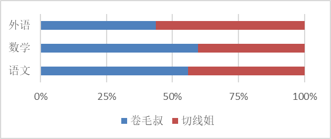
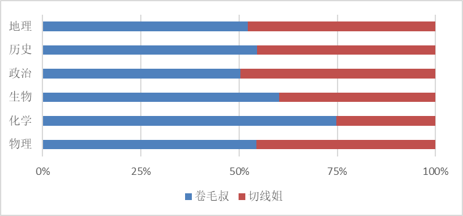
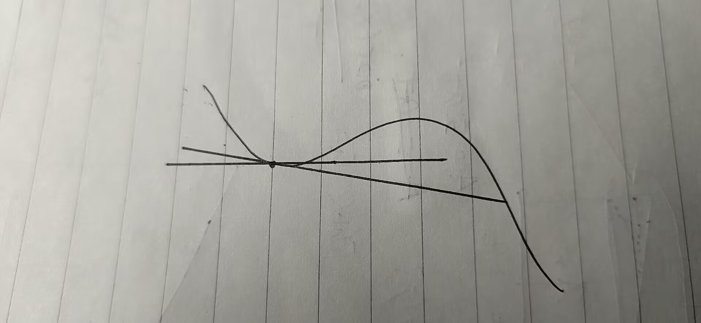

# 高中杂谈-恋爱脑的故事

我的粉丝占比中，有70%是男粉。常有男性粉丝跟我吐槽说，自己不善于接触女生。主要体现在：

1. 没有女人缘。
2. 有女人缘把握不住，情商低，遇见女人脑子短路。

相较之下，我的阅历肯定是比这些男粉多的。

有人会十分惊讶，转而嘲笑他们。我十分理解他们这样的现象。我认为，和女生相处最重要的是有勇气走第一步。因此，我想把自己和女生接触的“典型事例”分享给大家，由于这些事情的槽点太多，就当是博君一笑。

## 目前可以透露的情报：

主人公：**切线姐**（化名，这是我给起的绰号，至于原因后文会提到）

年龄：和我同岁，同班

关键词：富婆、恋爱脑

爱好：电影？游戏（是游戏鄙视链顶端的，诸如主机、switch等索尼大法之类的；以及，她的steam库比较丰富）

特长：英语，还有就是她的字写的不错！

　

声明：我本人不是她的追求者，亦不是她的前任、现在、或将来的任何一个男友。

　

# 目录

- ***一、赶潮流的女孩***
  - ***1.1 “他的衣服是哪买的？”***
  - ***1.2 “我养了个干女儿？”***
- ***二、与蠢学弟的情愫***
  - ***2.1 双人成行 配置升级***
  - ***2.2 学弟之蠢 切线两根***
  - ***2.3 唧唧我我 列队"欢迎"***
  - ***2.4 投喂之争 义正言辞***
- ***三、失或得？***
  - ***3.1 存亡关头的橄榄枝***
  - ***3.2 分道扬镳 好自为之***
  - ***3.3 后记与总结***

# 一、赶潮流的女孩

## 1.1 “他的衣服是哪买的？”（2021.10~2022.2）

　　如你们所见，切线姐既然是我高中的同学，那就从**高一**（2021.10）开始讲。

　　事情的起因是，我，和某个男生（就叫他W），报拓展课时都报了机器人编程。后来，学校里要参与机器人竞赛，我和他去报了名，混了个奖项，同时也加了微信。

　　不知道从哪打听到的消息，切线姐得知我有W的微信。然后就在某个大活动，她和她的闺蜜把我堵在墙角问我，义正言辞的说“我（切线姐）喜欢他（W）”，以此为理由，叫我问那个男生的穿着搭配，问他衣服的链接。我觉得这没什么反常，问就问了。

有人可能要问：为什么切线姐不问我要那男生微信？啊，切线姐真要微信，还轮的到我来给她？

当然，事情的结果是他俩在一起了，这是高一下（2022.2）的事情了。想来，她也追那男生大约一个季度了。

## ***1.2 “我养了个干女儿？”***（2022.2~2022.5）

作为高中生，学习显然是逃不开的话题。

讲一下背景：

我在学校被称作“小六门的六边形战士”（物化生政史地），但是整体看“三总”相对弱势。

切线姐则是英语见长。据她说是刷美剧等刷多了。

以下参见三总与小６门的相对情况：

（两图均以某次考试卷面分数比值为依据）

显然，我整体水平是比她高一截的。从上表可知，切线姐的化学最为劣势。的确，她的化学一度占据了年级倒4（倒3至倒1都是些不要读书的混子等......）

　

此外，我在高中里，性格也很高傲（这词需要推敲），比较自信。*（不是自大，自信与自大、自负的区别是“是否根据个人能力肯定自己”）*我不怎么向同龄人索要帮助，基本上是ta们向我求助的。对于向我求助的这些靓仔or美女，我的耐心还是比较充足的。

虽说“我很高傲”，但是我也很平易近人，被同学叫做“热心市民”。切线姐在这样的条件下，逐渐成为了我这的“常客”。诸如高一的信息技术，python编程对于很多同学而言是较难的；高二的物理必修电学，暑假她在外面上物理课，请我自习一下电学好教她（结果题目比她做得好，乐了）。

　

然后，在**高二开学**的时候，我们决定选修科目（上海高考3+3，小六门中选三个做选考科目）的时候，我选了物化地，她选了物地政。我选物化地的理由是：

1. 物化双选专业面广，感兴趣，有特长
2. 地理成绩高位稳定，学习压力低，感兴趣

至于她，她的选课是在“排除法”之后的答案（物地政）。结果居然有两科和我重合，其中想必有受到我选课的影响吧。

因此，我常常对切线姐自嘲：“你可没少让我操心啊！”她回答：“你是我的干爹啊！”——呵，我可不知道我什么时候有的这个干女儿！——不过想来，她学习、感情啥事都找我，确实耗了我不少精神。

说到感情，还记得W男生吗？她从和W在一起没几天，就开始给我吐槽男友了。我是看着他们牵手到分手的，好像也就谈了3个月左右吧？（2022.5）约会也只约了一次，手手好像也没牵呢。

哦！值得一提，他俩出去约会，切线姐是不考虑地点的，她先把钱拿出来，叫男方想到哪里去玩——这样的姑娘哪里找？

这是她自己挤破头挑的对象，我也不能说什么了。

------

# ***二、与蠢学弟的情愫***

## ***2.1 双人成行 配置升级***（2022.10~2022.11）

在高二上，（2022.10），她突然问我信息技术的题目。虽说我也是会的，但毕竟我们已经完成了“高中学业水平合格性考试—信息技术科目（就是你要拿毕业证书必须通过的这一考试）”，目前已经没有了学习信息技术的必要了。我特别疑惑，“到底是谁在问切线姐高一题目的呢？”

　

2022.11，切线姐突然问我电脑配置的事情。

*[回想一下，切线姐是富婆。人家家里配备了索尼全家桶，外星人电脑......她手持电脑配置理应不差，突然想换电脑必有异常。]*

一问，便说是自己“感觉”电脑很卡，想换。我问她想玩什么游戏，答曰：双人成行。

> 补充：
>
> ***《双人成行》***是一款由*Hazelight Studios*开发的合作冒险游戏。 
>
> 游戏的主要特点是**强制双人同屏**，玩家需要通过团结协作，连麦沟通完成各种挑战。游戏的画面精湛、节奏紧凑、创意出彩、可玩性极高，适合**朋友或情侣**一起玩。

我一看，哦，原来是**培养感情**的“小游戏”。我问：找到伴玩了吗？——“大概吧”！

——这个玩伴，在她嘴里，习惯称之为“小高一”（当年她高二、学弟高一），或者“小学弟”。我们姑且也这么称呼。

令人惊讶的是，学弟和切线姐玩的游戏中，有一款叫“永劫无间”，可能是因为操作太难，她**甚至为此做了笔记**（对，就是用纸和笔书写的那种！）来记录操作方法。这么努力，很难不怀疑切线姐是否喜欢学弟。

　

也就是那个时间点，她有一次叫我和她组队去打游戏，游戏名是**《代号：探戈》**。

> 补充：
>
> ***《代号：探戈》***也是一款由*Hazelight Studios*开发的合作冒险游戏。 也适合**朋友或情侣**一起游玩。

大抵就是我玩角色A，她玩B。在玩的时候，她总叫我把自己画面截图给她看；我还觉得是对她而言解密比较难，这样可以减低难度······我很快就意识到：这样做的目的，是她熟悉了角色A、B的流程操作之后，然后叫她的“男神”来玩，这样就能“带飞”了。

　

那一阵子我一直感到特别奇怪。我问她是否喜欢学弟，她矢口否认。她却借我的帮助，在学习、游戏方面接近学弟。

我感到自己可能被利用了，这样的事情让她在我这的印象变差了不少。可以说是我俩关系的转折点了。

　

## ***2.2 学弟之蠢 切线两根***（2022.12~2023.2）

2023.1，她给我吐槽学弟，说这个学弟有多么多么蠢。那么，多蠢呢？

先介绍一下背景知识：

> 高中地理中，“风向”由三个要素影响：水平气压梯度力、地转偏向力、摩擦力。
>
> 其中，在运用“等压线地图”判断“水平气压梯度力”方向的时候，方法是：垂直于等压线（的切线），由高压指向低压。
>
> 显然，最关键的是粗略地做出切线。

不过，他过曲线上一点，竟然能做两条切线。我姑且模仿一下：

老实人解答：这其实是作图误差。但是切线姐无论如何都没有办法教会他“如何只画一根切线”。

总之，是切线姐认为学弟蠢；我和学弟从没直接接触过，都是切线姐的一面之词。至少在这方面，我相信切线姐。

又因为我认为切线姐蠢，所以你可以把我、切线姐、学弟的“脑袋水平”看做如下关系：
$$
x>\sqrt{x}>\sqrt[3]{x}(x>>1)
$$

其实，在“切线事件”之前，她早就向我吐槽了好一阵子学弟的事情了。而这个时候我已经有些厌烦于她“三句话不离学弟”了。

刚好，就在她吐槽学弟的一周之前；我问她：有没有追学弟？她依然否认。我称她是“口嫌体正直”，她一边骂学弟，一边和学弟拉近关系（还把我耍了）。我还说：如果她没有追学弟，我就给她道歉

在她简称自己没有追学弟后——当然，我道歉了；

事实证明，我的信任是错误的。她这波是又当又立，“占了”两次“便宜”。

## ***2.3 唧唧我我 列队“欢迎"***（2023.3~2023.5）

在心照不宣的氛围下，在我毫无知觉的情况下，2023.3左右，切线姐和学弟牵手了。

我当时特别爱说一句话：“***虽然，从道理上讲，我应该祝他们幸福；但我由内而外地不想这么做。***”为什么呢？

- 我见证了W男生和切线姐从相识到“形同陌路”的过程，虽然在本文尚未提及，但其是一波114514折的，我认为像这样的情况**仍然会重演**而她将**不会吸取任何教训**，我累了。
- 切线姐“口嫌体正直”、“恋爱脑”的特质；和她一度要寻求我帮助（协助她追到学弟）的因素，让我有一种被当“工具人”的感觉，我非常讨厌这一点。
- 我对自己的定义是“聪明人”。并且我认为，蠢蛋要稍微有一点思想觉悟，和聪明人混（当然，切线姐可以去找其他人混，而不非要来找我的）；相反，蠢蛋和蠢蛋在一起混会变得“蠢上加蠢”——我讨厌和蠢到一定层次的人说话，费劲。

我的怨气可见一斑。上文也提到，我是“热心市民”，但是这不意味着我是“老好人”，我也有恶魔的一面。我必须做一些坏事让我的心态得到平衡，平息我的愤怒。

所谓“勿以恶小而为之”，但前提是，我得乐意啊？

　

那么，我干了哪些坏事呢？

例如，我曾经在朋友圈中写道：

> 给她一个曲线上的点，她能作出10条甚至9条切线。她就是人称“切线姐”的■■■。
>
> ——爱因斯坦曾这样评价她：“这个叫■■■的家伙让我感到惊讶，这是个天才，如果她敢来，我就把我的位置让给她。”就连某位穿着背带裤的知名篮球运动员也这样表示：“她是我学姐，我要感谢她。如果不是她，就没有我现在的辉煌成就。”下北泽实验中学的李荣先辈曾说到：“当我在会员制餐厅打工还钱时看到她的演讲，我就知道我的林檎将因她而得到拯救。”哪怕是霉国五星上将麦克阿瑟将军，也直言道：“当我看到她的作图、她的作风；我就知道：她很有军事才能。我仿佛看见了她的军队拿着冒蓝火的加特林，我就知道已经来不及撤退了。”
> 
> ■■■究竟是谁？被众多王者如此评价？大型纪录片​《切线姐传​奇》持续为您播出。

<u>这是绰号“切线姐”的由来</u>。我们都知道，做“一个点上两根切线”的并不是切线姐，这个绰号只不过是将她学弟的“蠢事”挪到她头上，借此讽刺他们这段关系罢了。

当然，这条朋友圈没有屏蔽她。主打一个“中门对狙”。

　

提到切线，在我们班级上课的时候，不论任何一科的老师，只要他提到“切线”相关的问题，我都会问：

> 老师，假如，我是说假如，如果有这么同学，他过曲线上一个点能做两条切线，应该怎么办？

我算了算，问了不下五六次。班级同学无不感受到我对“切线”的惦念之切、执着之深；也开始对“切线姐”的事迹有所耳闻了。

再加上，我的这张嘴以“锐评”著称——得罪了不少人。诸如我常在班里“演讲”说：***我们之间出了个恋爱脑，你们猜是谁？***时间一长，这种事情很快让班里相当的同学知道了。我的同桌戏称我（宣扬切线姐事迹的）这种行为叫做“传教”。

　

我们学校斜对面有个小卖部，门前常挤着几群人。有一日我发现，我们班的这群“小卖部常客”齐刷刷的朝一个方向看。我一看，哦，切线姐和学弟在校门口不到20m的地方在唧唧我我。——不怕被学校发现约谈吗？（被约谈了其实也不会怎么样，但多一事不如少一事）

还有一件事，有一次某个同学给我看学弟的朋友圈，第一张照片就是学弟和切线姐交换唾液的场面。

——不得不说，这样的恋爱方式对我而言还是太open了。

　

有些时候，他们会组队来到小卖部这里或者路过。每逢这个时候，我就会组织男生们站成一排，向他们行注目礼并且右手上台四十五度（“纳粹”礼），以表对他们的嘲笑。切线姐没多大反应，学弟倒是肉眼可见的尴尬。说实话，这个场面，虽然不太对，但确实解气！

　

## ***2.4 投喂之争 义正言辞***（2023.5）

我是一个干饭爱好者，经常每天带不少的食物。下课就在那边踏马吃吃吃吃吃。

很多同学爱“见者有份”。切线姐也是索要投喂的一员。当然，在她与学弟牵手之前就是这样的。而现在，我肯定会搞一点反制措施。又不能撕破脸皮搞得太难看，毕竟我俩情分还在。怎么办呢？

经过我的思考，我公开在班级里说：

给切线姐投喂食物，这应该是小学弟的责任。不过，我不是吝惜金钱的人——考虑到切线姐一直问我投喂食物——那么这样，每当小学弟投喂给她吃的，只要让我知道了，我就追加“25%股份”。——也就是学弟送切线姐100￥食物，我就得对应给她25￥的食物。

当时候还有人坐地追加税款起哄。“20%”“15%”的声音不绝于耳。

> 其实“交税”这是在我们这流行的一个梗。
>
> 这个说法是，当时切线姐和学弟在一起的时候，有人拿他们开玩笑，叫他们去临近学校50m的酒店开房。
>
> ——我起哄说：你们去开房我出20%股份（付20%房费），有人就起哄：卷毛叔要当xxx与xxx孩子的“20%”的爹了！这类的话。

虽然她辩解说：“学弟有给我吃的，但被我吃了。”但是，从此之后她再也没问我要过吃的。

　

原因如下：

切线姐是富婆。切线姐肯定比我有钱，我说我“不吝惜金钱”就是在讽刺她。并不是我给不起“25%股份”，而是她倘若来问我要“25%税款”，那岂不是打她脸么？

我怀着真诚讲话，是真心想这么做的。而她如何想，那就我说了不算了。

　

# ***三、失或得？***

## ***3.1 存亡关头的橄榄枝***（2023.6）

这一阵子事情之后，我们就几乎不怎么联系了。我对切线姐也是呈排斥的态度。她来问我什么问题，我都回复：“小学弟会教的哦！”

直到2023.6月，“高中学业水平合格性考试”要考所有的“小六门”。在这场考试之后，你将几乎永远地和你不选的科目说再见——前提是你要通过这场考试，否则面临的是2024.1的补考，面临着没有毕业证的风险（虽然在上海我真没听过这样的消息），那就麻烦大了。

切线姐在合格考前夕找到我，希望我抽空给她补化学。我想，她既然肯主动找到我，那我就给她一次机会。但是，我提出了一个附加条件：线下面对面讲。她同意了。

这个计划巧妙在于：

1. 切线姐的注意力比较**涣散**。线上讲没法保证效果。
2. 还处着对象呢，和其他男生单独出来，不会有**心理负担**吗？这是我有意为之。
3. 都到了“生死存亡”之际了，还考虑这么多？我认定她不得不来找我。哪怕我条件略微苛刻一点。
4. 借此，也是给她上一课；明确了“至少在学习问题上，她没得选（不可能找学弟讨论学习），所以她必须尊重我”。

等到见了面，拿出化学卷子，在我的监督下，她花了2小时做了一张“合格考难度”化学卷（一套卷子有2张8页呢）。这是因为一个是漏洞太大，另一个是因为她每做一题，就要和“亲爱的宝贝”（她给学弟备注的昵称）聊一会。

*ps：我为了防止这样（效率低下）的现象出现，在她同意线下教学之后；我特意以“威胁”的口吻说：你如果敢带学弟来，我就立刻撕票跑路。但没想到这次的情况更恶劣了。*

在她大费周章花了2小时做了我20分钟的题目之后，她收拾东西上地铁去找学弟玩了。临下地铁，我对她说了3句话：

- 我的任务完成了！（我打算不再教你东西了）
- 希望你的合格考能过（我认为你的合格考没什么希望）[^1]
- 玩得开心（字面意思）

下地铁后，我反手把她微信拉黑了。我们的关系宣告破产。

## ***3.2 分道扬镳 好自为之***（2023.6~2023.9）

7月，结果是，切线姐的合格考都过了。我大失所望。其实我是想看挂科，想看小丑的。但我更相信上海国子监的判断是公平的。

长远看，她还有两门高考选考科目和我有交集，如果她和我没崩，还有个人引路。那么，现在她要怎么办呢？

对于此，我只好引用下面的这件事情：；

> 2023.5，我们区搞了个区统考。
>
> 我的物理科目，拿到了全校最高等第“C+”，物理老师给我一顿批评。
>
> 切线姐得知我是全校最高，问我的等第，然后答："看来我努力努力，最多可以拿C+。"
>
> “就你也想到爬我的位置吗？”我很不屑。
>
> “不可以吗？”
>
> “希望你能做到哦！[^1]”

## ***3.3 后记与总结***

### 结局

最近得到的消息是，她似乎和学弟分手了？但我是不会因此恢复和她的关系的。这个结局对于切线姐而言，可以说是学业爱情“两欠收”了。我认为，这结果是切线姐自己一手造就的，她应得的。

### 卷毛叔评价：

高二下（2023上半年），切线姐对我说：“我高一的知识忘光了”，我对切线姐说“让学弟教”。哪怕对于高二下的知识点问题，我也主打“小学弟会学到的，所以学弟会教”。我都拿同样的话术：“小学弟会教的哦！”打发切线姐。——正好应了她那阵子“三句话不离学弟”的特性。***切线姐真的能从学弟那复习到知识吗？小学弟真的会教她吗？这个问题的答案只有她自己最清楚！***

凭良心说，我不曾亏待切线姐，在这些波折的事件中，我尽己所能展示出了宽容的态度，回避撕破脸皮式的暴力解决问题。对于同龄人，我是不可多得的稀缺资源；不然，她为什么要一遍又一遍地来找我？只可惜，是她自己一步步丧失了这根橄榄枝！什么？你问我有什么损失？显然没有，我无求于切线姐什么事情。

恋爱脑无妨、傲娇无妨、表达爱意也无妨；虽然我可能不理解但会予以尊重——前提是不可以影响到他人。那像切线姐那样，追个对象把我当“工具人”；自然是要受到强烈谴责的。

对待女生，不讨好，不谄媚；不卑不亢，靠自己的能力讲话，这样，思考“如何人情世故”的责任就交给了让你帮忙的女生。这个方法我百用不厌，实属上选！

[^1]: 当我说出“希望……”语句的时候，就说明我对这件事情“没什么希望”。毕竟，如果一件事情客观上完全可以达成，那人们根本没有必要为此求神问卜，表达“美好祝愿”的。