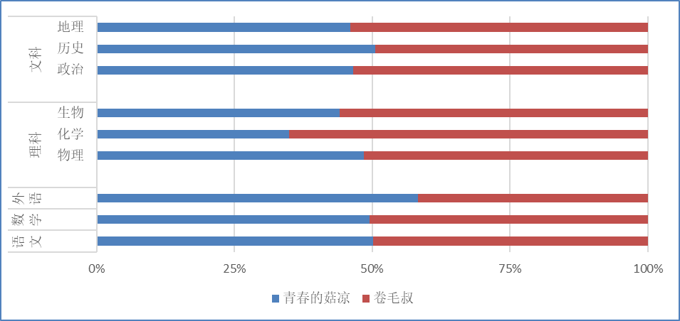

# 高中杂谈-？

> <html>
> <body>
>
>   <h3 style='text-align:center;'>致青春的菇凉</h3> 
>
> </body>
> </html>
>
> 嗨你好啊，青春的菇凉！
>
> 　　　　　　你曾梦想做那男孩的新娘！
>
> 感受温热，来自他的手掌；
>
> 　　　　　　与他步入，爱的洞房。
>
>  
>
> 真可爱啊，青春的菇凉！
>
> 　　　　　　无需装饰，朴素的容貌，
>
> 　　　　　　稍加打扮，清纯的模样；
>
> 你是家长口中的“好女孩”，
>
> 　　　　　　你是同学嘴里的“美女酱”。
>
>  
>
> 你让亿些纯情小伙，
>
> 　　　　　　让他们向往。
>
> 他们是如此的痴迷，
>
> 　　　　　　痴迷的血液在心中滚烫。
>
> 赤热的烈焰越焚越旺，
>
> 　　　　　　你仍然有着自己的期望。
>
>  
>
> 真执着啊，青春的菇凉！
>
> 别人笑你不屑把握机遇，
>
> 　　　　　　你说他们不懂自己的意向。
>
> 唯独那个男孩经过，
>
> 　　　　　　你才会眼前一亮。
>
> 他威风堂堂，积极向上。
>
> 　　　　　　俨然一副斯文的模样。
>
>  
>
> 真悲催啊，青春的菇凉!
>
> 不知是月老的红绳短，
>
> 　　　　　　还是是丘比特的箭儿长？
>
> 无论如何，
>
> 　　　　　　他和你一样，有了心仪的对象。
>
> 豆大的盐溶液被砸个稀碎，
>
> 　　化为气雾，弥漫在你的脚旁。
>
> 　　　　　　痛苦与失败，在你的脑海中回荡。
>
> 长话短说：
>
> ​    　　从可盐可甜“乖乖女”
>
> 　　　　　　变成七嘴八舌“臭婆娘”。
>
>  
>
>  
>
> 真纠结啊，青春的菇凉！
>
> 你期待敞开柔软的胸膛，
>
> 　　　　　　却逼迫自己插满锋芒！
>
> 一切的一切，就在脑袋里转，
>
> 　　　　　　一圈，两圈，直到这答案能让你明朗！
>
>  
>
> 快过来吧，青春的姑凉！
>
> 　　　　　　这些话都出自我的心肺肠：
>
> 无论你的内心，
>
> 　　　多么自闭、或是多么奔放，
>
> 　　　　　　没人能真正给你一片高亮。
>
>  
>
> 走下去吧！青春的菇凉！
>
> 　　　　　　走吧！望向天空，让心敲着暮色的鼓！
>
> 　　　　　　走吧！莫失记忆，一起寻找生命的湖！
>
> 你的前路宽广，
>
> 　　　　　　你的心底清亮；
>
> 肩上的清风，头顶的星空，
>
> 　　　　　　会告诉你方向；
>
> 你是你自己的，
>
> 　　　　　　所有希望。
>
> 我期待看到你的嘴角，
>
> 　　　　　　再次微微的上扬．
>
> 
>
> 去思考吧！青春的菇凉！
>
> 如果这首诗让你感到迷惑，头痛
>
> 　　　　　　请过阵子来品尝。
>
> 你会明白，
>
> 　　　　　　这首诗的容量。

- 一、菇凉的青春年华
  - 1.1 	无意作诗，暗指往事？
  - 1.2　强势互补的关系
- 二、如A股的好感度—断崖式熊市
  - 2.1　“浪漫”的摸头杀
  - 2.2　语文の小游戏
  - 2.3　物化蠢才，生物天才
- 三、如A股的好感度—波动式牛市
  - 3.1　借书事件，真诚难寻
  - 3.2　军训琐事：失声难言，独咽苦衷
  - 3.3　电动车的新人
  - ......

