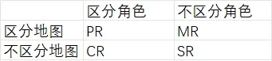
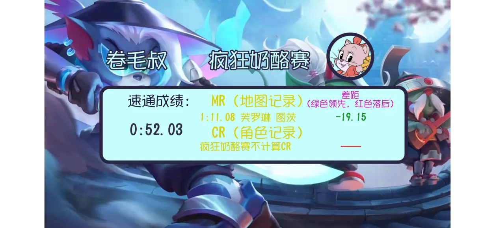

# 猫和老鼠手游 速通手册V1.02

简化版速通规则⬇️

[03:58 想和猫皇交锋,苦于没有实力段位?进来看！ 9214 60 视频 凯特调教师_卷毛叔](//www.bilibili.com/video/BV1HU4y1o7LJ)

  

## 零、总则  

　　速通是单机游戏的一个挑战项目，即用最快的速度通关游戏的行为。速通的历史非常久，比较熟知的速通游戏有《和班尼特福迪一起闯过难关》（掘地求升、Getting Over it）《Minecraft》（我的世界）。
　　速通视频挑战性和观赏性兼具，在玩家群体中很受欢迎。 速通发展到今天已经十分完善和精细，其操作细节达到了以帧为单位的程度，相邻两个记录间也仅有零点几秒的差距真正的电子竞技。 速通可以利用游戏原有的BUG或设计缺陷，但通常不允许使用指令和外部修改程序。**根据萌娘百科“速通”词条修改*
　　世事难尿，猫和老鼠这样的非对称竞技手游也加入了速通的行列。作为猫和老鼠的资深玩家、顶尖主播，我卷毛叔开创了速通的先河。而这万恶之源可见下面的视频：

[万恶之源](www.bilibili.com/video/BV19K4y1n7js)

近几个月来，我大量尝试速通，成果显著，播放量也稳居高位，说明大量的玩家热衷于速通这个竞技项目。

我投稿的一些速通视频

　　如今，这已经成为猫和老鼠一项新兴的娱乐方式与电子竞技项目，且没有段位限制，是大多数玩家接触电竞最佳的项目。参与、练习速通有助于

1.  节约大量时间、提升上分效率
    
2.  参与投稿上视频素材，增加游戏乐趣（投稿方式见文章尾部）
    
3.  激烈竞争，但不互相为敌（所有速通玩家都不在比赛中见面，避免了大量矛盾冲突）
    
4.  应对一些高端打法，提升技术
    

近来，速通项目在猫鼠欣欣向荣。但没有成文规则便是没有意义的。

由此，我自2021.10起，开始依照我之前的速通记录，整理了成文的速通规则，经过一个月的修改发布了这一正式版。制定过程中贯彻了公平、严谨的思想；因此速通规则绝非寥寥几句就可以概括的，而速通规则每一句话背后都饱含了我，以及毛绒们的思想。因此，希望大家在了解速通规则的时候不要嫌规则冗杂，耐心看。

当然，本速通规则还有极大的缺陷，例如鼠速通尚未纳入，猫还有部分模式是不计入速通的。如果你有什么更好的建议（包括本规则的范围）或者有任何疑问，欢迎私聊我进行讨论。也欢迎各位投稿视频（投稿方式请见文章尾部）
最后，祝大家都能取得不错的速通成绩！

卷毛叔    

2021.11.27

# **目录**

- ### **零、总则**

- ### **一、速通成绩计算方式、速通的定义**

- ### **二、**成绩计算******适用范围**

- ##### **①模式**

- ##### **②特殊地图、模式**

- ##### **③速通对手适用条件**

- ##### **④禁忌**

- ### **三、成绩排行以及记录刷新规则**：

- ##### ①速通成绩记录方式：

- ##### **②速通记录分类** 

- ##### **③速通记录格式** 

- ##### **④速通成绩排行及记录刷新办法**

- ##### ⑤MR的特殊地图计算规则

- ### **四、对专有名词的解释**

- ### **五、速通投稿要求**

------

## **一、速通成绩计算方式及其定义**

A时间点  奶酪期开始（即老鼠可以出洞推入奶酪）

B时间点  比赛结束前<u>最后一次使老鼠全员处于可投降状态</u>的时候

**取视频素材中A时间点和B时间点，用165帧下的录屏计时器，使用PR、万兴喵影等电脑剪辑软件对时，计算经过的时间**，精度为百分之一秒

**定义：当经过的时间≤180.00s时是速通，此时视经过的时间为“速通成绩”**

***可投降状态包括下面的情况**

**倒地、抓住、绑上火箭、铁血、老鼠被托普斯捕虫网困住、苏蕊跳舞使老鼠跟随自己**

***不包括以下情况**

敌方老鼠挂机、且不包括上面绿色的情况；

绑上火箭的老鼠被天使祝福，且最后复活队友成功

  

对B时间点判定的举例说明：  

张三击倒所有老鼠但没绑上火箭，若老鼠投降，则B时间点取最后一只老鼠倒地的时间

李四把所有老鼠击倒且绑上火箭，B时间点取最后一只老鼠倒地的时间

王五把所有老鼠绑上火箭，老鼠不投降且有一只挣脱了，王五重新抓起并把它绑上火箭；则B时间点取王五击倒最后一只老鼠的时间

老六放飞2只老鼠，击倒剩余2只老鼠，老鼠起身后再次击倒的瞬间显示猫胜利（说明鼠在倒地时投降了）；B时间点取老六第一次击倒剩余2只老鼠的时间

**二、速通适用范围：**  

①角色要求：仅限猫  

②  1）模式：

匹配、天梯（无段位限制）、娱乐【包括：黄金钥匙赛、疯狂奶酪、克隆大作战、特工行动、5v5大作战】、锦标赛、各大主流官方举办比赛（如奶酪杯、精英联赛、next电竞杯赛、城市赛等）

​      2）特殊地图、模式的成绩：

疯狂奶酪、5v5大作战模式的速通单独作为一张地图计算成绩（指有单独的MR）

疯狂奶酪速通无法刷新CR

雪夜古堡1、2合并为一张地图计算MR

2021.11.18至2022.2.24的锦标赛中，速通成绩×1.67后计入记录

③速通对手限制条件

*无论是速通人还是被速通人，均无段位、实力限制

*对方挂机人数＞1 则 速通作废

>人机局计入速通（匹配等非房间获得的人机，但刷新记录方式不同且投稿不会被解说）

**④明确禁忌——房间模式（各大比赛除外），以及包括但不限于放水、让分、请演员等使对手的消极比赛的主观行为  

  

**三、成绩排行以及记录刷新规则**：

①速通成绩记录方式：

投稿给我视频（给我投稿视频的优先发布至排行榜）

或在各大平台发布视频并联系我（B站私聊、QQ等）登记成绩且成绩以进一法计算到个位，否则不予承认。

②速通记录分类

用一张图来解释吧

**③速通记录格式**

**所有都适用 速通人+速通角色+速通地图+成绩**

如：张三 塔拉 太空2 114.51s

注意：应避免速通地图与成绩造成混淆，例如张三塔拉太空234.5s，因此如果有必要，须加空格隔开各项内容

各个记录的表达方式

|                                   |                            |
| --------------------------------- | -------------------------- |
| 某地图某角色PR=速通人+成绩        | 太空2塔拉PR 张三114.51s    |
| 某角色CR=速通人+地图+成绩         | 塔拉CR 张三 太空3 114.51s  |
| 某地图MR=速通人+角色＋成绩        | 太空3MR 张三 塔拉 114.51s  |
| SR=速通人＋速通角色+速通地图+成绩 | SR 张三 塔拉 太空2 114.51s |

**人机局速通须在成绩后面标注AI字样**

 

**④速通成绩排行及记录刷新办法**

比较已经记录的成绩，取最快成绩为SR

相同角色的速通中，取最快成绩作为CR

相同地图的速通中，取最快成绩作为MR

相同角色与地图的速通中，取最快成绩作为PR  

**若AI速通获得记录，则在记录中须一并写出真人局最快成绩**

例如：李四苏蕊太空3 60s  王五苏蕊太空2 70s（AI）——此时CR为李四60s

若张三投稿，成绩为50s（AI）

那么  苏蕊CR 张三/李四 50sAI/60s

  

⑤MR的特殊地图计算规则  

古堡1与古堡2合并为一张地图计算CR

5v5大都会与疯狂奶酪赛作为单独地图计算CR（即5v5大都会与普通大都会不一样等）

  

  

**四、对专有名词的解释：**

速通人 参与速通的选手

被速通人 

PR（Perfect Record）完全记录 指控制了角色与地图变量

MR（Map Record）地图记录 本张地图最快记录

CR（Character Record）角色记录 本角色最快记录，

SR（Super Record）超级记录 速通界的新星！

AI（即人机局）

个人认为，刷新难度是SR＞PR＞CR＞MR

  

**五、成绩记录**

成绩记录必须基于向我投稿视频

投稿规则在文章开头

非向我投稿视频仅在各平台发布的速通，成绩以进一法计算到个位且刷新记录

投稿后会获得这样一张成绩单：

成绩单样式

上方对应：速通人 速通地图 速通角色  
下方对应：速通成绩 MR与CR及本成绩与记录的差距（+即为落后 -为领先）  

  

  

希望猫鼠各界对本规则多提出宝贵意见！

  

v0.1 2021.10.30

v0.12 11.1

v0.13 11.8

v0.14 11.9

v0.15 11.11

v0.16 11.20

v1.0 11.26

v1.01 12.8

v1.02 2022.2.24